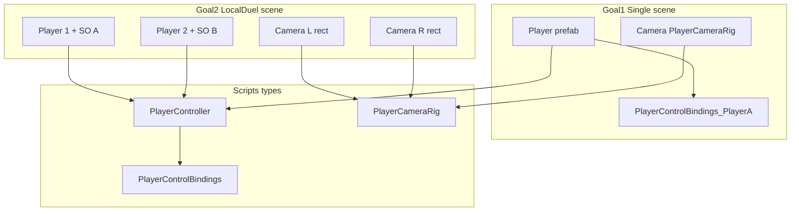

# Goals (order of delivery)

| Goal | Scene (package root) | Outcome |
|------|----------------------|---------|
| **1 — Single third person** | `Assets/ThirdPersonMixamo/ThirdPersonMixamo_Single.unity` | One player prefab, one **PlayerCameraRig**, jump gym, **Player A** bindings (WASD-style). |
| **2 — Local duel / same-screen two players** | `Assets/ThirdPersonMixamo/ThirdPersonMixamo_LocalDuel.unity` | Two player prefabs, **two cameras** with **split viewports** (e.g. left/right half), **Player A** on player 1 and **Player B** on player 2 (non-overlapping keys). |

WhoWiredThis **CoOpController** / **CoOpCameraRig** / **CoOpControlBindings** stay unchanged elsewhere; this package uses **renamed** types and **package-local** SOs only.

---

# Naming and namespace (required)

- **Namespace:** `ThirdPersonMixamo` for every package-authored script.
- **Movement:** `ThirdPersonMixamo.PlayerController` (implementation = fork of [CoOpController.cs](Assets/WhoWiredThis/Scripts/Player/CoOpController.cs) + jump + binding reference to package SO type).
- **Camera:** `ThirdPersonMixamo.PlayerCameraRig` (fork of [CoOpCameraRig.cs](Assets/WhoWiredThis/Scripts/Player/CoOpCameraRig.cs)).
- **Configuration SO:** Duplicate [CoOpControlBindings.cs](Assets/WhoWiredThis/Scripts/Player/CoOpControlBindings.cs) into **`PlayerControlBindings.cs`** under `ThirdPersonMixamo/Scripts/` with `[CreateAssetMenu]` pointing at **Who Wired This / ThirdPersonMixamo** (or similar), **plus serialized `KeyCode jump`** (and any future fields). Two asset instances:
  - **`ThirdPersonMixamo/Data/PlayerControlBindings_PlayerA.asset`**
  - **`ThirdPersonMixamo/Data/PlayerControlBindings_PlayerB.asset`**  
  Default key maps should mirror your existing **[CoOpControls_PlayerA](Assets/WhoWiredThis/Data/Player/CoOpControls_PlayerA.asset)** / **[PlayerB](Assets/WhoWiredThis/Data/Player/CoOpControls_PlayerB.asset)** intent (no duplicate keys between A and B in CoOp scene).

---

# Folder layout

**Root:** `Assets/ThirdPersonMixamo/`

```text
ThirdPersonMixamo/
  ThirdPersonMixamo_Single.unity       # Goal 1
  ThirdPersonMixamo_LocalDuel.unity   # Goal 2 (split-screen sample)
  Editor/                              # ThirdPersonMixamoBuildMenu — one-click rebuild of prefab + scenes
  Prefabs/
  Animations/
  Audio/
  Data/                                # PlayerControlBindings_PlayerA/B.asset
  Scripts/                             # namespace ThirdPersonMixamo
  Doc/
    README.md                          # Unity developer guide (see P9)
```

---

# Architecture



---

# Implementation phases (what gets built)

## P0 — Package skeleton

Create subfolders (including **`Doc/`**) + placeholder scenes (empty) at root.

## P1 — `PlayerControlBindings` + Player A / B assets

Duplicate SO script; create two `.asset` files with disjoint key sets; include **Jump** on both.

## P2 — `PlayerController` + `PlayerCameraRig`

Copy behavior from WhoWiredThis; add **jump**; serialize `PlayerControlBindings`; wire **camera-relative** move using `PlayerCameraRig`’s transform when assigned.

## P3 — Animator bridge + audio

`ThirdPersonAnimatorBridge` + audio helper; **only** package `Audio/` clips.

## P4 — Animation migration

Copy FBX, duplicate Animator Controller, reassign motions; assign on player **Animator**.

## P5 — Player prefab

One reusable prefab; **bindings assigned per instance** in each scene (A for solo default left instance; A/B for co-op).

## P6 — Goal 1 scene authoring

`ThirdPersonMixamo_Single.unity`: ground, light, boxes, one player, one camera full viewport, references wired in scene (no manual prefab edit each open).

## P7 — Goal 2 scene authoring

`ThirdPersonMixamo_LocalDuel.unity`: two spawn positions, two cameras **Camera.rect** (0,0,0.5,1) and (0.5,0,0.5,1) for horizontal split (or vertical if preferred—pick one and document in scene notes), **AudioListener** on one camera only (Unity rule), **PlayerCameraRig** per camera each targeting correct player root.

## P8 — Build + handoff

Add both scenes to **EditorBuildSettings**; short **in-editor checklist** (below) so you validate with **minimum intervention**.

## P9 — Developer documentation (`Doc/README.md`)

Create **`Assets/ThirdPersonMixamo/Doc/README.md`** (Markdown) aimed at **Unity developers** who will use or extend the package. Minimum sections:

1. **Purpose** — What ThirdPersonMixamo provides vs WhoWiredThis `CoOp*` originals (forked types, no runtime dependency on those scripts for package content).
2. **Architecture** — Short narrative + optional embed of the mermaid diagram (or ASCII) showing `PlayerController` → `CharacterController`, `PlayerCameraRig` → `Camera` + `target`, `ThirdPersonAnimatorBridge` → `Animator`, `PlayerControlBindings` SO, audio helper → `Audio/` clips.
3. **Folder map** — Table of `Prefabs/`, `Animations/`, `Audio/`, `Data/`, `Scripts/`, `Doc/`, and the two **`.unity`** files at package root.
4. **How to try the samples** — Open `ThirdPersonMixamo_Single.unity` vs `ThirdPersonMixamo_LocalDuel.unity`, press Play, expected controls (A vs B), where jump gym lives.
5. **How to use in your own scene** — Steps: drop player prefab, add ground, add Camera + `PlayerCameraRig`, assign `target` and `PlayerController.cameraTransform`, assign `PlayerControlBindings` asset; for two-player duplicate with second camera rect and second SO.
6. **Split screen + audio** — Document single **AudioListener**, two cameras, **Viewport Rect** convention used in the LocalDuel scene.
7. **Customization** — Where to tune capsule, camera distance/height, jump force, animator controller; how to duplicate `PlayerControlBindings` for a third profile.
8. **Test checklist link** — Point to the “Test iterations” section of this plan or inline the same checkboxes for on-call QA.

**Test:** A new developer reads README only and can open the correct scene and understand wiring without spelunking the whole repo.

---

# Test iterations (minimize your work)

Each iteration is a **Play Mode pass** or **one Inspector confirmation**. Implementer should leave scenes **fully wired** so you do not re-drag references.

### Iteration 0 — Compile gate

- ⬜ Project compiles with zero errors; no missing script icons on package prefabs.

### Iteration 1 — Single scene smoke (`ThirdPersonMixamo_Single`)

- ⬜ Press **Play**: player spawns on ground, not inside geometry.
- ⬜ **Player A** keys: move, sprint, **jump**; camera follows; no console spam.
- ⬜ Jump gym: can land on each box layout; **no fall-through** (if fail, adjust box collider / CC step offset / positions—implementer iterates without asking unless ambiguous).

### Iteration 2 — Single scene A/V

- ⬜ Footstep / land / jump SFX audible (mute check).
- ⬜ Animator: idle / move / air states plausible (pink mesh = fail).

### Iteration 3 — Two-player scene spawn (`ThirdPersonMixamo_LocalDuel`)

- ⬜ **Play**: two characters visible in **split** regions.
- ⬜ **Player A** controls only left (or designated) player; **Player B** only the other—no cross-control.
- ⬜ Both **PlayerCameraRig** targets correct transform; no black half-screen (rect + depth clear).

### Iteration 4 — Two-player stress

- ⬜ Both players jump/move simultaneously 30s; no duplicate **AudioListener** warning.
- ⬜ No key ghosting (if overlap, reassign B keys in `PlayerControlBindings_PlayerB`).

### Iteration 5 — Dependency audit

- ⬜ Select package prefab + both scenes: **no** `WhoWiredThis.Player` scripts; **no** `StarterAssetsThirdPerson.controller` on shipped Animator; audio paths under `ThirdPersonMixamo/Audio` only.

### Iteration 6 — Documentation gate

- ⬜ **`Doc/README.md`** exists under `Assets/ThirdPersonMixamo/Doc/`, covers sections in **P9**, and file paths match the repo (scene names, prefab names as implemented).

**Your role:** run Iterations 0–6 checklists; report only if a checkbox fails. Implementer fixes prefabs/scenes first, code second.

---

# CoOp camera / listener rules (for Goal 2)

- **Two `Camera`s**, each with **`PlayerCameraRig`**, **different** `target`, **Viewport Rect** splits screen.
- **One** `AudioListener` (disable on second camera or use single listener on a rig object—Unity allows one active listener).

---

# Risks

- **Split screen + URP:** verify both cameras render correct stack; depth/stencil issues rare but document if seen.
- **Listener:** duplicate listener warning is a hard **Iteration 3** fail to fix immediately.
- **Drift:** `PlayerController` / `PlayerCameraRig` diverge from WhoWiredThis over time—acceptable for package isolation.

---

# Open optional follow-up

- **Vertical split** vs horizontal: plan defaults to **horizontal** left/right; say if you want top/bottom only.

Say **execute the plan** when ready for implementation.
