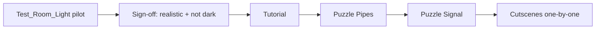

# Baked lighting — all scenes (manager plan)

## Manager summary (read this first)

### What we want

| Goal | Plain language |
|------|----------------|
| **Look** | Warehouse interiors that feel **realistic and readable** — sun + soft pools under wall lamps, **not pitch black** |
| **Performance** | Light **pre-calculated in the Editor** and saved into the room; **low cost during Play** |
| **Process** | Prove the recipe on **`Test_Room_Light`** using **shared room prefabs**, then copy to **each Game scene** after sign-off |

### What “baked” means here (one sentence)

Unity **paints** light onto floors and walls **once** before shipping; at runtime the game **displays that picture** instead of recalculating every lamp every frame.

### Why we use a test scene first

`Test_Room_Light` uses the same **`Wall Light_Lit`** and **room prefabs** (`Room5x5`, `Corner4x4`, `Corner5x5`) that appear in Game levels. Fix lighting **once on prefabs + test scene**, then **rebake each Game scene** — avoids repeating mistakes in every level.

### The recipe (high level)

| Piece | Setting |
|-------|---------|
| **Sun** | One directional light, **Mixed** mode |
| **Wall lamps** | **`Wall Light_Lit`** prefab — **Point** light at bulb, **Mixed** mode |
| **Room** | Floor/walls marked **Static** so they receive baked light |
| **Sky fill** | Interior skybox + moderate ambient (keeps corners from going black) |
| **After any light change** | **Generate Lighting** in Unity, then save scene |

> **Note for tech:** “Mixed” is the asset-pack standard (SciFi Warehouse demo). It **includes baking** for static geometry while staying flexible. Pure “Baked-only” on wall lights without a fresh bake is what caused the recent **dark room** issue.

### Rollout order

**Not in first wave:** `StartScene`, `GameOverScene` (no shared warehouse room today).

### Risks (short)

| Risk | Mitigation |
|------|------------|
| Room goes **dark** after edits | Always **Generate Lighting** after moving lights or changing modes |
| Whole scene turns **yellow** | Use tuned lighting settings (not raw warehouse preset on test scene) |
| Inconsistent look across levels | Same prefabs + same lighting settings asset per scene type |

### Success criteria (manager sign-off)

- ⬜ `Test_Room_Light` in Play Mode: **readable**, **local pools under wall fixtures**, **no yellow wash**
- ⬜ Frame cost: no all-realtime lamp stack on static room geometry
- ⬜ One Game scene rebaked with same prefabs matches pilot look
- ⬜ Documented rebake steps for level designers

---

## Task name

Baked realistic lighting — pilot on `Test_Room_Light`, rollout to all Game warehouse scenes

## Date

2026-07-11

## Scope

- Lock **shared prefab lighting** on `Wall Light_Lit` and room prefabs used in production.
- Validate **baked GI** on **`Assets/Scenes/Test/Test_Room_Light.unity`** (pilot).
- Define **one shared Lighting Settings asset** for Game warehouse scenes (baked ON, tuned indirect — not overly yellow).
- Roll out **Generate Lighting** per Game scene after pilot approval.
- Keep **sun + sky ambient** so interiors are never fully dark.

## Out of scope

- Rewriting puzzle, UI, or gameplay systems.
- Runtime-created lights.
- `StartScene` / `GameOverScene` unless they gain warehouse room prefabs later.
- Committing Game scene rebakes without per-scene visual sign-off.

---

## Approved implementation steps

### Phase 1 — Prefab recipe (blocks everything else)

1. ✅ **`Wall Light_Lit`**: `Wall Light Source` = **Point**, **Mixed**, intensity ~3.5, range ~8; kit wall spot removed from prefab.
2. ✅ **Room prefabs** (`Corner5x5 Variant` in test scene): `Wall Light_Lit` under `_Lights`; Room5x5 static GI ensured via editor tool.
3. ✅ **Sun** scene pattern: one **Mixed** directional light under `_Lights`.

### Phase 2 — Pilot bake (`Test_Room_Light`)

4. ✅ Scene uses **`Test_Room_LightSettings`** — baked GI ON, shadowmask ON, indirect scale ~1.2.
5. ✅ Skybox + ambient ~1.3 (interior-readable).
6. ✅ **Generate Lighting** run via `Who Wired This/Scenes/Bake Lighting (Active Scene, Room5x5)`; `LightingData` + lightmaps updated.
7. ⚠️ **Play Mode sign-off** — user to confirm readable, pools under fixtures, not yellow/dark.

### Phase 3 — Shared settings for Game scenes

8. ⬜ Create or tune **`WhoWiredThis_WarehouseBakedSettings`** — **blocked until pilot sign-off**
9. ⬜ Assign to Game warehouse scenes (replace current `SciFi_WarehouseSettings` where realtime GI is unwanted).

### Phase 4 — Scene-by-scene rollout (after pilot ✅)

10. ⬜ `Tutorial.unity` — assign settings, Generate Lighting, sign-off.
11. ⬜ `Puzzle Pipes.unity` — same.
12. ⬜ `Puzzle Signal.unity` — same.
13. ⬜ Cutscenes with rooms — one at a time (`CutScene-*`).

### Phase 5 — Documentation

14. ⬜ Short **rebake checklist** in plan / README for anyone moving a lamp or changing intensity.

---

## Testing checklist

- ⬜ Scene view **Baked Lightmap** shows pools under wall fixtures on floor
- ⬜ Play Mode: room readable without live-realtime-only lighting
- ⬜ No full-scene yellow cast
- ⬜ Corners and far wall still have ambient fill (not black void)
- ⬜ Dynamic players/props acceptable via existing light probes
- ⬜ Second scene (e.g. Tutorial) matches pilot after rebake
- ⚠️ Manual sign-off on **both displays** if dual-viewport test scene used

---

## Rollback notes

- Git revert prefab or scene commit; restore previous `LightingData` folder for that scene.
- Pilot scene backup: `Test_Room_Light_OLD.unity` / `_BACKUP_2026-07-11/` copies if needed.
- Switching light modes without rebaking causes darkness — rollback = restore Mixed modes + old bake OR rebake from known-good prefab state.

---

## Related

- Prior pilot detail: [test-room-light-interior-sun-lighting.md](test-room-light-interior-sun-lighting.md)
- Reference look: `Assets/Models/SciFi Warehouse Kit/Demo/Scene/SciFi_Warehouse.unity`
