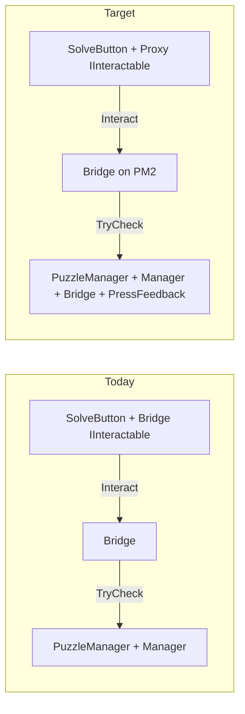

# Move bridge + press feedback to PuzzleManager (wire Solve from there)

## Why a proxy is required

[`MultiDimensionPuzzleInteractableBridge`](Assets/WhoWiredThis/Scripts/Visibility/MultiDimensionPuzzleInteractableBridge.cs) implements [`IInteractable`](Assets/WhoWiredThis/Scripts/Interfaces/IInteractable.cs). Today it lives on the **SolveButton** prefab instance (added component on stripped `8716756151544247228` in scenes like [Split Tutorial.unity](Assets/Scenes/Split Tutorial.unity)), so **player raycasts** and [`PanelFocusController`](Assets/WhoWiredThis/Scripts/PanelFocus/PanelFocusController.cs) (`solveButton` → `interactableReference`) hit that collider/object.

[`MultiDimensionPuzzelManager`](Assets/WhoWiredThis/Scripts/Visibility/MultiDimensionPuzzelManager.cs) already lives on a separate **`PuzzleManager`** GameObject per panel (e.g. `2097925728` / `1340959901` in Split Tutorial) and serializes **`solveButtonInteractable`** (must implement `IInteractable`) for **disable-on-solve** and **`interactionsToDisable`**.

If you **only** move the bridge to `PuzzleManager` with no Solve-side `IInteractable`, **nothing on the Solve mesh will receive `Interact`** unless you reparent colliders or duplicate interaction logic.

## Target architecture

1. **`PuzzleManager` GameObject** (same object as `MultiDimensionPuzzelManager`):
   - Add **`MultiDimensionPuzzleInteractableBridge`**
   - Add **`ActivateButtonFeedbackController`**
   - **`puzzleTargetReference`** on the bridge → **same** `MultiDimensionPuzzelManager` on that GameObject (drag self or `GetComponent` in `Awake` with null warning).

2. **SolveButton GameObject** (unchanged hierarchy / prefab):
   - **Remove** `MultiDimensionPuzzleInteractableBridge` and `ActivateButtonFeedbackController` from prefab **m_AddedComponents** (or replace with one tiny script).
   - Add **`SolveInteractProxy`** (new, ~15–25 lines): `MonoBehaviour, IInteractable`, `[SerializeField] MonoBehaviour bridgeReference` with **`[RequireInterface(typeof(IInteractable))]`** (matches your workspace rule pattern), `Interact` → cast and forward. Optional **`[SerializeField] string promptPassthrough`** or always delegate `GetPromptText` if you also forward prompts (bridge already implements prompt).

3. **Cross-references to update** (per side, Blue/Red):

| Consumer | Change |
|----------|--------|
| [`PanelFocusController`](Assets/WhoWiredThis/Scripts/PanelFocus/PanelFocusController.cs) `solveButton` → `interactableReference` | Point to **Proxy** on Solve (not bridge on Solve). |
| [`MultiDimensionPuzzelManager`](Assets/WhoWiredThis/Scripts/Visibility/MultiDimensionPuzzelManager.cs) `solveButtonInteractable` | Point to **Proxy** (so disable-on-solve disables the object players actually trigger), **or** keep pointing at bridge on manager if you want to disable the coordinator—then you must **also** disable proxy during solve; simpler: **`solveButtonInteractable` = Proxy**. |
| `interactionsToDisable` array | Replace old bridge fileID with **Proxy** where the bridge was listed. |
| [`ProcessingFeedbackController`](Assets/WhoWiredThis/Scripts/Puzzles/Common/ProcessingFeedbackController.cs) `activateInteractable` | Point to **Proxy** (so `enabled = false` still blocks re-clicks during processing, same as today with bridge on Solve). |
| Bridge `pressFeedback` | Stays on bridge; **`ActivateButtonFeedbackController.visualRoot`** → **serialized ref** to Solve’s animated transform (e.g. existing `713330656` / `654811929` stripped transforms—same as today’s feedback targets). |

4. **Coroutine host** in bridge: today `RunActivateFlow` prefers **`PuzzleTarget`** (manager). With bridge on the **same** GameObject as the manager, **`StartCoroutine`** can use **`this`** (the bridge) as host—still valid. Verify **`processingFeedback.activateInteractable`** disables **Proxy**, not the bridge, so disabling bridge does not stop the coroutine.

## Code / asset work breakdown

| Step | Action |
|------|--------|
| 1 | Add **`SolveInteractProxy.cs`** under [`Assets/WhoWiredThis/Scripts/Visibility/`](Assets/WhoWiredThis/Scripts/Visibility/) (or `PanelFocus/` if you prefer proximity to focus). Implement `IInteractable`: forward `Interact` and `GetPromptText` to the bridge reference. |
| 2 | Optionally add **`[ContextMenu]`** or runtime validation: proxy and bridge not on same GO is allowed; warn if bridge null. |
| 3 | **Scenes**: [Split Tutorial.unity](Assets/Scenes/Split Tutorial.unity), [Split Puzzle.unity](Assets/Scenes/Split Puzzle.unity), [Tutorial.unity](Assets/Scenes/Tutorial.unity) — YAML edits: remove bridge/feedback from Solve `m_AddedComponents`; add bridge+feedback to **`PuzzleManager`** `m_Component` list; insert **Proxy** on Solve; rewire all fileIDs above. **Tutorial** already has manager+bridge on same `MultiDimension_PuzzleManager` GO—only needs splitting if bridge is still separate; align with split scenes. |
| 4 | **Prefab** [`64fd3ce83c54d446ab573a94fd98efaf`](Assets) (Board prefab): if Solve bridge is added in **prefab defaults**, update prefab once so new scenes inherit **Proxy + scene-specific bridge on manager** pattern—or keep prefab unchanged and only **scene overrides** (more duplication). Recommend **one prefab edit** if all boards share Solve. |
| 5 | **Docs / tooltips**: Update [`MultiDimensionPuzzelManager`](Assets/WhoWiredThis/Scripts/Visibility/MultiDimensionPuzzelManager.cs) tooltip for `solveButtonInteractable` (“typically **SolveInteractProxy** on the Solve button”). |

## Risks and checks

- **Strip / prefab instance ordering:** After moving components, Unity may regenerate fileIDs; grep scene for stale references to old bridge IDs.
- **Domain / duplicate `IInteractable`:** Ensure only **one** `IInteractable` on Solve (the proxy) to avoid ambiguous `GetComponent<IInteractable>()`.
- **MCP test pass** (from your earlier plan): `read_console` for compile errors; play Split Tutorial; confirm **PanelFocus** log still forwards Solve to proxy and puzzle still checks.

## Optional simplification (later)

If you dislike a proxy, alternative is **`MultiDimensionPuzzelManager` implementing `IInteractable`** and delegating to private/shared flow—but that **mixes** puzzle core with interaction entry and violates “don’t rewrite puzzle surface” more than a 1-file proxy.
