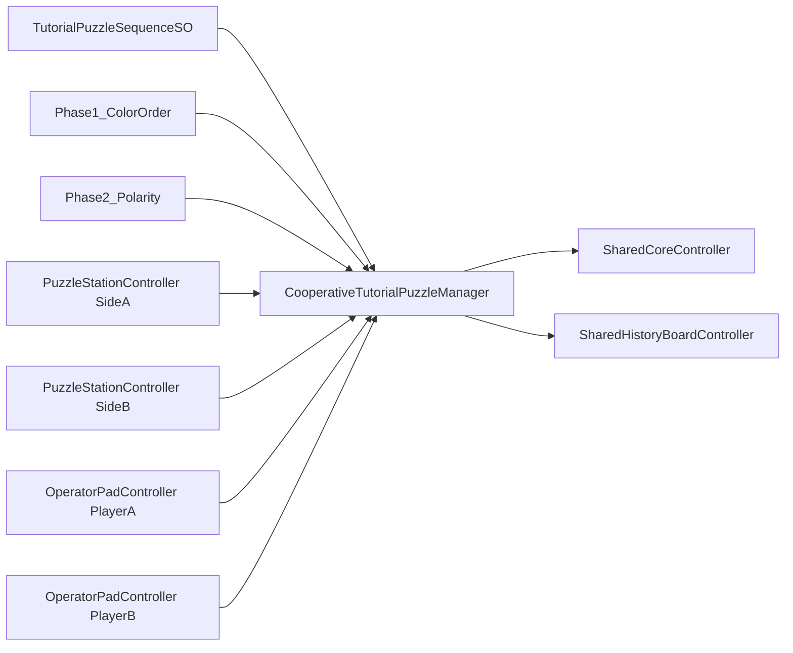

# Cooperative Calibration Tutorial2 Implementation Plan

## Existing Systems To Reuse
- Interaction contract: [`/Users/ilang/git/unity/who-wired-this/Assets/WhoWiredThis/Scripts/Interfaces/IInteractable.cs`](/Users/ilang/git/unity/who-wired-this/Assets/WhoWiredThis/Scripts/Interfaces/IInteractable.cs).
- Local player interaction loop: [`/Users/ilang/git/unity/who-wired-this/Assets/WhoWiredThis/Scripts/Player/PlayerActions.cs`](/Users/ilang/git/unity/who-wired-this/Assets/WhoWiredThis/Scripts/Player/PlayerActions.cs) (uses nearest `IInteractable`, prompt token `$INTERACT$`).
- Player identity conventions: tags `PlayerA`/`PlayerB` and enum [`/Users/ilang/git/unity/who-wired-this/Assets/WhoWiredThis/Scripts/Data/enums/AllowedPlayerTag.cs`](/Users/ilang/git/unity/who-wired-this/Assets/WhoWiredThis/Scripts/Data/enums/AllowedPlayerTag.cs); tutorial slot type [`/Users/ilang/git/unity/who-wired-this/Assets/WhoWiredThis/Scripts/Tutorial/TutorialPlayerSlot.cs`](/Users/ilang/git/unity/who-wired-this/Assets/WhoWiredThis/Scripts/Tutorial/TutorialPlayerSlot.cs).
- Existing first-person assets to reuse: [`/Users/ilang/git/unity/who-wired-this/Assets/FirstPerson/Prefabs/FirstPersonPlayer_A.prefab`](/Users/ilang/git/unity/who-wired-this/Assets/FirstPerson/Prefabs/FirstPersonPlayer_A.prefab), [`/Users/ilang/git/unity/who-wired-this/Assets/FirstPerson/Prefabs/FirstPersonPlayer_B Variant.prefab`](/Users/ilang/git/unity/who-wired-this/Assets/FirstPerson/Prefabs/FirstPersonPlayer_B%20Variant.prefab), plus project variants under [`/Users/ilang/git/unity/who-wired-this/Assets/WhoWiredThis/Prefabs/Players`](/Users/ilang/git/unity/who-wired-this/Assets/WhoWiredThis/Prefabs/Players).
- TMP/world interaction pattern: keep world-space mesh objects with interactable scripts (same pattern as existing tutorial/puzzle interactables), no networking.

## Target Architecture

## Step-by-Step Implementation

### 1) Add New Tutorial2 Puzzle Logic Without Altering Existing Tutorial
- Create all new scripts under a dedicated Tutorial2 path, not the original tutorial folder:
  - [`/Users/ilang/git/unity/who-wired-this/Assets/WhoWiredThis/Scripts/Tutorial2`](/Users/ilang/git/unity/who-wired-this/Assets/WhoWiredThis/Scripts/Tutorial2)
- Introduce/align scripts to requested reusable architecture:
  - `CooperativeTutorialPuzzleManager`
  - `PuzzleStationController`
  - `PuzzleInputSlotController`
  - `PuzzleOptionButtonController` (`IInteractable`)
  - `MachineActionButtonController` (`IInteractable`)
  - `SharedHistoryBoardController`
  - `SharedCoreController`
  - `OperatorPadController`
- Preserve compatibility with current player tags/slot components and existing `PlayerActions` interaction flow.
- Do not modify existing `TutorialRoom` setup or its current coordinator/module flow; Tutorial2 is additive.

### 2) Add ScriptableObject Data Layer
- Create SO classes under Tutorial2 conventions:
  - `PuzzleValueSetSO`
  - `PuzzlePhaseSO`
  - `TutorialPuzzleSequenceSO`
  - `FeedbackMessageSetSO`
- Create assets in dedicated Tutorial2 data folders:
  - [`/Users/ilang/git/unity/who-wired-this/Assets/WhoWiredThis/Data/Tutorial2`](/Users/ilang/git/unity/who-wired-this/Assets/WhoWiredThis/Data/Tutorial2)
  - `Colors_RGB`, `Polarity`
  - `Phase1_ColorOrder`, `Phase2_Polarity`
  - `CooperativeCalibrationTutorialSequence`
  - `DefaultFeedbackMessages`
- Ensure phase assets encode: input/observer player, station IDs, slot count=2, fixed solutions (`G R`, `+ -`), labels/messages.

### 3) Implement Feedback + History + Transitions
- In manager, implement 2-slot Bulls-and-Cows style feedback where metric1 includes aligned matches.
- Enforce `allowDuplicates=false` validation.
- Maintain global attempt history across both phases (do not clear on transition).
- Transition behavior:
  - On phase success, show side-calibrated status.
  - Enter waiting state for observer-side initialize action.
  - Start next phase only after initialize button interaction.
  - Final state updates shared core to `CORE STABILIZED`.

### 4) Build Reusable Two-Sided Machine Prefab Structure
- Create/adjust prefab hierarchy under dedicated Tutorial2 prefab path:
  - [`/Users/ilang/git/unity/who-wired-this/Assets/WhoWiredThis/Prefabs/Tutorial2`](/Users/ilang/git/unity/who-wired-this/Assets/WhoWiredThis/Prefabs/Tutorial2)
  - `CooperativeCalibrationMachine` root
  - `SharedCore`, `SharedHistoryBoard`, `SideA/PuzzleStation`, `SideB/PuzzleStation`
- Keep SideA/SideB physically mirrored but structurally identical; role switches by phase config only.
- Use TMP text components for in-world labels/status and physical mesh buttons/switches for interactions.

### 5) Scene Assembly and Wiring (Unity MCP)
- Duplicate [`/Users/ilang/git/unity/who-wired-this/Assets/Scenes/Starter FirstPerson.unity`](/Users/ilang/git/unity/who-wired-this/Assets/Scenes/Starter%20FirstPerson.unity) into a new scene (e.g. `Assets/Scenes/Tutorial2.unity`) and use that duplicate as the sole POC host.
- Keep existing tutorial scenes/prefabs/data untouched unless a strictly shared reusable script requires extension.
- Keep existing tutorial scenes/prefabs/data untouched, and do not add new files to the original `Tutorial` folders.
- Ensure room includes camera + main directional light baseline.
- Place two local first-person players facing opposite sides of same machine, with line-of-sight across/around machine.
- Wire manager references: sequence asset, both stations, shared core, shared history board, operator pads, action buttons, TMP fields.

### 6) Debug Shortcut Layer
- Add optional debug mode on manager (toggle bool) with keys:
  - `F1` wrong phase1 (`R G`), `F2` correct phase1 (`G R`)
  - `F3` initialize phase2
  - `F4` wrong phase2 (`- +`), `F5` correct phase2 (`+ -`)
  - `F9` reset tutorial
- Emit logs for: phase start, attempt submit, feedback, phase solved, waiting initialize, final stabilized.

### 7) Validation Loop
- After each script batch, compile and check console for new errors/warnings.
- Verify scene flow in play mode against required 20-step acceptance path.
- Verify no networking added; verify both sides use same station structure; verify references are inspector-wired and stable.

## Expected File Impact (Primary)
- Script updates/additions in:
  - [`/Users/ilang/git/unity/who-wired-this/Assets/WhoWiredThis/Scripts/Tutorial2`](/Users/ilang/git/unity/who-wired-this/Assets/WhoWiredThis/Scripts/Tutorial2)
- New SO classes/assets in:
  - [`/Users/ilang/git/unity/who-wired-this/Assets/WhoWiredThis/Data/Tutorial2`](/Users/ilang/git/unity/who-wired-this/Assets/WhoWiredThis/Data/Tutorial2)
  - possibly [`/Users/ilang/git/unity/who-wired-this/Assets/FirstPerson/Data`](/Users/ilang/git/unity/who-wired-this/Assets/FirstPerson/Data) only when reusing existing first-person binding assets
- Prefabs/scenes in:
  - [`/Users/ilang/git/unity/who-wired-this/Assets/WhoWiredThis/Prefabs/Tutorial2`](/Users/ilang/git/unity/who-wired-this/Assets/WhoWiredThis/Prefabs/Tutorial2)
  - [`/Users/ilang/git/unity/who-wired-this/Assets/Scenes/Starter FirstPerson.unity`](/Users/ilang/git/unity/who-wired-this/Assets/Scenes/Starter%20FirstPerson.unity) (read-only source to duplicate)
  - [`/Users/ilang/git/unity/who-wired-this/Assets/Scenes/Tutorial2.unity`](/Users/ilang/git/unity/who-wired-this/Assets/Scenes/Tutorial2.unity) (new target scene)
