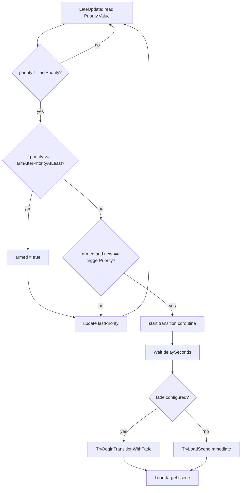

# CutScene-Intro — load next scene when intro camera priority drops

## Scope

Add a small runtime script on **`CinemachineCamera Intro`** in [`CutScene-Intro.unity`](../Assets/Scenes/Game/CutScene-Intro.unity). When the Cinemachine camera **priority changes to `-1`**, wait a configurable delay (default **1 s**), **fade both player HUDs to black**, then load the next scene (configurable name).

Reuse existing scene-load helpers in `WhoWiredThis.Core.SceneTransitionUtility` and **`SceneTransitionFadeOverlay`** (same pattern as `CompletionPopupSceneTransition` / puzzle completion exits).

## Out of scope

- Changing `IntoCamera.anim` or the Animator Controller (unless a false-positive guard is insufficient)
- Wiring StartScene → CutScene-Intro playtest entry (separate follow-up)
- Auto-adding `CutScene-Intro` to Build Settings (already present)

## Scene context (verified)

| Object | Notes |
|--------|--------|
| `CinemachineCamera Intro` | Has `CinemachineCamera` (CM 3.x), `CinemachineSplineDolly`, `Animator` → `IntoCameraAmimController` |
| Initial priority | `Priority.m_Value = 2` in scene |
| `IntoCamera.anim` | Animates `Priority.m_Value`: **-1 → 0** (flythrough) → **-1** at **t = 7.5 s** (handoff) |
| `UI_Canvas` | Prefab instance with **two** `PlayerHudView` (dual-display HUD) — fade targets |
| `NextLevel` | Disabled `SceneTransitionTrigger` → `Puzzle Pipes` (legacy placeholder; leave disabled) |

**Important:** The clip also sets priority **-1 at t = 0**. A naïve “any change to -1” rule can fire at intro **start** (scene value `2` → animated `-1`). The script must **not** load on that first dip.

## Fade effect (in scope)

### Sequence

1. Intro camera priority drops to **`triggerPriority`** (`-1`) after flythrough ends.
2. **Hold** for **`delaySeconds`** (default **1 s**) — last intro frame visible on both displays.
3. **Fade out** all wired **`SceneTransitionFadeOverlay`** instances over **`fadeOutDurationSeconds`** (default **1 s**) via `SceneTransitionUtility.TryBeginTransitionWithFade`.
4. Load **`targetSceneName`**.

Total time from handoff ≈ **delay + fade** (default **~2 s** after t = 7.5 s → load at ~**9.5 s**).

### Overlay wiring

Match [`CompletionPopupSceneTransition.cs`](../Assets/WhoWiredThis/Scripts/Environment/CompletionPopupSceneTransition.cs):

- Serialized **`SceneTransitionFadeOverlay[] fadeOverlays`** on the new component.
- **`Awake` / `ResolveReferences`:** if array empty, auto-collect from both `PlayerHudView` instances on `UI_Canvas` (`PlayerHudView.FadeOverlay` adds overlay if missing).
- Fade runs on **both displays** in parallel (utility already iterates all overlays).

### Fallback

If `fadeOutDurationSeconds <= 0` or no overlays resolve, log warning and fall back to **`TryLoadSceneImmediate`** after delay only (same as `SceneTransitionTrigger`).

## Proposed script

**Path:** `Assets/WhoWiredThis/Scripts/Environment/CinemachinePrioritySceneTransition.cs`  
**Namespace:** `WhoWiredThis.Environment`  
**Host:** same GameObject as `CinemachineCamera Intro` (`[RequireComponent(typeof(CinemachineCamera))]`)

### Serialized fields

| Field | Default | Purpose |
|-------|---------|---------|
| `CinemachineCamera cinemachineCamera` | auto (same GO) | CM 3.x camera to watch |
| `int triggerPriority` | `-1` | Load when priority **changes to** this value |
| `int armAfterPriorityAtLeast` | `0` | Only react after priority was once **≥** this (skips intro-start `-1` glitch) |
| `float delaySeconds` | `1` | Hold after trigger **before** fade begins |
| `bool useUnscaledTime` | `true` | Delay uses unscaled time |
| `string targetSceneName` | `Tutorial` | Next scene (Unity scene **name**, not asset path) |
| `bool ignoreWhenAlreadyInTargetScene` | `true` | No-op if already in target |
| `bool loadOnce` | `true` | Ignore repeat priority changes |
| `float fadeOutDurationSeconds` | `1` | Fade both HUD overlays to black before load |
| `SceneTransitionFadeOverlay[] fadeOverlays` | auto-resolve | Per-player full-screen fade (dual HUD) |

### Runtime flow

1. Cache `lastPriority` on enable (from live `Priority.Value`).
2. Each **LateUpdate** (after Animator applies animation): read `cinemachineCamera.Priority.Value`.
3. If value **≥ `armAfterPriorityAtLeast`**, set `armed = true` (intro camera was live during flythrough).
4. If `armed` and **new value == `triggerPriority`** and **previous ≠ triggerPriority**, start coroutine:
   - `yield return` **delay**
   - **`SceneTransitionUtility.TryBeginTransitionWithFade(this, targetSceneName, fadeOutDurationSeconds, fadeOverlays, ...)`** when fade is configured
   - else **`TryLoadSceneImmediate`**
5. Guard with `loadOnce` / cancel coroutine on disable.

### Why `armAfterPriorityAtLeast = 0`

Matches [`IntoCamera.anim`](../Assets/Animation/IntoCamera.anim):

- Start: `2 → -1 → 0` — not armed yet when first `-1` appears
- Flythrough: priority stays at `0` → **armed**
- End: `0 → -1` → **trigger** hold → fade → load

## Scene wiring (after implementation)

1. Open `CutScene-Intro.unity`.
2. Select **`CinemachineCamera Intro`**.
3. Add **`CinemachinePrioritySceneTransition`**.
4. Inspector:
   - `targetSceneName` → e.g. **`Tutorial`** (confirm with you)
   - `delaySeconds` → **`1`**
   - `fadeOutDurationSeconds` → **`1`**
   - `fadeOverlays` → leave empty for auto-resolve from `UI_Canvas` HUDs, or drag both `PlayerHudView` fade overlays explicitly
   - Leave `triggerPriority` **`-1`**, `armAfterPriorityAtLeast` **`0`**
5. Ensure each **`PlayerHudView`** under `UI_Canvas` has (or auto-gets) **`SceneTransitionFadeOverlay`** — same as Tutorial / puzzle completion scenes.
6. Leave **`NextLevel` / `SceneTransitionTrigger` disabled** (avoid duplicate loads).
7. Confirm target scene is in **Build Settings** (Tutorial already is).

## Testing checklist

- ⚠️ Enter Play Mode on `CutScene-Intro`; intro flythrough runs (~7.5 s)
- ⚠️ Scene does **not** load or fade in the first second (no start false-positive)
- ⚠️ After handoff: **1 s hold**, then **both displays fade to black** over **1 s**
- ⚠️ **`Tutorial`** loads after fade completes (~**9.5 s** total from start)
- ⚠️ `loadOnce`: priority flicker does not double-load or double-fade
- ⚠️ Empty / missing build scene name → warning, no crash
- ⚠️ Missing HUD overlays → warning + immediate load after delay (fallback)

## Rollback notes

Remove component from `CinemachineCamera Intro` and delete script file; scene unchanged otherwise.

## Implementation notes (2026-05-30)

- Script: `Assets/WhoWiredThis/Scripts/Environment/CinemachinePrioritySceneTransition.cs`
- Component added to **`CinemachineCamera Intro`** in `CutScene-Intro.unity` via Unity MCP
- Defaults: `targetSceneName = Tutorial`, `delaySeconds = 1`, `fadeOutDurationSeconds = 1`, `triggerPriority = -1`, `armAfterPriorityAtLeast = 0`
