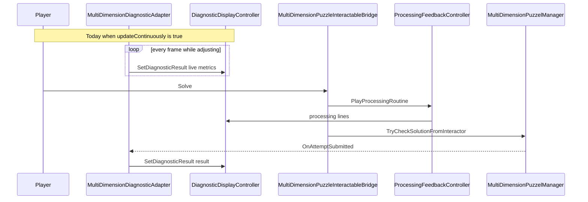
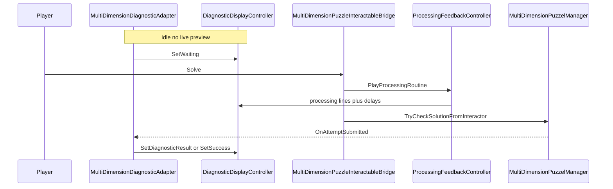

# Diagnostic result only after Solve (post-processing)

## What you want vs what happens today

Today, **[`MultiDimensionDiagnosticAdapter`](Assets/WhoWiredThis/Scripts/Puzzles/Common/MultiDimensionDiagnosticAdapter.cs)** with **`updateContinuously: 1`** (all your scenes: Split Tutorial, Split Puzzle, Tutorial) calls **`RefreshDisplay`** every **`Update`**, so the diagnostic **already shows “result-like” metrics before** the player presses Solve.

The **Solve → processing → check** order is **already correct** in **[`MultiDimensionPuzzleInteractableBridge`](Assets/WhoWiredThis/Scripts/Visibility/MultiDimensionPuzzleInteractableBridge.cs)** (`yield return processingFeedback.PlayProcessingRoutine()` then **`TryCheckSolutionFromInteractor`**). The manager raises **`OnAttemptSubmitted`** only after the check, and the adapter refreshes there. So “**result after processing delay**” is satisfied for the **attempt outcome** as long as nothing else writes the body during processing (your **`BeginBodyWriteSuppress`** path already prevents the adapter from overwriting body text during processing; lamp may still update if you care later).

## Target behavior

1. **Before Solve:** diagnostic stays on **waiting** (or equivalent), **not** live partial metrics while sliders move.
2. **After Solve:** processing lines run for their configured duration, **then** the check runs and the adapter shows the **real** outcome once.

## Code changes

### 1. [`MultiDimensionDiagnosticAdapter.cs`](Assets/WhoWiredThis/Scripts/Puzzles/Common/MultiDimensionDiagnosticAdapter.cs)

When **`updateContinuously` is false** (use this as the “commit-only” mode; no new public API required):

- **`OnEnable`:** instead of always **`RefreshDisplay(force: true)`**, do:
  - If **`puzzleManager.Solved`** → **`RefreshDisplay(force: true)`** (show calibrated success on load if applicable).
  - Else → **`diagnosticDisplay.SetWaiting()`** (and keep **`lastRecognized` / `lastAligned` / `lastTotal` / `lastSolved`** in a state so the **first** **`OnAttemptSubmitted`** still forces a real refresh — e.g. leave sentinels or set them so the first post-attempt refresh is not skipped).
- **`Update`:** already returns when **`!updateContinuously`** — no change.
- **`HandleAttemptSubmitted`:** keep **`RefreshDisplay(force: true)`** — this is the only path that updates the body after an attempt when continuous is off.

Optional polish (only if you want zero “stale metrics” flash): ensure **`SetWaiting`** path does not immediately get overwritten by another component on the same frame (unlikely).

### 2. Scene / prefab data

Turn off live preview where you want this UX:

- **[`Assets/Scenes/Split Tutorial.unity`](Assets/Scenes/Split Tutorial.unity)** — both **`MultiDimensionDiagnosticAdapter`** blocks: set **`updateContinuously: 0`**.
- Same for **[`Split Puzzle.unity`](Assets/Scenes/Split Puzzle.unity)** and **[`Tutorial.unity`](Assets/Scenes/Tutorial.unity)** if you want consistent behavior across scenes.

Inspector default in script can stay **`true`** for backward compatibility; scenes that need “only after Solve” opt out explicitly.

### 3. Processing timing (optional product tweak)

If “**after** processing message **delay**” should include a **pause after the last line** before the check (not only between lines), add **`[SerializeField] float delayAfterLastLine`** (default **0**) on **[`ProcessingFeedbackController`](Assets/WhoWiredThis/Scripts/Puzzles/Common/ProcessingFeedbackController.cs)** and **`yield return WaitForSecondsRealtime`** after the loop, **before** the bridge calls **`TryCheckSolutionFromInteractor`**. Omit if the current “last line visible for `timePerMessage` then check” is enough.

### 4. No change required to

- **[`MultiDimensionPuzzelManager`](Assets/WhoWiredThis/Scripts/Visibility/MultiDimensionPuzzelManager.cs)** — check timing stays event-driven from the bridge.
- **`DiagnosticDisplayController` body suppress** — still valid so **`Update`-driven adapter** does not stomp processing text **if** you ever leave continuous on in a scene that also uses processing.

## Verification

- **Split Tutorial:** adjust sliders — body stays **waiting** (no live SETTINGS OK / PLACES OK counts).
- Press **Solve** — three processing lines on the correct **`Body_TMP`**, then metrics/message for that attempt.
- After **solve** success — success message persists; continuous off avoids overwriting success with `Update`.

## Risk / note

With **`updateContinuously: false`**, changing sliders **after** a failed attempt **does not** update the diagnostic until the next **Solve**; that matches “result only after try solve.” If you later want “preview after first attempt only,” that would be a follow-up flag.
