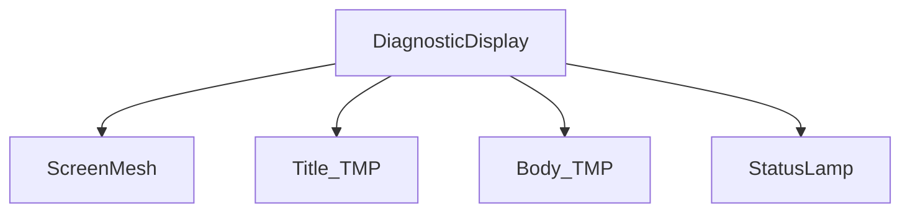

## Defaults (called out so you can flag before I execute)

- New script lives in `WhoWiredThis.Puzzles.Common`, next to [HistoryBoardController.cs](Assets/WhoWiredThis/Scripts/Puzzles/Common/HistoryBoardController.cs).
- Class name: `DiagnosticDisplayController`. No new shared data type — the controller takes primitives.
- Scene object is authored directly into [Tutorial3.unity](Assets/Scenes/Tutorial3.unity) as a sibling of `HistoryBoard` (not a prefab in this task — HistoryBoard isn't a prefab either). A short note on saving as a prefab is included at the end if you want it.
- Reuses HistoryBoard's already-authored visuals: font asset guid `0fa373e2af9b045ba822079a9fd0c9ef` (monospace SDF), green `m_fontColor` `(0.337, 0.708, 0.351, 1)`, root material guid `40d4c495e8a3144408c463ca512f7e2f`, `ScreenMesh` material guid `105a0f04b376346a4ae3860ed1bfd1ad`, font size **0.8**, title `m_HorizontalAlignment: 2` (center), `m_overflowMode: 1` (overflow).
- `OptionalStatusLamp` (`statusLampRenderer`) is implemented as an inspector reference plus optional per-state material swap fields; if no renderer is assigned, the script silently skips the swap.
- Debug shortcuts use legacy `UnityEngine.Input.GetKeyDown` (matches HistoryBoard convention).

## New script

[Assets/WhoWiredThis/Scripts/Puzzles/Common/DiagnosticDisplayController.cs](Assets/WhoWiredThis/Scripts/Puzzles/Common/DiagnosticDisplayController.cs)

- Namespace `WhoWiredThis.Puzzles.Common`.
- Inspector fields:
  - `[SerializeField] TMP_Text titleText`
  - `[SerializeField] TMP_Text bodyText`
  - `[SerializeField] Renderer statusLampRenderer` (optional)
  - `[SerializeField] string title = "DIAGNOSTIC"`
  - `[SerializeField] string separatorLine = "----------------"`
  - `[SerializeField] string waitingText = "WAITING FOR\nNEXT ATTEMPT..."`
  - `[SerializeField] string clearText = "NO DATA"`
  - `[SerializeField] int metricLabelMinWidth = 10` (so `RECOGNIZED:` and `ALIGNED:` align cleanly even though the labels are passed in by the caller)
  - Optional lamp materials (only used if `statusLampRenderer` is assigned): `Material lampWaitingMaterial`, `Material lampResultMaterial`, `Material lampSuccessMaterial`, `Material lampErrorMaterial`, `Material lampClearMaterial`.
  - `[Header("Debug")] bool enableDebugInput`, plus inspector-tweakable sample strings used by the keyboard shortcuts.
- Internal state: a single `DisplayState` enum (`Clear / Waiting / Result / Success / Error`) for tracking and lamp swap. No data is held beyond what's needed to re-render.
- Public API:
  - `void Clear()` — body = `clearText`, lamp = clear material (if assigned).
  - `void SetWaiting()` — body = `waitingText`.
  - `void SetDiagnosticResult(string metric1Label, int metric1Value, int metric1Max, string metric2Label, int metric2Value, int metric2Max, string message)` — formats body using padded labels (right-aligned colons via `metricLabelMinWidth`), inserts a blank line between metrics and `message`. `message` is rendered verbatim, so callers can include `\n` (matches the example "CORRECT SIGNALS,\nWRONG ORDER").
  - `void SetSuccess(string message)` — body = just `message` under the title/separator.
  - `void SetError(string message)` — body = just `message` under the title/separator.
- `Awake()` calls `SetWaiting()` so the panel reads correctly in edit/play mode without manual init.
- `Update()` polls debug input only when `enableDebugInput`:
  - `D` → `SetDiagnosticResult("RECOGNIZED", 2, 2, "ALIGNED", 0, 2, "CORRECT SIGNALS,\nWRONG ORDER.")`
  - `Shift+D` → `SetSuccess("A-SIDE CALIBRATED")`
  - `C` → `Clear()`
- `[ContextMenu]` shortcuts mirror the keyboard (`Show Sample Result`, `Show Sample Success`, `Set Waiting`, `Clear`).
- Render layout (all written to `bodyText.text`):

```text
{separatorLine}
{label1Padded} {value1} / {max1}
{label2Padded} {value2} / {max2}

{message}
```

Title text is set to `title` once in `Awake()` and never touched again.

## Scene wiring (Unity MCP, via the same flow used for HistoryBoard)

Operating on the live Unity instance `who-wired-this@83d43727124ae4b2`, in [Tutorial3.unity](Assets/Scenes/Tutorial3.unity).



Steps the agent will run via `manage_gameobject` / `manage_components`:

1. `find_gameobjects` for `HistoryBoard`, read its Transform (position, rotation, scale) and root MeshRenderer material via the components resource.
2. Create `DiagnosticDisplay` next to it. Default offset: same Y/Z, X shifted by `-1.5` along the panel's local right (i.e. mounted next to HistoryBoard on the same machine face). Same rotation, same root mesh, same root material guid `40d4c495e8a3144408c463ca512f7e2f`. **If you want a different placement, say so before I run** — easy to change with one number.
3. Create child `ScreenMesh` (Quad), reusing material guid `105a0f04b376346a4ae3860ed1bfd1ad`. Remove the auto-added MeshCollider (matches HistoryBoard's ScreenMesh, which has none).
4. Create child `Title_TMP` (3D `TextMeshPro`). Apply: font asset `0fa373e2af9b045ba822079a9fd0c9ef`, font color `(0.337, 0.708, 0.351, 1)`, `fontSize` 0.8, `horizontalAlignment` 2 (center), `overflowMode` 1, default text "DIAGNOSTIC".
5. Create child `Body_TMP` (3D `TextMeshPro`). Same font asset / color / size; `horizontalAlignment` 1 (left) so the metric rows align by leading column; `overflowMode` 1.
6. Create child `StatusLamp` (small Quad or Cube) parented to the panel — a renderer-only node that the controller can material-swap. Default: a Quad with the existing `Mat_LightOff` material; the four state materials are left empty in the Inspector and can be assigned later.
7. Add `WhoWiredThis.Puzzles.Common.DiagnosticDisplayController` to `DiagnosticDisplay` and set: `titleText` → Title_TMP, `bodyText` → Body_TMP, `statusLampRenderer` → StatusLamp's MeshRenderer.
8. `manage_scene save` to persist.

Known MCP quirk seen on the previous wiring: setting `MeshRenderer.material` / `sharedMaterial` from MCP returns a property-not-found error. The screen and panel materials assigned to primitives at creation already inherit Unity's default; if the Quad doesn't pick up the dark screen material via `manage_components`, the agent will fall back to writing the `m_Materials` reference into the scene YAML directly (same approach used for the HistoryBoard `inputOrder` fix). I'll surface this only if it actually fails.

## How to call from another script later

```csharp
[SerializeField] private DiagnosticDisplayController diagnosticDisplay;

// after a wrong attempt (Phase 1)
diagnosticDisplay.SetDiagnosticResult(
    "RECOGNIZED", 2, 2,
    "ALIGNED",    0, 2,
    "CORRECT SIGNALS,\nWRONG ORDER.");

// after a correct attempt
diagnosticDisplay.SetSuccess("A-SIDE CALIBRATED");

// to reset
diagnosticDisplay.SetWaiting();
diagnosticDisplay.Clear();
```

Whatever calculates the metrics (a future Phase Manager / private diagnostic adapter) is not in scope here — this controller only renders.

## How to test in Play Mode

1. Tick `Enable Debug Input` on `DiagnosticDisplay`.
2. Press `D` → Phase-1 sample result.
3. Press `Shift+D` → success message.
4. Press `C` → clear ("NO DATA").
5. Untoggle `Enable Debug Input` for delivery.

Inspector context-menu items on the component (`Set Waiting`, `Show Sample Result`, `Show Sample Success`, `Clear`) work in edit mode too if you don't want to enter Play.

## Acceptance check

- New script compiles (`dotnet build Assembly-CSharp.csproj`).
- `DiagnosticDisplay` exists in Tutorial3, visually matches HistoryBoard (same screen mesh material, same font asset/color/size).
- Uses world TextMeshPro, no Canvas.
- Controller responds to all five state methods + debug shortcuts.
- No reference to validator, buttons, phase, or solution code anywhere in the new file.

## Optional follow-up (not in scope unless asked)

- Save `DiagnosticDisplay` as a prefab under `Assets/WhoWiredThis/Prefabs/Common/` so it can be reused across scenes.
- Add a `MultiDimensionDiagnosticAdapter` (parallel to `MultiDimensionHistoryAdapter`) that subscribes to `OnAttemptSubmitted` and computes the metrics. This is the natural Stage-B counterpart, but per your instruction it is left out for now.