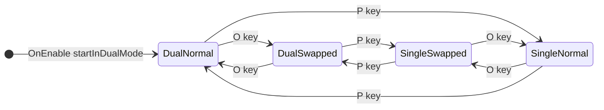

# Dual viewport display swap toggle

## Task name

`DualSingleViewportSwitcher` — `toggleSwitchKey` display swap (left ↔ Display 2 / right ↔ Display 1)

## Date

2026-07-11

## Scope

- Wire the existing but unused `toggleSwitchKey` field (`KeyCode.O` default) on [`DualSingleViewportSwitcher.cs`](../Assets/WhoWiredThis/Scripts/Core/DualSingleViewportSwitcher.cs).
- On each key press, **toggle** a `displaysSwapped` runtime flag and re-apply the current layout (dual or single).
- **Dual mode (primary request):**
  - **Normal:** first camera → `Left_Half_Display1`, second camera → `Right_Half_Display1` (unchanged default).
  - **Swapped:** first camera → `Left_Half_Display2`, second camera → `Right_Half_Display1`.
  - Press again → back to normal.
- **Single mode (recommended for consistency):**
  - **Normal:** `Full_Display1` + `Full_Display2`.
  - **Swapped:** `Full_Display2` + `Full_Display1`.
- Extend [`ViewportPreset`](../Assets/WhoWiredThis/Scripts/Data/enums/ViewportPreset.cs) and [`CameraViewportPresetApplier`](../Assets/WhoWiredThis/Scripts/Core/CameraViewportPresetApplier.cs) with half-viewport presets on Display 2 (`Left_Half_Display2`, `Right_Half_Display2`).
- Use legacy `Input.GetKeyDown` (matches `toggleKey` and project debug-input pattern).

## Out of scope

- New Input System bindings or rebinding UI.
- On-screen HUD indicator for swap state.
- Scene/prefab rewiring beyond optional explicit `toggleSwitchKey` serialization on `Managers.prefab` / `StartScene` / `GameOverScene` (defaults already work).
- Changing dual/single rect geometry (still 50/50 split; only `targetDisplay` changes for the left camera in swapped dual).

## Current state

| Piece | Status |
|-------|--------|
| `toggleKey` (`P`) | Wired — toggles dual ↔ single layout |
| `toggleSwitchKey` (`O`) | **Serialized but not wired** in `Update()` |
| `ViewportPreset` | Only half presets exist for Display 1 |
| Scenes using switcher | `StartScene`, `GameOverScene`, `Managers.prefab`, `SampleScene` |

## Approved implementation steps

### 1. Extend `ViewportPreset` enum

Append (do **not** reorder — preserves existing serialized ints):

```csharp
Left_Half_Display2,   // rect (0,0,0.5,1), targetDisplay = 1
Right_Half_Display2,  // rect (0.5,0,0.5,1), targetDisplay = 1
```

### 2. Extend `CameraViewportPresetApplier.ApplyPreset`

Add switch cases mirroring Display 1 half presets but with `targetDisplay = 1`.

### 3. Update `DualSingleViewportSwitcher`

- Add `private bool displaysSwapped`.
- In `Update()`, on `Input.GetKeyDown(toggleSwitchKey)` → `ToggleDisplaySwap()`.
- `ToggleDisplaySwap()`: flip `displaysSwapped`, call `ApplyCurrentLayout()`.
- Refactor `ApplyCurrentLayout()` to resolve **effective** presets:

| Mode | `displaysSwapped == false` | `displaysSwapped == true` |
|------|---------------------------|---------------------------|
| Dual | `firstDualPreset`, `secondDualPreset` | `Left_Half_Display2`, `Right_Half_Display1` |
| Single | `firstSinglePreset`, `secondSinglePreset` | `Full_Display2`, `Full_Display1` |

- Add `[ContextMenu("Toggle Display Swap")]` on `ToggleDisplaySwap()` for editor testing.
- Reset `displaysSwapped = false` in `OnEnable()` when applying initial layout (or preserve across enable — **default: reset to false** so scenes start predictable).

### 4. Compile & validate

- Unity compiles with zero errors (player build safe — no `UnityEditor` usage).
- Manual test on two-monitor setup.

## Behavior diagram



**DualNormal:** left half → Display 1, right half → Display 1  
**DualSwapped:** left half → Display 2, right half → Display 1  
**SingleNormal:** cam1 full → Display 1, cam2 full → Display 2  
**SingleSwapped:** cam1 full → Display 2, cam2 full → Display 1  

## Files likely touched

| File | Change |
|------|--------|
| `Assets/WhoWiredThis/Scripts/Data/enums/ViewportPreset.cs` | +2 enum values |
| `Assets/WhoWiredThis/Scripts/Core/CameraViewportPresetApplier.cs` | +2 switch cases |
| `Assets/WhoWiredThis/Scripts/Core/DualSingleViewportSwitcher.cs` | Wire `toggleSwitchKey`, swap state, apply logic |

## Inspector / wiring

- **No new references** — reuses existing `firstCameraApplier` / `secondCameraApplier`.
- `toggleSwitchKey` already defaults to `KeyCode.O`; scenes without the field pick up the default after script reload.
- Optional: save `Managers.prefab` so `toggleSwitchKey` is explicit in YAML.

## Testing checklist

- ⬜ Unity compiles; player build succeeds (no editor-only imports).
- ⬜ **Dual mode:** `P` not pressed; press `O` → left viewport moves to Display 2, right stays Display 1.
- ⬜ **Dual mode:** press `O` again → restores left/right both on Display 1 (default dual presets).
- ⬜ **Single mode:** `P` to single; `O` swaps which camera is full on Display 1 vs Display 2.
- ⬜ `toggleKey` (`P`) still toggles dual/single without losing swap state (swap flag independent of layout mode).
- ⬜ Context menu **Toggle Display Swap** works in editor Play Mode.
- ⚠️ Two physical monitors connected for meaningful visual verification.

## Risks

| Risk | Mitigation |
|------|------------|
| Enum reorder breaks serialized presets | Append new values only at end of `ViewportPreset` |
| Single-monitor dev machine | Swap still changes `targetDisplay`; verify with log or dual monitors |
| `displaysSwapped` persists unexpectedly | Reset to `false` in `OnEnable` unless user asks to persist |

## Rollback notes

- Revert the three script files via Git.
- No scene/prefab changes required for rollback if only scripts were edited.
