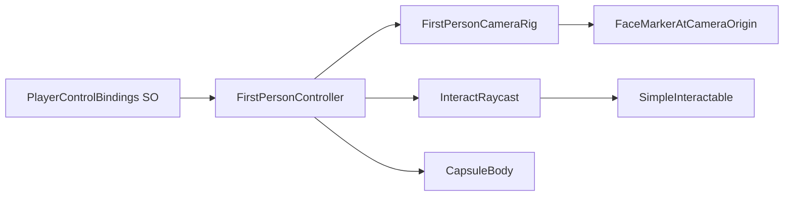

# FirstPerson prototype setup plan

## Relevant patterns found in existing third-person implementation

- Feature is self-contained under `[/Users/ilang/git/unity/who-wired-this/Assets/ThirdPersonMixamo](/Users/ilang/git/unity/who-wired-this/Assets/ThirdPersonMixamo)` with predictable subfolders (`Scripts`, `Prefabs`, `Data`, docs).
- Input binding pattern uses ScriptableObject in `[/Users/ilang/git/unity/who-wired-this/Assets/ThirdPersonMixamo/Scripts/PlayerControlBindings.cs](/Users/ilang/git/unity/who-wired-this/Assets/ThirdPersonMixamo/Scripts/PlayerControlBindings.cs)`, then per-player assets in `Data/` (PlayerA/PlayerB), assigned via prefab serialized fields.
- Scene naming pattern is `FeatureName_Mode` (single and duel), currently in root feature folder (e.g. `ThirdPersonMixamo_Single.unity`, `ThirdPersonMixamo_Duel.unity`).
- Prefab composition pattern splits player and camera prefabs, then wrapper setup prefabs for scenario variants.
- The current project already includes shared player/input systems under `[/Users/ilang/git/unity/who-wired-this/Assets/WhoWiredThis/Scripts/Player](/Users/ilang/git/unity/who-wired-this/Assets/WhoWiredThis/Scripts/Player)`, so first-person prototype should stay isolated and only reuse simple, proven ideas.

## Proposed FirstPerson folder/file plan

- Create feature root: `[/Users/ilang/git/unity/who-wired-this/Assets/FirstPerson](/Users/ilang/git/unity/who-wired-this/Assets/FirstPerson)`
- Add subfolders:
  - `[/Users/ilang/git/unity/who-wired-this/Assets/FirstPerson/Scripts](/Users/ilang/git/unity/who-wired-this/Assets/FirstPerson/Scripts)`
  - `[/Users/ilang/git/unity/who-wired-this/Assets/FirstPerson/Prefabs](/Users/ilang/git/unity/who-wired-this/Assets/FirstPerson/Prefabs)`
  - `[/Users/ilang/git/unity/who-wired-this/Assets/FirstPerson/Data](/Users/ilang/git/unity/who-wired-this/Assets/FirstPerson/Data)`
  - `[/Users/ilang/git/unity/who-wired-this/Assets/FirstPerson/Scenes](/Users/ilang/git/unity/who-wired-this/Assets/FirstPerson/Scenes)`
  - `[/Users/ilang/git/unity/who-wired-this/Assets/FirstPerson/README.md](/Users/ilang/git/unity/who-wired-this/Assets/FirstPerson/README.md)`

Planned new runtime scripts:

- `PlayerControlBindings.cs` (ScriptableObject with `move/look/interact` keys or equivalent minimal fields matching third-person style)
- `FirstPersonController.cs` (movement, look, interact dispatch)
- `FirstPersonCameraRig.cs` (camera pitch/yaw handling and rig references)
- `SimpleInteractable.cs` (minimal interaction test target; toggle state/color/log)

Planned data assets:

- `PlayerControlBindings_PlayerA.asset`
- `PlayerControlBindings_PlayerB.asset`

Planned prefabs:

- `FirstPersonPlayer_A.prefab`
- `FirstPersonPlayer_B.prefab`
- `FirstPersonCamera_A.prefab`
- `FirstPersonCamera_B.prefab`
- `SimpleInteractable.prefab`

Planned scenes:

- `FirstPerson_Single.unity`
- `FirstPerson_Duel.unity`

## Implementation approach (step-by-step)

1. Build feature skeleton in `Assets/FirstPerson` and add namespaces/classes matching existing coding style.
2. Implement ScriptableObject control bindings first, then create PlayerA/PlayerB assets.
3. Implement minimal first-person controller:
  - Walking movement only (no extra polish).
  - The camera look where the player is going (turn left right back - like a human that chang its vision)
  - Interact key event/raycast trigger for nearby target - can be configured in inpector
4. Assemble prefab hierarchy:
  - Capsule body root.
  - Camera child rig.
  - Face marker (small sphere/circle proxy) placed at camera local origin.
  - Hide/disable self-obstructive geometry for local camera view while preserving remote visibility behavior.
5. Create minimal interactable prefab and wire interaction feedback (state/color/log).
6. Create `FirstPerson_Single` scene with one player + interactable target.
7. Create `FirstPerson_Duel` scene with two players facing each other to validate visible capsule + face marker orientation.
8. Run compile/error checks, then update README with setup, structure, controls, and extension points.

## Scene/prefab interaction flow

## Validation checklist

- Project compiles with no new errors after script creation.
- `FirstPersonPlayer` prefab moves, looks, and triggers interact.
- Face marker is at camera local origin and visible from other participant perspective.
- Single scene verifies movement + interact pipeline.
- Duel scene verifies two participants can visually read each other orientation via capsule + face marker.
- README documents how to open scenes, test controls, and swap bindings.

## Notes on scope control

- No external packages will be added.
- No networking redesign; duel scene remains internal/local prototype demonstration.
- Keep implementation minimal and reusable, with straightforward extension points for future co-op experiments.

