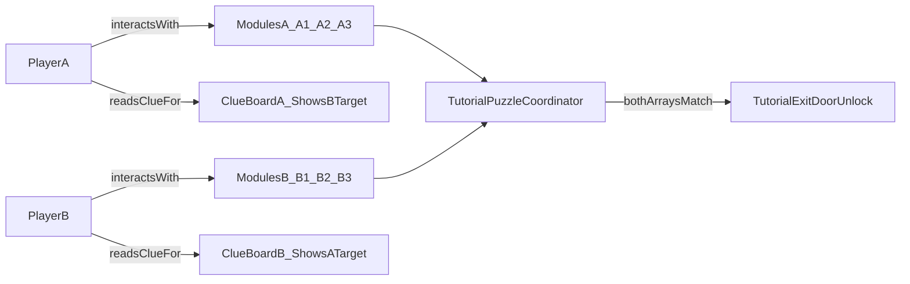

# FirstPerson Tutorial Room Implementation Plan

## 1) Existing reusable assets and systems found in the project

- **First-person player base (already working)**
  - `[/Users/ilang/git/unity/who-wired-this/Assets/FirstPerson/Scripts/FirstPersonController.cs](/Users/ilang/git/unity/who-wired-this/Assets/FirstPerson/Scripts/FirstPersonController.cs)`
  - `[/Users/ilang/git/unity/who-wired-this/Assets/FirstPerson/Prefabs/FirstPersonPlayer_A.prefab](/Users/ilang/git/unity/who-wired-this/Assets/FirstPerson/Prefabs/FirstPersonPlayer_A.prefab)`
  - `[/Users/ilang/git/unity/who-wired-this/Assets/FirstPerson/Prefabs/FirstPersonPlayer_B Variant.prefab](/Users/ilang/git/unity/who-wired-this/Assets/FirstPerson/Prefabs/FirstPersonPlayer_B%20Variant.prefab)`
  - `[/Users/ilang/git/unity/who-wired-this/Assets/FirstPerson/Data/PlayerControlBindings_PlayerA.asset](/Users/ilang/git/unity/who-wired-this/Assets/FirstPerson/Data/PlayerControlBindings_PlayerA.asset)`
  - `[/Users/ilang/git/unity/who-wired-this/Assets/FirstPerson/Data/PlayerControlBindings_PlayerB.asset](/Users/ilang/git/unity/who-wired-this/Assets/FirstPerson/Data/PlayerControlBindings_PlayerB.asset)`
- **Interaction contract and selected interaction stack**
  - `[/Users/ilang/git/unity/who-wired-this/Assets/WhoWiredThis/Scripts/Interfaces/IInteractable.cs](/Users/ilang/git/unity/who-wired-this/Assets/WhoWiredThis/Scripts/Interfaces/IInteractable.cs)`
  - `[/Users/ilang/git/unity/who-wired-this/Assets/WhoWiredThis/Scripts/Player/PlayerActions.cs](/Users/ilang/git/unity/who-wired-this/Assets/WhoWiredThis/Scripts/Player/PlayerActions.cs)`
  - `[/Users/ilang/git/unity/who-wired-this/Assets/WhoWiredThis/Scripts/Player/PlayerInputBridge.cs](/Users/ilang/git/unity/who-wired-this/Assets/WhoWiredThis/Scripts/Player/PlayerInputBridge.cs)`
- **Player-specific visibility foundations already present**
  - Layers/tags in `[/Users/ilang/git/unity/who-wired-this/ProjectSettings/TagManager.asset](/Users/ilang/git/unity/who-wired-this/ProjectSettings/TagManager.asset)` (`PlayerA`, `PlayerB`, `DimensionA`, `DimensionB`)
  - `[/Users/ilang/git/unity/who-wired-this/Assets/WhoWiredThis/Scripts/Visibility/DimensionVisibilityObject.cs](/Users/ilang/git/unity/who-wired-this/Assets/WhoWiredThis/Scripts/Visibility/DimensionVisibilityObject.cs)`
  - `[/Users/ilang/git/unity/who-wired-this/Assets/WhoWiredThis/Scripts/Puzzles/Common/PolaritySwitchController.cs](/Users/ilang/git/unity/who-wired-this/Assets/WhoWiredThis/Scripts/Puzzles/Common/PolaritySwitchController.cs)`
  - `[/Users/ilang/git/unity/who-wired-this/Assets/WhoWiredThis/Scripts/Data/enums/AllowedPlayerTag.cs](/Users/ilang/git/unity/who-wired-this/Assets/WhoWiredThis/Scripts/Data/enums/AllowedPlayerTag.cs)`
- **Viewport/splitscreen utility**
  - `[/Users/ilang/git/unity/who-wired-this/Assets/WhoWiredThis/Scripts/Core/DualSingleViewportSwitcher.cs](/Users/ilang/git/unity/who-wired-this/Assets/WhoWiredThis/Scripts/Core/DualSingleViewportSwitcher.cs)`
- **Clue/display baseline**
  - `[/Users/ilang/git/unity/who-wired-this/Assets/WhoWiredThis/Scripts/Interactables/ClueInteractable.cs](/Users/ilang/git/unity/who-wired-this/Assets/WhoWiredThis/Scripts/Interactables/ClueInteractable.cs)`

## 2) What to reuse and why

- **Reuse as-is**
  - `FirstPersonPlayer_A` + `FirstPersonPlayer_B Variant` for local 2-player movement setup and known key profiles.
  - `IInteractable` to keep all tutorial modules interoperable with current interaction architecture.
  - `PlayerActions`/`PlayerInputBridge` as requested interaction stack, for consistent prompt + interact handling.
  - `DimensionVisibilityObject` for per-player object visibility and placeholder swap behavior without custom rendering systems.
  - `PolaritySwitchController` where possible for 3-state interaction modules (already supports per-player restriction via `AllowedPlayerTag`).
- **Reuse with light adaptation (wrapper/composition, not rewrite)**
  - Add a tiny adapter component on first-person player prefabs so `PlayerActions` can read first-person interact input cleanly (bridge between existing first-person input and `PlayerActions` expectations).
  - Reuse clue interaction pattern from `ClueInteractable`, but with per-station configurable clue text and non-scoring behavior.
- **Do not reuse for this tutorial**
  - Inventory/socket/test-button loop (overkill for tutorial objective and tied to global singleton state).
  - Old/demo scenes and duel demo scenes as direct scene base (use only as reference).

## 3) What new prefabs are needed

Create under:

- `[/Users/ilang/git/unity/who-wired-this/Assets/WhoWiredThis/Prefabs/Tutorial](/Users/ilang/git/unity/who-wired-this/Assets/WhoWiredThis/Prefabs/Tutorial)`

New prefabs:

- `TutorialRoomShell.prefab`
  - Small shared room shell, exit door mesh, two opposite stations, line-of-sight preserved.
- `TutorialPuzzleModule.prefab`
  - Shared base 3-state module prefab (primitive-only visuals), configured per player via config asset + per-instance override values.
- `TutorialClueBoard.prefab`
  - Shared base clue board prefab that displays opposite player target clue using config data.
- `TutorialExitDoor.prefab`
  - Locked/unlocked state via material/child-state swap (no animation).
- `TutorialStation.prefab`
  - Shared station container prefab composed of `TutorialPuzzleModule x3` + `TutorialClueBoard x1`, parameterized by player config.

## 4) What new scripts are needed

Create under:

- `[/Users/ilang/git/unity/who-wired-this/Assets/WhoWiredThis/Scripts/Tutorial](/Users/ilang/git/unity/who-wired-this/Assets/WhoWiredThis/Scripts/Tutorial)`

Script list and responsibilities:

- `TutorialPlayerSlot.cs`
  - Explicit player identity component (`PlayerA` or `PlayerB`) on each player root.
  - Used by tutorial interactables/checkers; avoids implicit tag assumptions.
- `TutorialModuleState.cs`
  - Minimal interactable module state (0/1/2) with visual state swap (material/child active).
  - Optional mode to wrap/reuse `PolaritySwitchController` state mapping if attached.
- `TutorialModuleAccessGate.cs`
  - Enforces who can interact (`PlayerA` vs `PlayerB`) by checking `TutorialPlayerSlot` and/or tags.
  - Keeps module permission logic separate from module visuals/state.
- `TutorialClueBoardDisplay.cs`
  - Stores and exposes clue text / target state array for the opposite player’s station.
  - Optional `IInteractable` implementation to show text via existing message panel.
- `TutorialStationConfig.cs` (ScriptableObject)
  - Data-only per-player setup: owner slot (`PlayerA`/`PlayerB`), module IDs (`A1..A3` or `B1..B3`), hidden target states, and opposite-player clue payload.
  - Two assets planned: `TutorialStationConfig_PlayerA.asset`, `TutorialStationConfig_PlayerB.asset`.
- `TutorialStationConfigurator.cs`
  - Applies `TutorialStationConfig` to a `TutorialStation` instance at scene load.
  - Wires module ownership, visibility mode/layer, clue board text, and target arrays into coordinator bindings.
- `TutorialPuzzleCoordinator.cs`
  - Authoritative room-level checker with two target arrays: `targetA[3]`, `targetB[3]`.
  - Reads current module states for A and B, checks full match, notifies door.
  - Re-checks on every module state change.
- `TutorialDoorController.cs`
  - Handles locked/unlocked representation (material or active child object swap).
  - Optionally disables blocking collider when unlocked.
- `FirstPersonPlayerActionsAdapter.cs`
  - Small compatibility adapter so `PlayerActions` can be used reliably on FirstPerson player prefab setup.
  - Maps first-person-specific references to required `PlayerActions` dependencies.

## 5) Proposed scene hierarchy

Scene path:

- `[/Users/ilang/git/unity/who-wired-this/Assets/Scenes/WhoWiredThis_TutorialRoom.unity](/Users/ilang/git/unity/who-wired-this/Assets/Scenes/WhoWiredThis_TutorialRoom.unity)`

Hierarchy plan:

- `WhoWiredThis_TutorialRoom`
- `Environment`
- `TutorialRoomShell`
- `Gameplay`
- `TutorialPuzzleCoordinator`
- `StationA`
- `TutorialStation` (configured with `TutorialStationConfig_PlayerA`)
- `A1_Module` (instance of `TutorialPuzzleModule`)
- `A2_Module` (instance of `TutorialPuzzleModule`)
- `A3_Module` (instance of `TutorialPuzzleModule`)
- `ClueBoard_A` (instance of `TutorialClueBoard`, shows solution for B)
- `StationB`
- `TutorialStation` (configured with `TutorialStationConfig_PlayerB`)
- `B1_Module` (instance of `TutorialPuzzleModule`)
- `B2_Module` (instance of `TutorialPuzzleModule`)
- `B3_Module` (instance of `TutorialPuzzleModule`)
- `ClueBoard_B` (instance of `TutorialClueBoard`, shows solution for A)
- `ExitDoor`
- `Players`
- `PlayerA` (FirstPerson prefab + `TutorialPlayerSlot`)
- `PlayerB` (FirstPerson prefab + `TutorialPlayerSlot`)
- `CamerasAndViewport`
- existing split-screen setup objects/components

Visibility/ownership configuration in hierarchy:

- A modules on `DimensionA`, B modules on `DimensionB` using `DimensionVisibilityObject`.
- Player A camera culling mask includes `DimensionA`; Player B includes `DimensionB`.
- Shared room geometry stays on `Default` so both players see same room and each other.
- Player tags remain `PlayerA` and `PlayerB` for compatibility with existing allowed-tag logic.

## 6) Tutorial puzzle flow step by step

1. Spawn/load room with two players and both stations visible across room.
2. Player A can interact only with `A1-A3`; Player B can interact only with `B1-B3`.
3. Player A reads clue board A, which tells the required state pattern for B modules.
4. Player B reads clue board B, which tells the required state pattern for A modules.
5. Players communicate and set their own three modules accordingly.
6. Each module change triggers coordinator validation.
7. Coordinator checks:
  - `currentA[3] == targetA[3]`
  - `currentB[3] == targetB[3]`
8. If both true, door unlock state is applied immediately.
9. If either array mismatches, door stays locked (or relocks if design wants continuous validation).

## 7) Risks or ambiguities

- **Interaction stack mismatch risk**: `PlayerActions` was originally aligned with third-person controller assumptions; adapter work is intentionally planned to keep tutorial stable without broad controller refactor.
- **Visibility configuration risk**: camera culling masks and layer assignment must be validated in scene once to ensure “see own puzzle objects only” while still seeing the other player.
- **State authority risk**: avoid `GameManager`/singleton puzzle-solved flags for this tutorial; keep state local to `TutorialPuzzleCoordinator` to prevent cross-scene side effects.
- **Clue readability risk**: if `MessagePanel` UX is too heavy for tutorial pacing, clue boards should also expose always-visible simple mesh/text labels.
- **Door behavior decision**: choose either one-way unlock or continuous lock/unlock checks; default recommendation is one-way unlock for minimal user confusion in tutorial.

## 8) Unity MCP verification requirement

- Use Unity MCP as part of implementation verification, not only manual inspector checks.
- Before and after major script/prefab wiring changes, run Unity MCP checks for:
  - compilation status / console errors
  - scene hierarchy and required components on tutorial objects
  - player ownership/visibility setup (`PlayerA`/`PlayerB`, `DimensionA`/`DimensionB`)
  - puzzle solve flow and door unlock state transitions
- Treat Unity MCP validation as a required final gate before marking implementation complete.

## Folder/file plan (WhoWiredThis feature area)

- `[/Users/ilang/git/unity/who-wired-this/Assets/Scenes/WhoWiredThis_TutorialRoom.unity](/Users/ilang/git/unity/who-wired-this/Assets/Scenes/WhoWiredThis_TutorialRoom.unity)`
- `[/Users/ilang/git/unity/who-wired-this/Assets/WhoWiredThis/Prefabs/Tutorial/TutorialRoomShell.prefab](/Users/ilang/git/unity/who-wired-this/Assets/WhoWiredThis/Prefabs/Tutorial/TutorialRoomShell.prefab)`
- `[/Users/ilang/git/unity/who-wired-this/Assets/WhoWiredThis/Prefabs/Tutorial/TutorialStation.prefab](/Users/ilang/git/unity/who-wired-this/Assets/WhoWiredThis/Prefabs/Tutorial/TutorialStation.prefab)`
- `[/Users/ilang/git/unity/who-wired-this/Assets/WhoWiredThis/Prefabs/Tutorial/TutorialPuzzleModule.prefab](/Users/ilang/git/unity/who-wired-this/Assets/WhoWiredThis/Prefabs/Tutorial/TutorialPuzzleModule.prefab)`
- `[/Users/ilang/git/unity/who-wired-this/Assets/WhoWiredThis/Prefabs/Tutorial/TutorialClueBoard.prefab](/Users/ilang/git/unity/who-wired-this/Assets/WhoWiredThis/Prefabs/Tutorial/TutorialClueBoard.prefab)`
- `[/Users/ilang/git/unity/who-wired-this/Assets/WhoWiredThis/Prefabs/Tutorial/TutorialExitDoor.prefab](/Users/ilang/git/unity/who-wired-this/Assets/WhoWiredThis/Prefabs/Tutorial/TutorialExitDoor.prefab)`
- `[/Users/ilang/git/unity/who-wired-this/Assets/WhoWiredThis/Data/Tutorial/TutorialStationConfig_PlayerA.asset](/Users/ilang/git/unity/who-wired-this/Assets/WhoWiredThis/Data/Tutorial/TutorialStationConfig_PlayerA.asset)`
- `[/Users/ilang/git/unity/who-wired-this/Assets/WhoWiredThis/Data/Tutorial/TutorialStationConfig_PlayerB.asset](/Users/ilang/git/unity/who-wired-this/Assets/WhoWiredThis/Data/Tutorial/TutorialStationConfig_PlayerB.asset)`
- `[/Users/ilang/git/unity/who-wired-this/Assets/WhoWiredThis/Scripts/Tutorial/TutorialPlayerSlot.cs](/Users/ilang/git/unity/who-wired-this/Assets/WhoWiredThis/Scripts/Tutorial/TutorialPlayerSlot.cs)`
- `[/Users/ilang/git/unity/who-wired-this/Assets/WhoWiredThis/Scripts/Tutorial/TutorialModuleState.cs](/Users/ilang/git/unity/who-wired-this/Assets/WhoWiredThis/Scripts/Tutorial/TutorialModuleState.cs)`
- `[/Users/ilang/git/unity/who-wired-this/Assets/WhoWiredThis/Scripts/Tutorial/TutorialModuleAccessGate.cs](/Users/ilang/git/unity/who-wired-this/Assets/WhoWiredThis/Scripts/Tutorial/TutorialModuleAccessGate.cs)`
- `[/Users/ilang/git/unity/who-wired-this/Assets/WhoWiredThis/Scripts/Tutorial/TutorialClueBoardDisplay.cs](/Users/ilang/git/unity/who-wired-this/Assets/WhoWiredThis/Scripts/Tutorial/TutorialClueBoardDisplay.cs)`
- `[/Users/ilang/git/unity/who-wired-this/Assets/WhoWiredThis/Scripts/Tutorial/TutorialStationConfig.cs](/Users/ilang/git/unity/who-wired-this/Assets/WhoWiredThis/Scripts/Tutorial/TutorialStationConfig.cs)`
- `[/Users/ilang/git/unity/who-wired-this/Assets/WhoWiredThis/Scripts/Tutorial/TutorialStationConfigurator.cs](/Users/ilang/git/unity/who-wired-this/Assets/WhoWiredThis/Scripts/Tutorial/TutorialStationConfigurator.cs)`
- `[/Users/ilang/git/unity/who-wired-this/Assets/WhoWiredThis/Scripts/Tutorial/TutorialPuzzleCoordinator.cs](/Users/ilang/git/unity/who-wired-this/Assets/WhoWiredThis/Scripts/Tutorial/TutorialPuzzleCoordinator.cs)`
- `[/Users/ilang/git/unity/who-wired-this/Assets/WhoWiredThis/Scripts/Tutorial/TutorialDoorController.cs](/Users/ilang/git/unity/who-wired-this/Assets/WhoWiredThis/Scripts/Tutorial/TutorialDoorController.cs)`
- `[/Users/ilang/git/unity/who-wired-this/Assets/WhoWiredThis/Scripts/Tutorial/FirstPersonPlayerActionsAdapter.cs](/Users/ilang/git/unity/who-wired-this/Assets/WhoWiredThis/Scripts/Tutorial/FirstPersonPlayerActionsAdapter.cs)`

