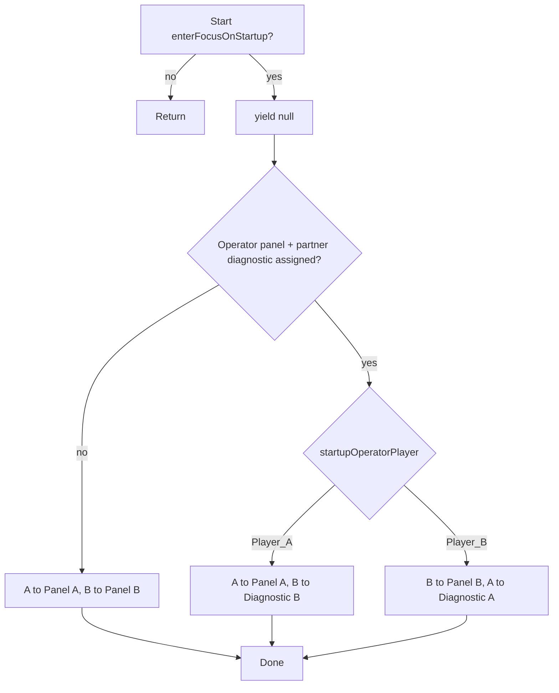

# InitialPanelFocusBootstrap — per-player bindings + operator/diagnostic startup focus

## Task name

Refactor `InitialPanelFocusBootstrap` for grouped per-player Inspector bindings, optional diagnostic focus targets, and operator-driven asymmetric startup focus.

## Date

2026-06-27

## Scope

- Restructure [`InitialPanelFocusBootstrap.cs`](Assets/WhoWiredThis/Scripts/PanelFocus/InitialPanelFocusBootstrap.cs) Inspector fields into **two per-player bindings** (Player A / Player B).
- Each binding contains:
  - **Focus** — `PlayerPanelFocusController` (unchanged role)
  - **Panel** — `PanelFocusController` (unchanged role)
  - **Diagnostic** — `PanelFocusController` (new, optional / null for now)
- Add **tooltips** on every serialized field (including existing ones that lack them).
- Add **startup operator** dropdown using existing [`AllowedPlayerTag`](Assets/WhoWiredThis/Scripts/Data/enums/AllowedPlayerTag.cs) (`Player_A` / `Player_B` only in UI intent).
- When `enterFocusOnStartup` is on **and** operator/diagnostic mode applies:
  - Operator **A** → camera A focuses **Panel A**; camera B focuses **Diagnostic B**
  - Operator **B** → camera B focuses **Panel B**; camera A focuses **Diagnostic A**
- Preserve **backward compatibility** for all existing scenes/prefabs/editor wire tools (no mandatory scene re-save).
- Update editor wire helpers that assign bootstrap fields by property name.

## Out of scope

- Adding `PanelFocusController` components to diagnostic prefabs/scenes (field stays null until a follow-up wiring task).
- Changes to [`PlayerPanelFocusController`](Assets/WhoWiredThis/Scripts/PanelFocus/PlayerPanelFocusController.cs) or [`PanelFocusController`](Assets/WhoWiredThis/Scripts/PanelFocus/PanelFocusController.cs) focus math / selection model.
- Changes to [`TutorialStageManager`](Assets/WhoWiredThis/Scripts/Tutorial/TutorialStageManager.cs) locks, glass overlay, or diagnostic copy (unless Play Mode reveals a hard conflict — see risks).
- Camera-snap-only mode without full focus UI (would need a new API on `PlayerPanelFocusController`; not requested yet).
- Scene-by-scene assignment of diagnostic `PanelFocusController` refs (future wiring pass).

---

## Current behavior (baseline)

[`InitialPanelFocusBootstrap`](Assets/WhoWiredThis/Scripts/PanelFocus/InitialPanelFocusBootstrap.cs) today:

- `enterFocusOnStartup` (bool, has tooltip) — when true, deferred coroutine runs after one frame.
- Four flat refs: `playerAFocus`, `playerAPanel`, `playerBFocus`, `playerBPanel` (no tooltips on the four refs).
- Always calls `TryEnterStartupFocus(A, PanelA)` and `TryEnterStartupFocus(B, PanelB)`.

Used in Tutorial, Puzzle Pipes, Puzzle Signal, and several POC/backup scenes. Editor tools [`PipePressurePuzzlePipesWireTool`](Assets/WhoWiredThis/Editor/PipePressurePuzzlePipesWireTool.cs) and [`SignalCalibrationPuzzleSignalWireTool`](Assets/WhoWiredThis/Editor/SignalCalibrationPuzzleSignalWireTool.cs) set the four flat property names via `SerializedObject`.

[`TutorialStageManager`](Assets/WhoWiredThis/Scripts/Tutorial/TutorialStageManager.cs) runs at `[DefaultExecutionOrder(100)]` **after** bootstrap `Start` and assumes both players may already be in panel focus.

---

## Target Inspector layout

```text
InitialPanelFocusBootstrap
├── Startup
│   ├── enterFocusOnStartup (bool)          [Tooltip: existing + clarified]
│   └── startupOperatorPlayer (AllowedPlayerTag)  [Tooltip: A or B; used only in operator/diagnostic mode]
├── Player A
│   ├── focus   → PlayerPanelFocusController
│   ├── panel   → PanelFocusController
│   └── diagnostic → PanelFocusController (optional)
└── Player B
    ├── focus
    ├── panel
    └── diagnostic (optional)
```

### Serializable binding type (new, same file or small sibling)

```csharp
[Serializable]
public sealed class PlayerStartupFocusBinding
{
    [Tooltip("This player's focus driver (FirstPersonPlayer_A/B).")]
    [SerializeField] private PlayerPanelFocusController focus;

    [Tooltip("This player's main puzzle board PanelFocusController.")]
    [SerializeField] private PanelFocusController panel;

    [Tooltip("Optional diagnostic surface for startup camera framing. Leave empty until wired.")]
    [SerializeField] private PanelFocusController diagnostic;

    public PlayerPanelFocusController Focus => focus;
    public PanelFocusController Panel => panel;
    public PanelFocusController Diagnostic => diagnostic;
}
```

Parent fields:

```csharp
[SerializeField] private PlayerStartupFocusBinding playerA;
[SerializeField] private PlayerStartupFocusBinding playerB;
[SerializeField] private AllowedPlayerTag startupOperatorPlayer = AllowedPlayerTag.Player_A;
```

Use `[Header("Player A")]` / `[Header("Player B")]` for clarity.

---

## Startup focus behavior

### Mode selection (backward compatible)

Introduce a private helper `bool UsesOperatorDiagnosticMode()`:

| Condition | Mode | Behavior |
|-----------|------|----------|
| `!enterFocusOnStartup` | — | No-op (unchanged) |
| Operator’s **panel** missing OR partner’s **diagnostic** missing | **Legacy both-panels** | A→`playerA.panel`, B→`playerB.panel` (same as today) |
| Operator panel + partner diagnostic both assigned | **Operator + partner diagnostic** | Asymmetric (see below) |

**Rationale:** Existing scenes have diagnostics unset → **zero behavior change** without touching YAML. New tutorial/split scenes opt in by assigning diagnostic refs.

Normalize `startupOperatorPlayer`: if not `Player_A` or `Player_B`, log warning and treat as `Player_A`.

### Operator + partner diagnostic mode

When operator is **Player A**:

1. `TryEnterStartupFocus(playerA.Focus, playerA.Panel, "Player A (operator panel)")`
2. `TryEnterStartupFocus(playerB.Focus, playerB.Diagnostic, "Player B (diagnostic)")`

When operator is **Player B**:

1. `TryEnterStartupFocus(playerB.Focus, playerB.Panel, "Player B (operator panel)")`
2. `TryEnterStartupFocus(playerA.Focus, playerA.Diagnostic, "Player A (diagnostic)")`

Keep existing `TryEnterStartupFocus` static helper (null guards + `TryEnterFocus` + warnings). Still `yield return null` before entering focus.

### Legacy both-panels mode

Same as today:

```csharp
TryEnterStartupFocus(playerA.Focus, playerA.Panel, "Player A");
TryEnterStartupFocus(playerB.Focus, playerB.Panel, "Player B");
```



---

## Serialization migration (backward compatible)

Use Unity `[FormerlySerializedAs]` on **nested** binding fields so existing scene/prefab YAML migrates without manual re-wire:

| Old top-level field | New nested path |
|---------------------|-----------------|
| `playerAFocus` | `playerA.focus` |
| `playerAPanel` | `playerA.panel` |
| `playerBFocus` | `playerB.focus` |
| `playerBPanel` | `playerB.panel` |

Example on `PlayerStartupFocusBinding.focus` when used for Player A binding — apply per-binding with correct old names.

**Validation step after implementation:** Open one scene that already had bootstrap wired (e.g. `Tutorial.unity`), confirm Focus/Panel refs survived migration in Inspector, diagnostics remain null.

---

## Tooltips (all fields)

| Field | Tooltip (proposed) |
|-------|-------------------|
| `enterFocusOnStartup` | Keep existing; optionally note operator/diagnostic mode. |
| `startupOperatorPlayer` | Which player operates the puzzle panel at startup. Partner camera frames their diagnostic when operator/diagnostic mode is active and refs are assigned. |
| `playerA` / `playerB` binding headers | (Header only) |
| `focus` | Per-player focus controller on the FirstPerson player root. |
| `panel` | Main board `PanelFocusController` for this player. |
| `diagnostic` | Optional diagnostic `PanelFocusController` for partner readout framing; leave empty until diagnostic surfaces are wired. |

---

## Editor tool updates

Update serialized property paths in:

- [`PipePressurePuzzlePipesWireTool.WireInitialPanelFocusBootstrap`](Assets/WhoWiredThis/Editor/PipePressurePuzzlePipesWireTool.cs)
- [`SignalCalibrationPuzzleSignalWireTool.WireInitialPanelFocusBootstrap`](Assets/WhoWiredThis/Editor/SignalCalibrationPuzzleSignalWireTool.cs)

New paths (nested):

- `playerA.focus`, `playerA.panel`
- `playerB.focus`, `playerB.panel`

Leave `diagnostic` and `startupOperatorPlayer` untouched (defaults) unless a future wire task assigns them.

Optional: add `#if UNITY_EDITOR` `[ContextMenu("Migrate from legacy fields")]` only if FormerlySerializedAs fails in testing — prefer not to add unless needed.

---

## Risks and mitigations

| Risk | Mitigation |
|------|------------|
| Unity fails to migrate flat → nested refs | Manual checklist on one scene; FormerlySerializedAs; editor test |
| Partner in diagnostic focus gets full button nav / no Exit | Future diagnostic `PanelFocusController` wiring: empty `interactableButtons`, `includeExitInFocusCycle = false` or minimal Exit — **confirm with user** (see questions) |
| `allowedPlayerId` mismatch on diagnostic PFC | Diagnostic B must use `AllowedPlayerTag.Player_B` so B’s camera can enter focus |
| TutorialStageManager assumes both on boards | Staged locks target panel colliders; observer on diagnostic may be intentional — verify in Play Mode when diagnostics are wired |
| `TutorialStageManager` execution order | No bootstrap API change; order unchanged |

---

## Approved implementation steps

1. ⬜ Add `PlayerStartupFocusBinding` serializable class with tooltips.
2. ⬜ Refactor `InitialPanelFocusBootstrap` to use `playerA` / `playerB` bindings + `startupOperatorPlayer` with `[FormerlySerializedAs]` migration attributes.
3. ⬜ Implement `UsesOperatorDiagnosticMode()` and branch startup coroutine (legacy vs operator/diagnostic).
4. ⬜ Add/update tooltips on all serialized fields.
5. ⬜ Update both editor wire tools to nested property paths.
6. ⬜ Unity compile check (`read_console` / MCP).
7. ⬜ Open `Tutorial.unity` (or `Puzzle Pipes.unity`) — verify migrated refs, Play Mode legacy behavior unchanged with diagnostics null.
8. ⚠️ Optional follow-up (separate task): add `PanelFocusController` to diagnostic prefab(s) and assign `playerA.diagnostic` / `playerB.diagnostic` in Tutorial.

---

## Testing checklist

- ⬜ **Compile:** zero new errors.
- ⬜ **Migration:** existing scene bootstrap shows Focus + Panel populated without re-dragging refs.
- ⬜ **Legacy (diagnostics null):** Play Mode — both players enter focus on own panel (same as today).
- ⬜ **enterFocusOnStartup off:** both players stay first-person.
- ⬜ **Operator mode (when diagnostics wired):** operator on panel, partner on own diagnostic; warnings if refs missing.
- ⬜ **Editor wire tools:** run on Puzzle Pipes / Puzzle Signal dev scenes — bootstrap still wires A/B focus + panel.
- ⚠️ **TutorialStageManager:** after diagnostic wiring, confirm stage-1 locks still match design (manual).

---

## Rollback notes

- Revert single script + two editor tool files; Unity will orphan nested YAML but FormerlySerializedAs migration is one-way safe — prefer Git revert of the commit.
- No prefab/scene changes required for the refactor itself if migration succeeds.

---

## Open questions (need your input before implementation)

1. **Observer focus UX:** When B frames Diagnostic B, should that be **full** `PanelFocusController` focus (movement off, selection frame, Exit to leave) or **camera snap only** without entering focus mode? Today `TryEnterFocus` always enters full focus. Diagnostic prefabs currently have **no** `PanelFocusController`.

2. **Partial wiring:** If operator panel is set but partner diagnostic is null, the plan **falls back to legacy both-panels**. Is that the behavior you want, or should the partner stay in first-person while only the operator enters panel focus?

3. **Explicit mode toggle:** Do you want a separate enum (e.g. `BothPanels` | `OperatorAndDiagnostic`) in addition to the operator dropdown, or is **infer-from-null-diagnostics** enough?

4. **Default operator:** Is `Player_A` the right default for `startupOperatorPlayer` when the dropdown is ignored (legacy mode)?

---

## Files likely touched

| File | Change |
|------|--------|
| `Assets/WhoWiredThis/Scripts/PanelFocus/InitialPanelFocusBootstrap.cs` | Main refactor |
| `Assets/WhoWiredThis/Editor/PipePressurePuzzlePipesWireTool.cs` | Nested SerializedProperty paths |
| `Assets/WhoWiredThis/Editor/SignalCalibrationPuzzleSignalWireTool.cs` | Nested SerializedProperty paths |
| `.cursor/plan/README.md` | Index row (this plan) |

No scene/prefab edits in the refactor step itself.
