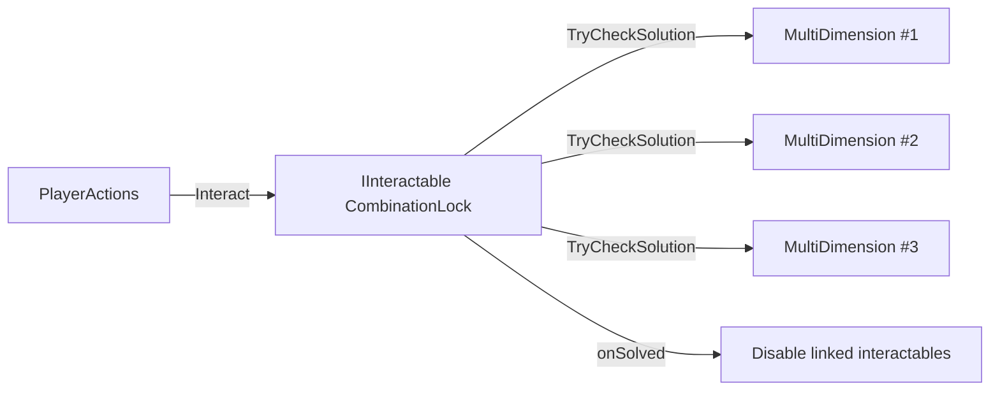

# MultiDimension Combination Solver Plan

## Goal
Create a script that validates a combination across multiple `MultiDimension` objects and locks the system once solved.

## Scope and behavior
- Track an ordered array of [`MultiDimension.cs`](Assets/WhoWiredThis/Scripts/Visibility/MultiDimension.cs).
- Store required solution indices (same order as array).
- On check:
  - **Case 2 (`ExclusiveSinglePlayer`)**: test `exclusiveSubjectIndex`.
  - **Case 3 (`AllPlayers`)**: test `sharedSubjectIndex`.
  - **Case 1 (`SplitPlayers`)**: ignore for now (entry treated as non-participating).
- If all participating entries match solution, mark solved and stop interaction responses permanently.
- Partial match: no side effects.

## Required code changes
- Update [`MultiDimension.cs`](Assets/WhoWiredThis/Scripts/Visibility/MultiDimension.cs) with read-only runtime accessors needed for validation:
  - `CurrentMode` getter.
  - `GetCurrentIndexForSolutionCheck()` (or equivalent) that returns:
    - Case 2: effective exclusive index
    - Case 3: effective shared index
    - Case 1: ignored sentinel (e.g. `-1`) to support “ignore for now”.
- Add new script in visibility domain, e.g. [`MultiDimensionCombinationLock.cs`](Assets/WhoWiredThis/Scripts/Visibility/MultiDimensionCombinationLock.cs):
  - Serialized arrays:
    - `MultiDimension[] targets`
    - `int[] requiredIndices`
  - Serialized flags/state:
    - `bool solved` (read-only at runtime in Inspector)
  - Public method `TryCheckSolution()`:
    - Validate array lengths and nulls.
    - Compare each participating target’s current index with required index.
    - If all pass: set solved and disable responses.
  - `IInteractable` integration:
    - `GetPromptText()` returns active prompt until solved, then solved text.
    - `Interact(GameObject interactor)` no-ops when solved; otherwise triggers `TryCheckSolution()` (and optionally check+feedback path).

## Stop-response strategy after solve
- Primary: gate all interaction in combination script (`if (solved) return;`).
- If this script also controls child cyclers, disable linked components on solve:
  - optional serialized `MonoBehaviour[] interactionsToDisable` (expecting `IInteractable` implementers).
  - On solve, disable each referenced component so objects stop reacting.

## Validation plan
- Compile C# and resolve errors.
- Runtime test scene:
  - Configure 3 targets (sizes 2,3,4) and solution `1,2,3`.
  - Confirm unsolved/partial does nothing.
  - Confirm exact match sets solved.
  - Confirm post-solve interactions no longer change states.

## Data flow

