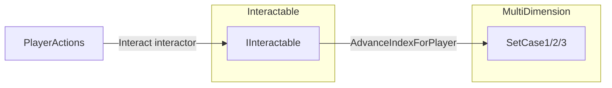

# MultiDimension interaction-driven subject cycling

## Context (current code)

- [`IInteractable`](Assets/WhoWiredThis/Scripts/Interfaces/IInteractable.cs) exposes `GetPromptText()` and `Interact(GameObject interactor)`; [`PlayerActions`](Assets/WhoWiredThis/Scripts/Player/PlayerActions.cs) finds the nearest `IInteractable` and calls `Interact` with the **interactor** `GameObject` only (no collider pass-through).
- [`MultiDimension`](Assets/WhoWiredThis/Scripts/Visibility/MultiDimension.cs) already applies state via `SetCase1` / `SetCase2` / `SetCase3` and `ApplyConfiguration()`. Index fields and `subjects` are **private**; there is no public read of length or current indices.
- Player identity in this project is established like [`PolaritySwitchController`](Assets/WhoWiredThis/Scripts/Puzzles/Common/PolaritySwitchController.cs): tags `PlayerA` / `PlayerB` in hierarchy; dimension layers are `DimensionA` / `DimensionB` from [`MultiDimensionLayerUtility`](Assets/WhoWiredThis/Scripts/Visibility/MultiDimensionLayerUtility.cs).

## Behavior (per your answers)

| `MultiDimension` mode | On valid interact |
|----------------------|-------------------|
| **Case 1 — SplitPlayers** | Advance **only** `indexPlayerA` or `indexPlayerB` depending on which player interacted, then `SetCase1`. |
| **Case 2 — ExclusiveSinglePlayer** | Advance `exclusiveSubjectIndex` only when the interactor is the **allowed** player for that case (the “specific user” for this mode is the exclusive player in the data model), then `SetCase2`. |
| **Case 3 — AllPlayers** | Advance `sharedSubjectIndex` (one shared index for everyone), then `SetCase3`. |

Cycling: `next = (current + 1) % subjectCount`, skipping invalid/empty array edge cases (0 subjects → no-op).

## “Same dimension as the detected object”

Because `Interact` does not receive the hit collider, treat the **interactable’s own collider** (or a serialized `Collider` reference) as the “object” whose **layer** encodes dimension after `MultiDimension` has run:

- Resolve `dimA` / `dimB` with `MultiDimensionLayerUtility.TryResolveDimensionLayers`.
- Map interactor to **Player A** or **Player B** using the same tag-walk as `PolaritySwitchController` (`PlayerA` / `PlayerB`).
- **Match rule (default in plan):** allow only if the collider’s `gameObject.layer` matches the player’s dimension layer (Player A ↔ `DimensionA`, Player B ↔ `DimensionB`). If the collider is on **Default** (e.g. interact volume on `generalObject`), allow **both** players to pass the dimension check and rely on mode rules (Case 2 still restricts to the exclusive player for the *index* change).

If a child has many colliders, place the `IInteractable` on the same GameObject as the collider that should carry the dimension, or add a `[SerializeField] Collider dimensionProbe` field.

## `MultiDimension` API additions

In [`MultiDimension.cs`](Assets/WhoWiredThis/Scripts/Visibility/MultiDimension.cs), add focused public members (names can be adjusted to your taste):

- `int SubjectCount` (or `GetSubjectCount()`) from `subjects.Length` with null-safe 0.
- `void AdvanceIndexForPlayer(AllowedPlayerTag player)` — internal `switch` on `configurationMode`:
  - **SplitPlayers:** if `player` is A, increment `indexPlayerA` mod n; if B, increment `indexPlayerB` mod n; then `SetCase1(...)`. If `player` is `Any_Player`, no-op or log once.
  - **ExclusiveSinglePlayer:** if `player` does not match `exclusivePlayer` (and not the `Any_Player` special case for your design), return; else increment `exclusiveSubjectIndex` mod n; `SetCase2(...)`.
  - **AllPlayers:** increment `sharedSubjectIndex` mod n; `SetCase3(...)` (any interactor that passes the interactable’s gating for Case 3 is fine; optional: only allow `Any_Player` in the public method).

This keeps all cycling math and `SetCase*` calls in one place and avoids a second copy of index fields in the interactable.

## New component (suggested name / location)

- **File:** e.g. [`Assets/WhoWiredThis/Scripts/Visibility/MultiDimensionSubjectCycler.cs`](Assets/WhoWiredThis/Scripts/Visibility/MultiDimensionSubjectCycler.cs) (or `Interactables` if you prefer; `Visibility` keeps it next to `MultiDimension`).
- **Implements:** `IInteractable` (`WhoWiredThis.Interfaces`).
- **Serialized fields:** `MultiDimension` target; optional `Collider dimensionProbe` (default: `GetComponent<Collider>()` on this object); optional prompt string (include `$INTERACT$` for [`PlayerActions.FormatPromptForPlayer`](Assets/WhoWiredThis/Scripts/Player/PlayerActions.cs)).
- **`Interact` flow:** null checks → resolve `AllowedPlayerTag` from interactor tags → **dimension layer match** (as above) → map to `Player_A` / `Player_B` for `AdvanceIndexForPlayer` (Case 3: use `Any_Player` or a dedicated path that only calls shared advance as implemented on `MultiDimension`).

## Wiring in the editor

- Add the new component to a GameObject that has a **non-trigger or trigger collider** in range of the player’s `PlayerActions` overlap (same as other interactables).
- Assign the `MultiDimension` reference. For split-dimension props, put the collider on geometry that ends up on `DimensionA` or `DimensionB` so the layer check matches the correct player; for a shared `generalObject` handle, use Default and accept both for the layer check, with Case 2 still limiting who actually changes the index.

## Validation

- After C# changes, recompile in Unity; fix any new console errors.
- No `IInteractable` or `PlayerActions` change is required unless you later want collider-specific hits (out of scope here).

