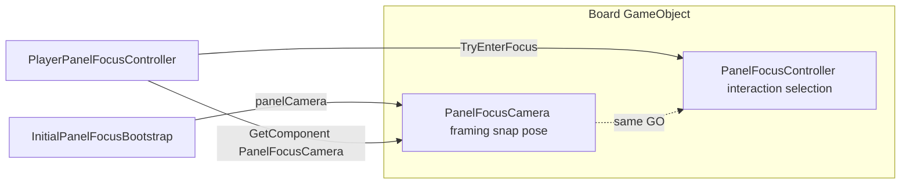

# Extract PanelFocusCamera — Tutorial pilot → full rollout

## Task name

Split camera framing out of `PanelFocusController` into `PanelFocusCamera`, pilot on Tutorial, then roll out to Pipes/Signal prefabs and all bootstrap scenes.

## Date

2026-06-27

## Scope

### Code (completed)

- [`PanelFocusCamera.cs`](Assets/WhoWiredThis/Scripts/PanelFocus/PanelFocusCamera.cs) — framing fields + `GetCameraSnapPose` on the **same GameObject** as `PanelFocusController`.
- [`PanelFocusController.cs`](Assets/WhoWiredThis/Scripts/PanelFocus/PanelFocusController.cs) — interaction/selection only; **no** serialized `focusCamera` ref. Legacy inline camera fields remain as **fallback** for unmigrated boards until a future cleanup pass.
- [`PlayerPanelFocusController.cs`](Assets/WhoWiredThis/Scripts/PanelFocus/PlayerPanelFocusController.cs) — resolves `PanelFocusCamera` via `panel.GetComponent<PanelFocusCamera>()` on every focus entry; falls back to `panel.GetCameraSnapPose()` for legacy boards.
- [`InitialPanelFocusBootstrap.cs`](Assets/WhoWiredThis/Scripts/PanelFocus/InitialPanelFocusBootstrap.cs) — `PlayerStartupFocusBinding` primary refs: `panelCamera` / `diagnosticCamera` (`PanelFocusCamera`); hidden `legacyPanel` / `legacyDiagnostic` with `[FormerlySerializedAs("panel")]` / `[FormerlySerializedAs("diagnostic")]`. Resolves `PanelFocusController` from the camera GameObject for `TryEnterFocus`.
- [`PanelFocusCameraMigrationTool.cs`](Assets/WhoWiredThis/Editor/PanelFocusCameraMigrationTool.cs) — menu items:
  - `Who Wired This/Panel Focus/Migrate All PanelFocusCamera` — all panel prefabs + all bootstrap scenes
  - `Who Wired This/Panel Focus/Migrate Tutorial PanelFocusCamera` — Tutorial-only (legacy menu)
  - `Who Wired This/Panel Focus/Wire Tutorial Bootstrap PanelFocusCamera` — wire bootstrap only

### Prefabs (completed)

| Prefab | Notes |
|--------|-------|
| `Tutorial_A V1.prefab` | Source Board: PFC + PFCamera; PFC `focusCamera` ref removed |
| `Tutorial_B V1 Variant.prefab` | `frameFillPercent: 100` on PFCamera (variant override) |
| `Player1_Pipes_Panel.prefab` | Board migrated; camera fields copied |
| `Player1_Signal_Panel.prefab` | Board migrated; `frameFillPercent: 80` on PFCamera |

Variant chains (`Tutorial_A/B V2`, scene instances) inherit or receive scene-synced camera values.

### Scenes (completed — 19 bootstrap scenes)

Production: `Tutorial.unity`, `Puzzle Pipes.unity`, `Puzzle Signal.unity`

Also: `_BACKUP_26-06-27/*`, `_DEMO-26-06-25/*`, `_OLD/*`, `Puzzles/*` POC, `PlayTest.unity`, `Test_Room.unity`, `OLD/Split Tutorial_UIRefactor.unity`

Per scene the migration tool:

1. Copies effective camera fields from each scene `PanelFocusController` → sibling `PanelFocusCamera` (preserves instance overrides such as Pipes `frameFillPercent`).
2. Wires `playerA.panelCamera` / `playerB.panelCamera` from `legacyPanel` (or flat `playerAPanel` / `playerBPanel` on old YAML).
3. For Tutorial-named scenes, preserves Player A `frameFillPercent` / `includeExitInFocusCycle` overrides.

## Out of scope (future)

- Remove legacy camera block from `PanelFocusController` (after all boards confirmed migrated)
- Diagnostic `PanelFocusCamera` wiring for operator/diagnostic bootstrap mode
- Retarget stale prefab-modification YAML on PFC component IDs (harmless; runtime uses PFCamera)
- Update editor wire tools (`PipePressurePuzzlePipesWireTool`, etc.) to assign `panelCamera` instead of `legacyPanel`

---

## Target architecture (final)

**Decoupling rule:** `PanelFocusController` does **not** reference `PanelFocusCamera`. Camera resolution is owned by `PlayerPanelFocusController` (runtime focus) and `InitialPanelFocusBootstrap` (startup binding).

---

## Approved implementation steps

### Phase 1 — Tutorial pilot ✅

1. ✅ Add `PanelFocusCamera.cs` with moved fields, enum, snap math.
2. ✅ Migrate Tutorial prefab chain + Tutorial scene.
3. ✅ Manual Play Mode — Tutorial startup focus validated.

### Phase 2 — Decouple + bootstrap camera refs ✅

1. ✅ Remove `focusCamera` serialized ref from `PanelFocusController`.
2. ✅ `PlayerPanelFocusController` resolves camera via `GetComponent<PanelFocusCamera>()`.
3. ✅ Bootstrap bindings use `panelCamera` / `diagnosticCamera` as primary refs.
4. ✅ Wire Tutorial bootstrap `panelCamera` refs.

### Phase 3 — Full rollout ✅

1. ✅ Migrate `Player1_Pipes_Panel.prefab`, `Player1_Signal_Panel.prefab`.
2. ✅ Run `Migrate All PanelFocusCamera` — 19 bootstrap scenes processed.
3. ✅ Flat bootstrap YAML (`playerAPanel`) supported in wire tool for legacy scenes.
4. ✅ Filesystem scene scan dedupes with `AssetDatabase.FindAssets` for complete coverage.

---

## Testing checklist

- ✅ Unity compiles with zero errors
- ✅ Tutorial — startup focus, framing, exit/re-enter, Solve
- ✅ Puzzle Pipes / Puzzle Signal — bootstrap has `panelCamera` wired; boards have PFCamera
- ⚠️ Manual Play Mode spot-check: Pipes + Signal startup focus framing (recommended before demo)

---

## Rollback notes

| If this breaks… | Rollback |
|-----------------|----------|
| Camera framing wrong in one scene | Re-run `Migrate All PanelFocusCamera`; or `git checkout --` that scene |
| Prefab regression | `git checkout -- Assets/WhoWiredThis/Prefabs/Panels/` |
| Script regression | Revert `PanelFocusController`, `PlayerPanelFocusController`, `InitialPanelFocusBootstrap`, `PanelFocusCamera` |

**Git:** commit before/after rollout; prefab + scene YAML touches many files.

---

## Files touched

| File | Change |
|------|--------|
| `PanelFocusCamera.cs` | **New** — framing component |
| `PanelFocusController.cs` | Interaction only; legacy camera fallback |
| `PlayerPanelFocusController.cs` | Resolves PFCamera on focus entry |
| `InitialPanelFocusBootstrap.cs` | `panelCamera` / `diagnosticCamera` bindings |
| `PanelFocusCameraMigrationTool.cs` | All-prefab + all-scene migration |
| `Tutorial_A V1.prefab`, `Tutorial_B V1 Variant.prefab` | PFCamera added |
| `Player1_Pipes_Panel.prefab`, `Player1_Signal_Panel.prefab` | PFCamera added |
| 19 `*.unity` scenes with bootstrap | `panelCamera` wired, scene camera sync |
