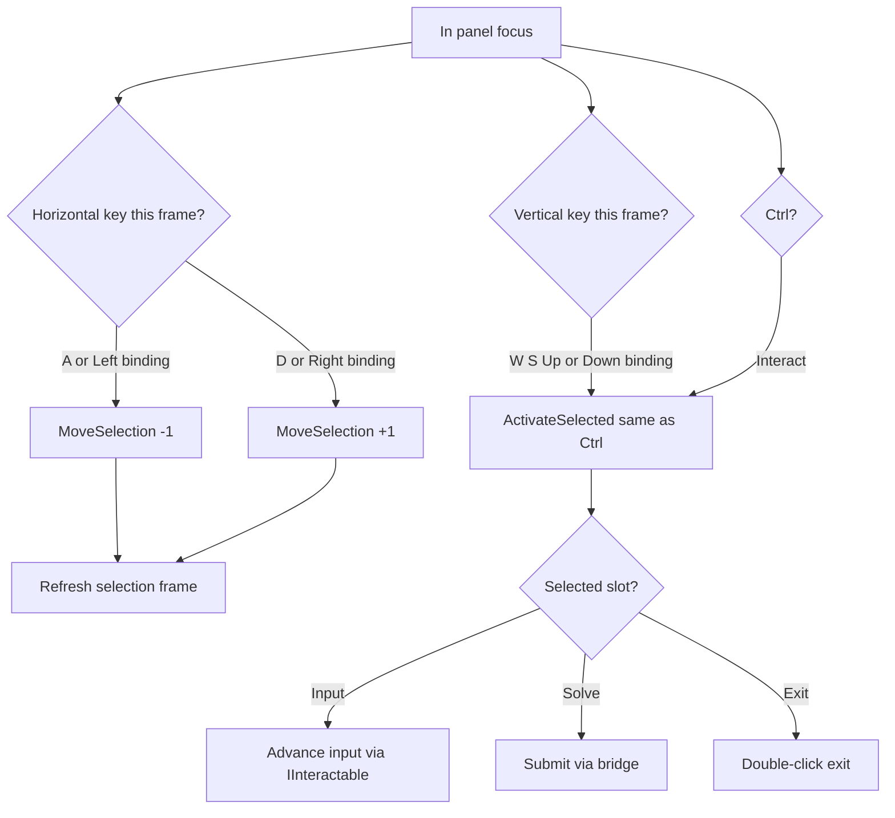

# Panel focus dual-axis input (select + action)

## Task name

Panel focus: horizontal = move selection; vertical = action (cycle input or Send), in addition to Ctrl.

## Date

2026-05-30

## Scope

While **in panel focus**, split each player’s movement keys into two axes:

| Axis | Player A keys | Player B keys | Effect |
|------|---------------|---------------|--------|
| **Selection** | `A` / `D` | `LeftArrow` / `RightArrow` | Move highlight **left/right** along the panel focus ring — **unchanged** |
| **Action** | `W` / `S` | `UpArrow` / `DownArrow` | **Activate** the highlighted slot — **new**, same outcome as **Ctrl** |

### What “action” means (reuses existing logic)

No new puzzle logic. Vertical keys call the same path as `inputBindings.Interact` (Ctrl):

`PlayerPanelFocusController` → `PanelFocusController.ActivateSelected(interactor)`

| Highlighted slot | Action result (today via Ctrl) |
|------------------|--------------------------------|
| Input module (knob/slider/etc.) | Forwards to slot `IInteractable` → typically `MultiDimensionSubjectCycler.Interact` → **advances** that control’s subject index |
| **Solve** | Forwards to Solve `IInteractable` → **Send / submit** attempt |
| **Exit** (when in cycle) | Exit double-click confirm flow — **unchanged** |

So vertical keys are an **alternate action binding** alongside Ctrl, not a second selection axis.

### Current behavior (inspected)

| Item | Today |
|------|--------|
| Selection in focus | `MoveLeft` / `MoveRight` only (`PlayerPanelFocusController.Update`) |
| Action in focus | `Interact` (Ctrl) only → `ActivateSelected` |
| W/S / Up/Down in focus | Ignored (movement controller disabled; focus driver doesn’t read them) |
| Player A SO | W/A/S/D + Right Ctrl |
| Player B SO | Up/Down/Left/Right + Left Ctrl |
| Input state change | `MultiDimension.AdvanceIndexForPlayer` — **forward only**; no retreat API today |

### Target behavior (per player)



**Player A**

| Key | Role |
|-----|------|
| `A` / `D` | Selection previous / next — **no change** |
| `W` / `S` | Action on selected slot — **new** (either key triggers activate) |
| Right Ctrl | Action — **unchanged** |

**Player B**

| Key | Role |
|-----|------|
| `LeftArrow` / `RightArrow` | Selection previous / next — **no change** |
| `UpArrow` / `DownArrow` | Action on selected slot — **new** (either key triggers activate) |
| Left Ctrl | Action — **unchanged** |

**Important:** Player B’s **Left/Right stay selection only**; **Up/Down are action only** (not selection). This mirrors Player A’s A/D vs W/S split.

### Input priority rules (same frame)

1. **Popup open** — vertical/Ctrl still dismiss popup first (existing `Interact` branch); do not also activate panel.
2. **One selection step per frame** — horizontal `if / else if` unchanged.
3. **Action** — if `Interact` **or** vertical key pressed, call `ActivateSelected` once (avoid double-fire if Ctrl+W same frame).
4. **`PanelActionLock`** — action blocked when locked (existing `ActivateSelected` guard); **selection still works**.

## Out of scope

- **S / Down = reverse cycle** on input modules (would need `MultiDimension.RetreatIndexForPlayer` or similar — not in repo today).
- Changing A/D or Left/Right behavior.
- Using Up/Down for Player A or W/S for Player B (each player uses their own binding SO).
- New Input System / rebinding UI.
- Scene or prefab rewiring (bindings SOs already map vertical keys correctly per player).

## Approved implementation steps

### 1. `PlayerPanelFocusController` — dual-axis input

**File:** `Assets/WhoWiredThis/Scripts/PanelFocus/PlayerPanelFocusController.cs`

**Keep** horizontal block unchanged:

```csharp
if (Input.GetKeyDown(inputBindings.MoveLeft))
    currentPanel.MoveSelection(-1);
else if (Input.GetKeyDown(inputBindings.MoveRight))
    currentPanel.MoveSelection(+1);
```

**Extract** action handling to a shared helper, e.g. `TryActivateSelection()`:

- Returns early if popup dismiss consumed the press (existing logic).
- Calls `currentPanel.ActivateSelected(gameObject)` when **any** of:
  - `Input.GetKeyDown(inputBindings.Interact)`
  - `Input.GetKeyDown(inputBindings.MoveForward)`
  - `Input.GetKeyDown(inputBindings.MoveBack)`

**Do not** add hardcoded arrow aliases on the horizontal path.

**Do not** add `LeftArrow`/`RightArrow` to the action path (Player B: only Up/Down bindings = MoveForward/MoveBack).

Player A has no arrow keys in the SO; if later needed, optional `UpArrow`/`DownArrow` aliases on **action only** can be added — **not required** for initial implementation since W/S are the primary action keys on keyboard A.

### 2. Optional: `PanelFocusController` warning text

Update lock message from “A/D still moves selection” → “selection keys still move focus; action keys and Ctrl are blocked while waiting.”

### 3. Validation

- Unity MCP compile + console.
- `Test PanelFocusMode.unity` — both players.
- Playtest scene with `PanelActionLock` (Tutorial/Pipes) — selection works while waiting; vertical + Ctrl blocked for activate.

## Testing checklist

- ⬜ Player A: `A`/`D` move selection only — **regression**.
- ⬜ Player A: `W` on input slot advances that control’s state.
- ⬜ Player A: `S` on input slot same as `W` (activate / advance).
- ⬜ Player A: `W` or `S` on **Solve** triggers Send (same as Ctrl).
- ⬜ Player A: Ctrl still works — **regression**.
- ⬜ Player B: `Left`/`Right` move selection — **regression**.
- ⬜ Player B: `Up`/`Down` action on input and Solve (same as Ctrl).
- ⬜ Player B: Ctrl still works — **regression**.
- ⬜ Ctrl+W same frame: single activate, not double.
- ⬜ Popup open: vertical/Ctrl dismiss popup, no panel activate.
- ⬜ `PanelActionLock`: horizontal works; vertical + Ctrl blocked.
- ⬜ Console clean.

## Rollback notes

- Revert `PlayerPanelFocusController.cs` (and optional warning in `PanelFocusController.cs`).

## Risks

| Risk | Mitigation |
|------|------------|
| W and S both advance (no “back” on inputs) | Document; bidirectional cycle is follow-up if design wants S = retreat |
| Player expects Up/Down to move selection on B | Plan explicitly: Left/Right = select, Up/Down = action |
| Accidental double activate Ctrl+vertical | Single `TryActivateSelection` with OR’d keys, one call per frame |

## Follow-up (not this task)

- **Bidirectional input cycling:** `S` / `DownArrow` retreats subject index (`MultiDimension.RetreatIndexForPlayer` + cycler support).

## Files likely touched

| File | Change |
|------|--------|
| `Assets/WhoWiredThis/Scripts/PanelFocus/PlayerPanelFocusController.cs` | Vertical keys → `ActivateSelected`; shared action helper |
| `Assets/WhoWiredThis/Scripts/PanelFocus/PanelFocusController.cs` | Optional lock warning copy |
