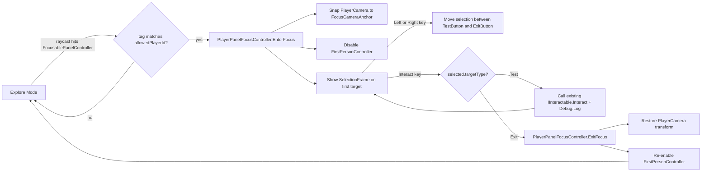

## Approach

Reuse existing systems verbatim. Add only three small scripts and 2 panel scene objects.

- Use the existing `IInteractable` flow ([IInteractable.cs](Assets/WhoWiredThis/Scripts/Interfaces/IInteractable.cs)) so the existing `FirstPersonController` forward-raycast Interact input already triggers focus entry.
- Use each player's existing `PlayerControlBindings` SO (no fallback input):
  - Player A: `MoveLeft`=A, `MoveRight`=D, `Interact`=LeftCtrl
  - Player B: `MoveLeft`=Left, `MoveRight`=Right, `Interact`=RightCtrl
- Movement/interaction lock = disable `FirstPersonController` MonoBehaviour during focus (it owns both movement and the interact raycast). Restore on exit.
- Camera = snap-and-restore the existing `PlayerCamera` local transform to a `FocusCameraAnchor`. Safe because `FirstPersonController` never writes the camera transform; it only reads `playerCamera.transform.forward`, and is disabled during focus anyway.
- For TestButton activation, forward to the existing `IInteractable` on the prefab (`MultiDimensionSubjectCycler`), which already gates by `PlayerA`/`PlayerB` tag via [PlayerInteractorResolver](Assets/WhoWiredThis/Scripts/Player/PlayerInteractorResolver.cs).

## Flow (Mermaid)

## New scripts (under `Assets/WhoWiredThis/Scripts/PanelFocus/`)

1. `PlayerPanelFocusController.cs` (namespace `WhoWiredThis.PanelFocus`)
   - `[SerializeField] AllowedPlayerTag playerId;` (reuse [AllowedPlayerTag.cs](Assets/WhoWiredThis/Scripts/Data/enums/AllowedPlayerTag.cs))
   - `[SerializeField] Camera playerCamera;`
   - `[SerializeField] FirstPerson.FirstPersonController firstPersonController;`
   - `[SerializeField] FirstPerson.PlayerControlBindings inputBindings;`
   - State: `bool isFocused`, `FocusablePanelController currentPanel`, cached camera local pos/rot.
   - Public: `bool TryEnterFocus(FocusablePanelController panel)` — checks `panel.AllowedPlayerId == playerId`, snaps camera (`playerCamera.transform.SetPositionAndRotation(panel.FocusCameraAnchor.position, panel.FocusCameraAnchor.rotation)`), disables `firstPersonController`, calls `panel.OnFocusEntered(this)`.
   - Public: `void ExitFocus()` — restores camera transform, re-enables controller, calls `currentPanel.OnFocusExited()`.
   - `Update()`: when `isFocused`, read `Input.GetKeyDown(inputBindings.MoveLeft|MoveRight|Interact)` and call `currentPanel.MoveSelection(-1/+1)` or `currentPanel.ActivateSelected(gameObject)` (passes the player root so existing tag resolver works).

2. `FocusablePanelController.cs` — implements `IInteractable`
   - `[SerializeField] AllowedPlayerTag allowedPlayerId;`
   - `[SerializeField] Transform focusCameraAnchor;`
   - `[SerializeField] PanelFocusTarget[] selectableTargets;` (size 2)
   - `[SerializeField] GameObject selectionFrame;`
   - `int selectedIndex; PlayerPanelFocusController activeController;`
   - `string GetPromptText()` → `"$INTERACT$ Open Panel"`.
   - `void Interact(GameObject interactor)` → resolve tag via `PlayerInteractorResolver.TryResolve`; if it matches `allowedPlayerId`, find the matching `PlayerPanelFocusController` (by walking up `interactor` to the player root) and call `TryEnterFocus(this)`.
   - `OnFocusEntered/Exited`: enable/disable `selectionFrame`, reset `selectedIndex=0`, position the frame at `selectableTargets[0].HighlightAnchor`.
   - `MoveSelection(int delta)`: `selectedIndex = Mathf.Clamp(selectedIndex + delta, 0, selectableTargets.Length - 1)`; reposition frame.
   - `ActivateSelected(GameObject interactor)`: forwards to `selectableTargets[selectedIndex].Activate(interactor, activeController)`.

3. `PanelFocusTarget.cs`
   - `enum PanelFocusTargetType { Test, Exit }`
   - `[SerializeField] string targetLabel;`
   - `[SerializeField] PanelFocusTargetType targetType;`
   - `[SerializeField] Transform highlightAnchor;`
   - `[SerializeField] MonoBehaviour interactableReference;` // expects `IInteractable`
   - `Activate(GameObject interactor, PlayerPanelFocusController focus)`:
     - `Test` → `Debug.Log($"Player {focus.PlayerId} activated TestButton.");` then `(interactableReference as IInteractable)?.Interact(interactor);`
     - `Exit` → `focus.ExitFocus();`

## Scene wiring (`Assets/Scenes/PanelFocusMode.unity`)

Use the Unity MCP `manage_gameobject` and `manage_scene` tools to add to the scene:

- Add `PlayerPanelFocusController` MonoBehaviour to each existing `FirstPersonPlayer_A` / `FirstPersonPlayer_B` instance, wired to:
  - `playerId = Player_A` / `Player_B`
  - `playerCamera = PlayerCamera` child
  - `firstPersonController = FirstPersonController` already on the player
  - `inputBindings = PlayerControlBindings_PlayerA`/`_PlayerB` SOs
- New root `Panel_Player1`:
  - Cube `Board` (front-facing flat board, ~1.4 × 0.8 × 0.05) with `BoxCollider` and `FocusablePanelController` (`allowedPlayerId = Player_A`).
  - Empty `FocusCameraAnchor` placed ~0.6 m in front of the Board, facing it straight on.
  - Prefab instance `TestButton` from `MultiDimension_ButtonPolarity` (left side of board).
  - Prefab instance `ExitButton` from `MultiDimension_ButtonColor` (right side of board, same Y as TestButton — horizontal row only).
  - On each button child, attach `PanelFocusTarget` with `interactableReference = MultiDimensionSubjectCycler` on the prefab root and `targetType = Test`/`Exit` and a small empty `HighlightAnchor` centered on the button.
  - `SelectionFrame` empty container with a wireframe cube child, initially disabled.
  - Place `Panel_Player1` ~2.5 m in front of Player A.
- Duplicate as `Panel_Player2` for Player B (`allowedPlayerId = Player_B`), placed in front of Player B (~2.5 m).

For panel entry to take precedence over the inner button colliders when the player approaches from the front, place the Board collider on the player-facing side and inset the button prefabs slightly behind/inside it; `FirstPersonController` already iterates raycast hits by distance and picks the nearest `IInteractable`.

## Acceptance check

- Players A and B can enter/exit focus on their own panel, see the SelectionFrame move between TestButton/ExitButton, activate either, and not affect the other player. No phase/history/diagnostic systems are added; only the three new scripts and 2 panel objects in the existing scene.
