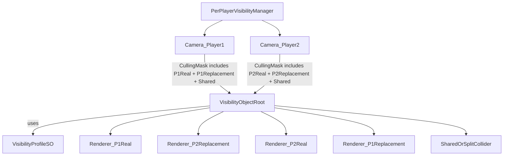

# Per-Player Visibility With ScriptableObject Profiles

## Goal
Enable scene objects to render differently per player camera using Inspector configuration:
- Player A sees real material, Player B sees replacement material (and vice versa)
- Some objects are visible normally to both players
- Collider behavior is configurable per object (shared or split)

## Recommended Approach
Use a **manager-driven + per-object component** design with **camera culling masks + per-player render children**, and move reusable visibility data to **ScriptableObjects**.

Why this over a pure layer-only setup:
- Unity layers alone cannot swap materials per camera on the same renderer cleanly
- Per-camera replacement needs separate renderers/layers, while keeping one gameplay collider source
- Still fully Inspector-configurable per object
- ScriptableObjects avoid duplicate per-object setup for common patterns

## Architecture

## Planned Scripts

### 1) [`/Users/ilang/git/unity/who-wired-this/Assets/WhoWiredThis/Scripts/Visibility/PerPlayerVisibilityManager.cs`](/Users/ilang/git/unity/who-wired-this/Assets/WhoWiredThis/Scripts/Visibility/PerPlayerVisibilityManager.cs)
Responsibilities:
- Hold references to Player1/Player2 cameras
- Define and validate dedicated layers:
  - `P1Real`, `P2Real`, `P1Replacement`, `P2Replacement`, plus existing shared layer(s)
- Apply camera culling masks at startup
- Register all visibility objects in scene and invoke setup/refresh
- Optional debug validation (warn when object is missing required child renderers)

Inspector fields:
- `Camera player1Camera`, `Camera player2Camera`
- Layer masks/names for each visibility channel
- Toggle for validation logs

### 2) [`/Users/ilang/git/unity/who-wired-this/Assets/WhoWiredThis/Scripts/Visibility/PerObjectVisibility.cs`](/Users/ilang/git/unity/who-wired-this/Assets/WhoWiredThis/Scripts/Visibility/PerObjectVisibility.cs)
Per-object Inspector config:
- Data source:
  - `VisibilityProfile profile` (ScriptableObject reference)
  - `bool useOverrides` (if true, local fields override profile)
- Visibility mode enum:
  - `VisibleToBoth`
  - `OnlyPlayer1` (Player2 sees replacement)
  - `OnlyPlayer2` (Player1 sees replacement)
- Renderer references:
  - `Renderer realRenderer`
  - `Renderer replacementRenderer`
- Material references:
  - `Material realMaterial`
  - `Material replacementMaterial`
- Collider policy enum (your choice was per-object configurable):
  - `CollideBothPlayers`
  - `CollideOnlyVisiblePlayer`
  - `NoCollision`
- Optional collider refs when split mode is used:
  - `Collider sharedCollider`
  - `Collider player1Collider`
  - `Collider player2Collider`

Responsibilities:
- Resolve effective settings from `profile` (or local overrides)
- Apply layers/materials to renderer instances according to mode
- Enable/disable/route colliders based on collider policy
- Expose `ApplyForManager()` method so manager can refresh all objects

### 3) [`/Users/ilang/git/unity/who-wired-this/Assets/WhoWiredThis/Scripts/Visibility/VisibilityProfile.cs`](/Users/ilang/git/unity/who-wired-this/Assets/WhoWiredThis/Scripts/Visibility/VisibilityProfile.cs)
`ScriptableObject` with `[CreateAssetMenu]` for reusable presets.

Fields:
- Default visibility mode
- Default real/replacement materials
- Default collider policy
- Optional flags for shared/static object behavior

Expected assets folder:
- [`/Users/ilang/git/unity/who-wired-this/Assets/WhoWiredThis/Data/Visibility/`](/Users/ilang/git/unity/who-wired-this/Assets/WhoWiredThis/Data/Visibility/)
- Example profiles:
  - `OnlyPlayer1_GrayGhost.asset`
  - `OnlyPlayer2_GrayGhost.asset`
  - `VisibleToBoth_Default.asset`

## Inspector Authoring Workflow (Per Object)
1. Add `PerObjectVisibility` to object root.
2. Assign a `VisibilityProfile` asset.
3. Assign renderer refs (real/replacement renderers).
4. If needed, enable `useOverrides` and override mode/material/collider policy per object.
5. Keep gameplay collider(s) on root; render-only children handle per-player visuals.

## Scene/Cameras Setup
- In split-screen scene (`LocalCoop`), assign cameras to manager.
- Manager sets masks:
  - Player1 camera sees `P1Real + P1Replacement + Shared`
  - Player2 camera sees `P2Real + P2Replacement + Shared`
- Shared static objects stay on shared/default layer and do not need per-object component unless special behavior is needed.

## Data/Prefab Strategy
- For repeatable objects, save prefab with `PerObjectVisibility` + `VisibilityProfile` assigned.
- For truly static shared props, no extra script required.
- For special puzzle objects, use prefab variants that only change profile or override fields.
- Keep profile assets centralized so design changes update many objects at once.

## Testing Plan
- Test case 1: `OnlyPlayer1`
  - Player1 sees real material, Player2 sees replacement material
  - collider policy toggles verified in play mode
- Test case 2: `OnlyPlayer2`
  - symmetric behavior
- Test case 3: `VisibleToBoth`
  - both cameras see real object
- Test case 4: mixed scene with static shared props + visibility-controlled props

## Key Implementation Notes
- Avoid changing shared asset materials at runtime; use renderer instance assignment (`renderer.material`) or serialized references per renderer.
- Keep colliders independent from renderer children to avoid accidental physics side-effects.
- In `PerObjectVisibility`, profile values should be fallback defaults; explicit Inspector overrides should always win.
- If layer budget is tight, this can be adapted using URP Renderer Features later, but the layer-based camera mask route is the simplest and most Inspector-friendly first version.