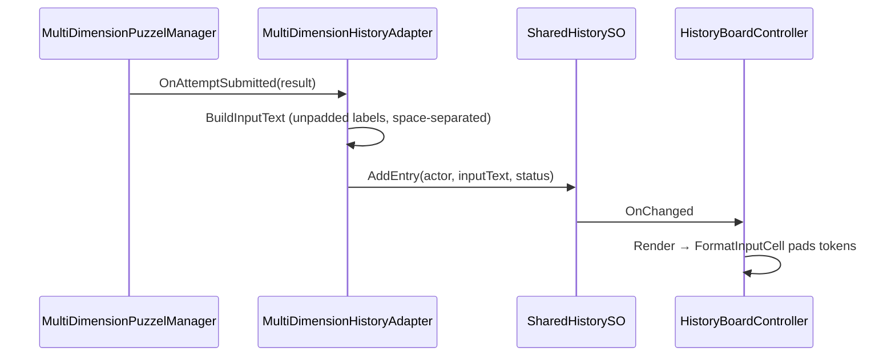
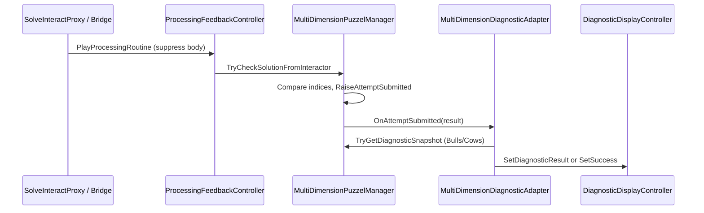

# Pipe Pressure Puzzle — Puzzel Pipes implementation plan

**Keep this plan** as the source of truth for Phases 2–6.

**Design choices (locked in):** separate 2×3 puzzles per player; fixed solutions first; **2** component hints per failed attempt (Phase 3); visualizer visible to **both** players; **alternating** turns with glass overlay.

**4-state prefabs:** `MultiDimension_Knob_4State`, `MultiDimension_Slider_4State`, `MultiDimension_ButtonText_4State` — do not edit old 3-state prefabs.

**Tools:** Wire — `Wire Puzzel Pipes Scene` / `Wire Puzzel Pipes Component Diagnostic (Phase 3)` / `Wire Puzzel Pipes Result Visualizer (Phase 4)`. History headers (Phase 2) — `Apply Puzzel Pipes History Headers (Phase 2)`. Validate — `Validate Phase 1` / `Validate Phase 4 (Puzzel Pipes)`.

**Workflow:** Update this plan (and [README](README.md) row) whenever a phase step lands — status table, progress log, and relevant checklists.

---

## Progress log

| Date | Change |
|------|--------|
| 2026-05-17 | Phase 1: scene wired (6×4-state inputs, managers, history order, focus, turn locks); editor wire + validate tools added. |
| 2026-05-17 | Symbolic `ButtonText_4State` rule locked — no TMP/displayName parity on FLOW/ROUTE; validation skips via `UsesSymbolicButtonTextVisuals`. |
| 2026-05-17 | Phase 2: widened `headerLine` / `separatorLine` on `Player1_Panel/HistoryPanel` and `Player2_Panel/HistoryPanel` only (17-char INPUT). Play Mode: Blue/Red rows padded; console clean. |
| 2026-05-17 | Validation: history checks scoped to both panel HistoryPanels; `ResetPuzzelPipesSolveStateForValidation()` after play-mode solves. |
| 2026-05-17 | **Phase 3 planned** — component-based diagnostic adapter; plan only (no code/scene changes yet). |
| 2026-05-17 | **Phase 3 implemented** — `ComponentDiagnosticAdapter`, manager API, `SetDiagnosticBody`, Puzzel Pipes wired; legacy diagnostic disabled on scene only. |
| 2026-05-17 | **Phase 3 validated** — full checklist (history, diagnostics, turn lock, completion, Tutorial isolation); Play Mode MCP + scene inspection. |
| 2026-05-17 | **Phase 4 planned** — `SubmittedCombinationVisualizer`; partner-panel placement; scene-only visuals. |
| 2026-05-17 | **Phase 4 implemented** — `SubmittedCombinationVisualizer`, partner `ResultVisual_Root` rigs, wire menu, `PipePressurePhase4ValidationTool`. |
| 2026-05-17 | **Phase 4 validated** — edit-mode structural + `ApplySubmittedIndices` mapping; Tutorial scene has no visualizer. |

---

## Phase status

| Phase | Status | Notes |
|-------|--------|-------|
| 1 — 3×4 inputs + wiring | **implemented** | See [Phase 1 validation](#phase-1-validation-2026-05-17) |
| 2 — History 3×5 columns | **implemented** | Scene-only header/separator on both panel HistoryPanels; see [Phase 2](#phase-2--shared-history-3-inputs--5-char-tokens) |
| 3 — Component diagnostic | **validated** | See [Phase 3 plan](#phase-3-plan--component-diagnostic) |
| 4 — Result visualizer | **validated** | See [Phase 4 plan](#phase-4-plan--pipe-result-visualizer) |
| 5 — Randomized solution | planned | |
| 6 — Balance / hints | planned | |

---

## Phase 1 validation (2026-05-17)

Validated via Unity MCP + editor menu `PipePressurePhase1ValidationTool` (structural / simulated checks). Play Mode used briefly; full two-player glass/focus pass still recommended manually.

### Results summary

| # | Check | Result | Notes |
|---|--------|--------|-------|
| 1 | 4 states per input | **PASS** | All six inputs `SubjectCount == 4` |
| 2 | Cycle through 4 states | **PASS** | `AdvanceIndexForPlayer` reaches 4 indices (edit-mode) |
| 3 | TMP matches `displayName` | **PASS** (scoped) | Knob/slider **PASS**; FLOW/ROUTE **PASS** via symbolic ButtonText_4State rule (see below) |
| 4 | Blue SEND → 3 history tokens | **PASS** (simulated) | Raw text `HALF MID RGHT`; adapter `inputOrder` ×3 |
| 5 | Red SEND → 3 history tokens | **PASS** (simulated) | Raw text `OPEN HIGH LOOP` |
| 6 | Panel focus 3 + Solve + Exit | **PASS** (wired) | `interactableButtons` ×3; Exit present (inactive in hierarchy) |
| 7 | Turn lock / glass (3 inputs) | **PASS** (wired) | `actionColliders` ×4 per bundle (3 inputs + Send) |
| 8 | Blue solution | **PASS** (simulated) | `TryCheckSolution` succeeds at indices 2/1/2 |
| 9 | Red solution | **PASS** (simulated) | `TryCheckSolution` succeeds at indices 3/2/3 |
| 10 | Console errors | **PASS** | No compile errors; no new runtime errors during checks |

### ButtonText_4State — symbolic visual labels (by design)

`MultiDimension_ButtonText_4State` intentionally uses **symbolic** LCD TMP on the control while `displayName` / Shared History use **readable** tokens:

| Index | `displayName` (history) | Visible TMP (control) |
|-------|-------------------------|------------------------|
| 0 | LEFT | `<<<` |
| 1 | MID | `[||]` |
| 2 | RGHT | `>>>` |
| 3 | LOOP | `(O)` |

**Do not** change `MultiDimension_ButtonText_4State` prefab or FLOW/ROUTE scene TMP overrides to match `displayName`. `PipePressurePhase1ValidationTool` skips TMP≠displayName for this prefab type (and FLOW/ROUTE names).

Knob/slider inputs still **PASS** visible TMP = `displayName` (e.g. VALVE shows SHUT/LOW/HALF/OPEN).

### Phase 1 — manual Play Mode still recommended

- Panel focus wrap across VALVE → PRESS → FLOW → Solve → Exit
- Glass blocks non-operator on all three colliders
- Live SEND rows on both HistoryPanel instances (both read same `SharedHistorySO`)

---

## Phase 2 — Shared History (3 inputs × 5-char tokens)

**Status: implemented (2026-05-17).** Minimal scope: scene-only header/separator on both Puzzel Pipes HistoryPanels; no Tutorial changes; no global `HistoryPanel.prefab` edit.

### 1. Existing history flow



| Piece | Role |
|-------|------|
| [`MultiDimensionHistoryAdapter.BuildInputText`](Assets/WhoWiredThis/Scripts/Puzzles/Common/MultiDimensionHistoryAdapter.cs) | Walks `inputOrder[]`; appends `GetSubjectDisplayName(index)` per token with **single spaces** — **no padding** |
| [`SharedHistorySO`](Assets/WhoWiredThis/Scripts/Data/Puzzels/SharedHistorySO.cs) | Stores `HistoryEntry.inputText` as raw string; resets on play |
| [`HistoryBoardController`](Assets/WhoWiredThis/Scripts/Puzzles/Common/HistoryBoardController.cs) | Owns `titleText`, `bodyText`, `headerLine`, `separatorLine`; calls `FormatInputCell` at render |
| **Puzzel Pipes** | One shared `SharedHistorySO` asset; **two** `HistoryPanel` instances (Player1 + Player2) both render it |
| **Font** | `VT323-Regular SDF` on body (monospace-style; good for columns) |

**Puzzel Pipes headers (scene overrides on both panel HistoryPanels):**

```
 # | SIDE | INPUT             | STATUS
===+======+===================+========
```

**Formatting:** `HistoryBoardController` uses `InputTokenWidth = 5` and `PadRight(5)` per token in `FormatInputCell`. Verified:

- `HALF MID RGHT` → `HALF  MID   RGHT` (17 characters)
- `OPEN HIGH LOOP` → `OPEN  HIGH  LOOP`

**Deferred:** stale `inputSeparator` prefab overrides on HistoryPanel instances — harmless.

### 2. Formatting rules (unchanged)

| Concern | Recommendation |
|---------|----------------|
| Where to pad | **Keep** padding only in `HistoryBoardController.FormatInputCell` (already true) |
| Method | `PadRight(5)` per token; single space between tokens (already true) |
| Labels longer than 5 | **Truncate** to 5 in `FormatInputCell` (already true); add **one** `Debug.LogWarning` per distinct truncated token (optional, editor/play once) |
| Labels shorter than 5 | Pad right with spaces in history only (already true) |
| `displayName` / TMP | Never pad; trim only |

**No change required** to `MultiDimensionHistoryAdapter` for basic 3-token support (Phase 1 wired `inputOrder` ×3).

### 3. Configuration

| Question | Recommendation |
|----------|----------------|
| Serialize `inputTokenWidth = 5`? | **Optional improvement:** `[SerializeField, Min(1)] int inputTokenWidth = 5` on `HistoryBoardController` — allows per-board override without code fork |
| Adapter vs board? | **HistoryBoardController only** — adapter stays unaware of column layout |
| All scenes vs Puzzel Pipes only? | **Default 5** is already global const; Tutorial uses 2 tokens → still fits widened logic. **Header/separator overrides: Puzzel Pipes scene only** — do not change `HistoryPanel.prefab` defaults unless Tutorial boards are visually re-tested |
| Avoid breaking Tutorial | Do not narrow `InputTokenWidth`; only widen Puzzel Pipes **scene** header strings. Tutorial rows remain 2×5 + space = 11 chars under a 13-char INPUT header (still fits) |

### 4. Scene changes (done)

Applied on **both** `Player1_Panel/HistoryPanel` and `Player2_Panel/HistoryPanel` only. Tutorial scenes and global `HistoryPanel.prefab` unchanged.

### 5. Testing (Phase 2)

| # | Test | Result |
|---|------|--------|
| 1 | Blue submit → 3 readable tokens | **PASS** (Play Mode / MCP) — raw `HALF MID RGHT`, rendered `HALF  MID   RGHT` |
| 2 | Red submit → 3 readable tokens | **PASS** — raw `OPEN HIGH LOOP`, rendered `OPEN  HIGH  LOOP` |
| 3 | Tokens align under widened INPUT header | **PASS** (both panel HistoryPanels) |
| 4 | FLOW/ROUTE symbolic TMP unchanged | **PASS** — e.g. `<<<` on control; history uses `RGHT` etc. |
| 5 | Console errors | **PASS** during automated submit |
| 6 | Tutorial regression (2-token row) | **Not run** — Tutorial headers unchanged by design |
| 7 | Live SEND via UI (focus, glass) | **Pending** — manual sign-off |

### 6. Risks

| Risk | Mitigation |
|------|------------|
| VT323 still drifts vs true monospace | Accept minor drift; avoid proportional fonts |
| Tutorial header looks sparse for 2 tokens | Leave Tutorial headers unchanged |
| 17-char INPUT wider than mesh | Scene-only RectTransform tweak |
| Stale `inputSeparator` confuses inspectors | Remove overrides |
| FLOW/ROUTE symbolic TMP | **By design** — not a validation failure |

### 7. Phase 2 implementation (completed)

| Step | Task | Status |
|------|------|--------|
| 2a | Validation: allow symbolic ButtonText_4State visuals | Done (`UsesSymbolicButtonTextVisuals`) |
| 2b | Puzzel Pipes: widen `headerLine` / `separatorLine` on `Player1_Panel/HistoryPanel` and `Player2_Panel/HistoryPanel` | Done (menu + scene YAML) |
| 2c | Remove stale `inputSeparator` prefab overrides | Deferred (harmless) |
| 2d | (Optional) Serialize `inputTokenWidth` | Not done (out of minimal scope) |
| 2e | Play Mode: Blue + Red submit | Done — raw `HALF MID RGHT` / `OPEN HIGH LOOP`; rendered `HALF  MID   RGHT` / `OPEN  HIGH  LOOP` |
| 2f | Plan + README | Done |
| 2g | Validation: scoped history paths + solve reset before validate | Done |

**Menu:** `Who Wired This → Pipe Pressure → Apply Puzzel Pipes History Headers (Phase 2)`

**Constants** (in `PipePressurePuzzelPipesWireTool`):

- `headerLine`: ` # | SIDE | INPUT             | STATUS` (INPUT segment = 17 chars)
- `separatorLine`: `===+======+===================+========`

---

## Phase 3 plan — Component diagnostic

**Status: implemented (2026-05-17).**

**Goal:** Replace Tutorial-style Bulls/Cows diagnostic on **Puzzel Pipes only** with pipe-machine component hints (max **2** component lines per failed attempt + one system line). Tutorial scenes keep `MultiDimensionDiagnosticAdapter`.

**Out of scope for Phase 3:** visualizer, randomized solution, scoring, main menu, global prefab edits, Tutorial scene changes.

**Git:** Working tree is dirty — commit or confirm safe state before implementation (per `unity-poc-workflow.mdc` §10).

---

### 1. Existing diagnostic flow (inspected)



| Piece | Puzzel Pipes today |
|-------|-------------------|
| **Adapter** | `MultiDimensionDiagnosticAdapter` on **`Player1_Panel`** and **`Player2_Panel`** (enabled) |
| **Puzzle managers** | Player1 adapter → `Player1_Panel/PuzzleManager` (Blue: VALVE/PRESS/FLOW, correct 2/1/2). Player2 adapter → `Player2_Panel/PuzzleManager` (Red: GATE/PUMP/ROUTE, correct 3/2/3). |
| **Diagnostic displays** | **Cross-panel wiring** (same as Tutorial split layout): Player1 adapter → `diagnosticDisplay` **45800108** (`TutorialStageManager.playerBDiagnosticDisplay`). Player2 adapter → **1975054485** (`playerADiagnosticDisplay`). Each operator’s SEND updates the display the stage manager labels for the **partner** side. |
| **Processing** | `ProcessingFeedbackController` on each panel; same `diagnosticDisplay` as diagnostic adapter (`READING SIGNAL…` / `CHECKING SETTINGS…` / `UPDATING HISTORY…`). |
| **Commit mode** | `updateContinuously: 0` — no live preview; updates on `OnAttemptSubmitted` only. |
| **Metrics shown** | `SETTINGS OK: n/3`, `PLACES OK: m/3` (Bulls/Cows via [`TryGetDiagnosticSnapshot`](Assets/WhoWiredThis/Scripts/Visibility/MultiDimensionPuzzelManager.cs)) |
| **Clue text** | `NO MATCHING SETTINGS…`, `PARTIAL MATCH…`, `CORRECT SETTINGS, WRONG ORDER.`, etc. |
| **Solved** | `A-SIDE CALIBRATED` / `B-SIDE CALIBRATED` via `SetSuccess` |
| **History** | Unaffected — `MultiDimensionHistoryAdapter` on same panels, shared `SharedHistorySO` |

**Tutorial isolation:** `MultiDimensionDiagnosticAdapter` remains on Tutorial / Split Tutorial scenes. Phase 3 only **disables** the two adapters on **Puzzel Pipes** and adds the new component adapter there.

---

### 2. Proposed new component

**Name:** `ComponentDiagnosticAdapter` (namespace `WhoWiredThis.Puzzles.Common`).

**Responsibilities:**

- Subscribe to one `MultiDimensionPuzzelManager.OnAttemptSubmitted` (`OnEnable` / `OnDisable`), same pattern as [`MultiDimensionDiagnosticAdapter`](Assets/WhoWiredThis/Scripts/Puzzles/Common/MultiDimensionDiagnosticAdapter.cs).
- On each attempt, for each configured component (parallel to `puzzleElements` / `inputOrder`):
  - Read `result.SubmittedIndices[i]`.
  - Read correct index via small manager API (see §3) or matching `ComponentDiagnosticDefinition` slot.
  - Classify: **Correct**, **TooLow**, **TooHigh** (ordered), **Mismatch** (categorical).
- Build body text:
  - **Solved:** configured success message → `DiagnosticDisplayController.SetSuccess`.
  - **Failed:** one **system** line + up to **two** component hint lines + optional **tell partner** line → new body-only API or equivalent (see §6).
- **No** `TryGetDiagnosticSnapshot` / SETTINGS OK / PLACES OK on Puzzel Pipes.
- **No** `updateContinuously` — commit-only like current Puzzel Pipes setup.
- Optional: skip `MachineFeedbackTextController` flavor lines for pipe tone (or one pipe-themed flavor list later).

**Not responsible for:** history rows, turn lock, processing timing, puzzle solve logic.

---

### 3. Data access plan

| Source | Available today | Gap |
|--------|-----------------|-----|
| [`MultiDimensionAttemptResult`](Assets/WhoWiredThis/Scripts/Visibility/MultiDimensionAttemptResult.cs) | `SubmittedIndices[]`, `IsSolved`, `Actor` / `ActorLabel`, `PublicStatus` | No per-slot correct indices |
| [`MultiDimensionPuzzleElement`](Assets/WhoWiredThis/Scripts/Visibility/MultiDimensionPuzzelManager.cs) | `Element`, `CorrectIndex` (public getters) | Parent `puzzleElements[]` is **private** |
| Manager | `TryGetDiagnosticSnapshot` (Bulls/Cows) | Wrong model for Phase 3 |

**Recommended minimum API** on `MultiDimensionPuzzelManager` (read-only):

```csharp
public int PuzzleElementCount { get; }
public bool TryGetPuzzleElement(int index, out MultiDimension element, out int correctIndex);
```

- Implementation walks existing `puzzleElements` (no new serialized data).
- Adapter maps `result.SubmittedIndices[i]` to `correctIndex` by **shared index** `i`.
- **No reflection**, no SerializedObject hacks in play mode.

**Config vs manager order:** `ComponentDiagnosticAdapter` should use an explicit `ComponentDiagnosticDefinition[]` where each entry references a `MultiDimension` and documents `displayName` + type. At runtime, resolve slot index by matching `input` reference to `TryGetPuzzleElement` element (or require config order === `puzzleElements` order and validate in editor). Prefer **reference match** with a one-time editor validation warning on mismatch.

**Future randomization (Phase 5):** `correctIndex` stays on the manager’s `puzzleElements`; adapter always reads live correct index per attempt — no hardcoded solution in the adapter.

---

### 4. Component configuration model

```csharp
public enum ComponentDiagnosticType { Ordered, Categorical }

[Serializable]
public class ComponentDiagnosticDefinition
{
    public MultiDimension input;           // same refs as puzzleElements / inputOrder
    public string displayName;             // e.g. VALVE, PRESS, FLOW
    public ComponentDiagnosticType type;
    [TextArea] public string correctText;    // e.g. VALVE LOOKS STABLE.
    [TextArea] public string tooLowText;     // ordered only
    [TextArea] public string tooHighText;    // ordered only
    [TextArea] public string mismatchText;   // categorical (and optional ordered fallback)
    public bool eligibleForHints = true;
}
```

**Puzzel Pipes defaults (Inspector copy, per panel):**

| Slot | Input | Type | correct | too low | too high | mismatch |
|------|-------|------|---------|---------|----------|----------|
| 0 | VALVE / GATE | Ordered | `{NAME} LOOKS STABLE.` | `{NAME} TOO CLOSED.` or `TOO LOW.` | `{NAME} TOO OPEN.` or `TOO HIGH.` | (unused) |
| 1 | PRESS / PUMP | Ordered | `{NAME} LOOKS STABLE.` | `PRESSURE TOO LOW.` / `PUMP OUTPUT TOO LOW.` | `PRESSURE TOO HIGH.` / `PUMP OUTPUT TOO HIGH.` | (unused) |
| 2 | FLOW / ROUTE | Categorical | `FLOW ROUTE LOOKS STABLE.` / `ROUTE LOOKS STABLE.` | — | — | `FLOW ROUTE DOES NOT MATCH.` / `ROUTE DOES NOT MATCH.` |

`{NAME}` = `displayName` field (VALVE, PRESS, FLOW / GATE, PUMP, ROUTE).

**Classification rules:**

- **Ordered:** `submitted == correct` → Correct; `<` → TooLow; `>` → TooHigh.
- **Categorical:** `submitted == correct` → Correct; else → Mismatch (never emit too low/high).

---

### 5. Hint selection strategy (v1 — deterministic)

**Per failed attempt:**

1. Classify all components.
2. **System line** (one), from counts:
   - 0 correct → `PIPE RESPONSE IS UNSTABLE.`
   - 1 correct → `PARTIAL CALIBRATION. ONE COMPONENT HOLDS.`
   - 2 correct → `NEARLY STABLE. ONE COMPONENT STILL OFF.`
   - (3 correct on failure path should not occur if manager logic is consistent.)
3. **Component hints — exactly 2 lines** when possible:
   - If **any** Correct: include **one** correct hint (first correct in config order).
   - If **any** wrong: include **one** wrong hint (first wrong in config order).
   - If **no** Correct: include **two** wrong hints (first two wrong in config order).
   - If only one wrong exists (shouldn’t with 3 inputs): show one wrong + system only.
4. **Tell partner** (optional footer): `TELL YOUR PARTNER WHAT YOU LEARNED.` when `IsSolved == false` and at least one hint shown.

**Explicitly not in v1:** rotation, progressive widening, hiding correct names, attempt-index-based shuffle.

**Solved attempt:** system + component hints skipped; only solved message.

---

### 6. Formatting & display API

**Body layout (failed):**

```
PIPE RESPONSE IS UNSTABLE.

VALVE LOOKS STABLE.
PRESSURE IS TOO HIGH.

TELL YOUR PARTNER WHAT YOU LEARNED.
```

**Minimal `DiagnosticDisplayController` change (recommended):**

Add `SetDiagnosticBody(string message)` — sets `DisplayState.Result`, writes body, applies result lamp. Keeps display render-only; avoids fake `SETTINGS OK` metrics.

**Default copy — Player A (Blue panel adapter)**

| Case | Text |
|------|------|
| Solved | `PIPE LINE CALIBRATED.` (or **SIDE** — see questions) |
| System (0 correct) | `PIPE RESPONSE IS UNSTABLE.` |
| System (partial) | `PARTIAL CALIBRATION. ONE COMPONENT HOLDS.` / `NEARLY STABLE. ONE COMPONENT STILL OFF.` |
| Ordered too low | `{NAME} TOO CLOSED.` (valve) / `PRESSURE TOO LOW.` |
| Ordered too high | `{NAME} TOO OPEN.` / `PRESSURE TOO HIGH.` |
| Categorical mismatch | `FLOW ROUTE DOES NOT MATCH.` |
| Ordered stable | `{NAME} LOOKS STABLE.` / `PRESSURE LOOKS STABLE.` |
| Partner | `TELL YOUR PARTNER WHAT YOU LEARNED.` |

**Player B:** same templates with GATE / PUMP / ROUTE display names; solved `PIPE LINE CALIBRATED.` or `B-SIDE PIPE CALIBRATED.`

**Processing lines (optional Phase 3b, scene-only):** change `ProcessingFeedbackController` messages on Puzzel Pipes to `READING PRESSURE…` / `CHECKING PIPE STATE…` / `UPDATING HISTORY…` — not required for first pass.

---

### 7. Scene wiring (Puzzel Pipes only)

| Step | Action |
|------|--------|
| A | Add `ComponentDiagnosticAdapter` to **`Player1_Panel`** and **`Player2_Panel`** (same GameObjects as history/diagnostic today). |
| B | **Disable** (or remove) existing `MultiDimensionDiagnosticAdapter` on both panels — prevents overwrite. |
| C | Wire `puzzleManager` → local `PuzzleManager`. |
| D | Wire `diagnosticDisplay` → **keep current cross-panel refs**: Player1 → **45800108**, Player2 → **1975054485**. |
| E | Assign `components[]` ×3 per panel (VALVE/PRESS/FLOW or GATE/PUMP/ROUTE) with types and strings from §4. |
| F | Leave `ProcessingFeedbackController` and `TutorialStageManager` diagnostic refs unchanged. |
| G | Leave `MultiDimensionHistoryAdapter` unchanged. |

**Do not** edit Tutorial.unity, Split Tutorial, or global Diagnostic prefab unless later approved.

**Optional editor menu:** `Who Wired This → Pipe Pressure → Wire Component Diagnostic (Puzzel Pipes)` — mirrors Phase 1/2 tools; assigns refs and disables old adapters.

---

### 8. Testing plan

| # | Test | Expected |
|---|------|----------|
| 1 | Blue wrong (e.g. SHUT/LOW/LEFT) | System + 2 wrong component lines; **no** SETTINGS OK / PLACES OK |
| 2 | Blue partial (e.g. HALF/LOW/LEFT) | System partial + 1 stable + 1 wrong |
| 3 | Blue solve HALF/MID/RGHT | `PIPE LINE CALIBRATED.` (or approved solved string) |
| 4 | Red wrong / partial / solve | Same pattern with GATE/PUMP/ROUTE copy |
| 5 | History | Rows still 3 tokens, padded; statuses CALIBRATED / UNSTABLE |
| 6 | Turn lock / glass | Alternation unchanged |
| 7 | Tutorial scene spot-check | Still SETTINGS OK / PLACES OK |
| 8 | Console | No errors on SEND |
| 9 | Partner display | Blue SEND updates display on partner wiring (45800108); confirm readable at Red station |

---

### 9. Risks

| Risk | Mitigation |
|------|------------|
| Correct index not accessible | Add `TryGetPuzzleElement` API (§3) |
| Old adapter still enabled | Disable `MultiDimensionDiagnosticAdapter` on Puzzel Pipes only |
| Cross-panel display confusion | Document refs; test from both physical stations |
| Too easy (2 hints) | Fixed v1 rule; tune copy before adding rotation |
| Too hard | Stable hint confirms one component; partner line encourages talk |
| Config order ≠ `puzzleElements` | Reference-based slot lookup + editor validate |
| Phase 5 random solutions | Read `correctIndex` from manager each attempt |
| `SetDiagnosticResult` mismatch | Use `SetDiagnosticBody` instead of fake metrics |
| Processing suppress race | Keep adapter write **after** `OnAttemptSubmitted` (post-check), same as today |

---

### 10. Questions (please answer before implementation)

1. **Solved text:** `PIPE LINE CALIBRATED.` vs `A-SIDE CALIBRATED` / `B-SIDE CALIBRATED` vs `SIDE CALIBRATED`?
2. **Component names in hints:** Use literal names (`VALVE`, `PRESS`) or atmospheric only (`THE VALVE`, no names)?
3. **Reveal correct components:** v1 plan **does** show one stable line when any component is correct — OK?
4. **FLOW/ROUTE:** Categorical **mismatch only** (no too low/high) — confirm?
5. **Hint selection:** Deterministic (first correct + first wrong in config order) — OK, or prefer rotating wrong hints across attempts?
6. **Partner line:** Include `TELL YOUR PARTNER…` on every failed attempt?
7. **Valve wording:** `TOO CLOSED` / `TOO OPEN` vs `TOO LOW` / `TOO HIGH` for VALVE/GATE?

---

### 11. Implementation steps (completed)

| Step | Task | Status |
|------|------|--------|
| 3.1 | Git baseline confirmed by user | Done |
| 3.2 | `MultiDimensionPuzzelManager`: `PuzzleElementCount` + `TryGetPuzzleElement` | Done |
| 3.3 | `DiagnosticDisplayController.SetDiagnosticBody` | Done |
| 3.4 | `ComponentDiagnosticAdapter` + definitions | Done |
| 3.5 | Menu: `Wire Puzzel Pipes Component Diagnostic (Phase 3)` | Done |
| 3.6 | Legacy `MultiDimensionDiagnosticAdapter` disabled on Puzzel Pipes | Done (`m_Enabled: 0`) |
| 3.7–3.8 | Play Mode MCP: Blue/Red wrong, partial, solve | **PASS** — no SETTINGS/PLACES |
| 3.9 | Tutorial scene | Unchanged (legacy adapter still on Tutorial) |
| 3.10 | Plan + README | Done |

**Menu:** `Who Wired This → Pipe Pressure → Wire Puzzel Pipes Component Diagnostic (Phase 3)`

### Phase 3 validation (2026-05-17)

**Method:** Fresh Play Mode on `Puzzel Pipes.unity` (MCP `execute_code` sequence) + edit-mode scene YAML inspection. No code or scene changes during validation.

| # | Check | Result |
|---|--------|--------|
| 1 | Blue SEND → 3 history tokens | **PASS** — e.g. raw `SHUT LOW LEFT` |
| 2 | Red SEND → 3 history tokens | **PASS** — e.g. raw `SHUT LOW LEFT` (Red indices) |
| 3 | History readable (3 tokens, padded render) | **PASS** — body contains `SHUT` after render |
| 4 | Blue wrong / partial / solve diagnostics | **PASS** — pipe copy; partial: VALVE STABLE + PRESSURE TOO LOW; solve: `PIPE LINE CALIBRATED.` |
| 5 | Red wrong / partial / solve diagnostics | **PASS** — GATE TOO CLOSED; partial: GATE STABLE; solve: `PIPE LINE CALIBRATED.` |
| 6 | No SETTINGS / PLACES on Puzzel Pipes | **PASS** |
| 7 | Waiting player (Red at start) blocked on 3 inputs | **PASS** — `PanelActionLock` + GATE/PUMP/ROUTE colliders disabled |
| 8 | Turn switch after Blue solves | **PASS** — `CurrentStage` → PlayerBOperator; Blue locked |
| 9 | Red operates after Blue solves | **PASS** — Red unlocked; GATE collider enabled |
| 10 | Completion after Red solves | **PASS** — `CurrentStage` → Complete (2) |
| 11 | Tutorial still SETTINGS / PLACES | **PASS** — `Tutorial.unity`: legacy adapter **enabled**, no `ComponentDiagnosticAdapter` |
| 12 | Console errors | **PASS** — 0 errors during validation |

**Note:** Checklist item 10 `completionRaised` confirmed via `CurrentStage == Complete` after Red solve. Manual UI pass (glass overlay, live SEND) still listed under Phase 1 checklist.

### Phase 3 test results (implementation smoke — Play Mode / MCP)

| Test | Result |
|------|--------|
| Blue wrong (0/0/0) | **PASS** — UNSTABLE + VALVE TOO CLOSED + PRESSURE TOO LOW + partner line; no SETTINGS/PLACES |
| Blue partial (2/0/0) | **PASS** — ONE PIPE SECTION + VALVE STABLE + PRESSURE TOO LOW |
| Blue solve (2/1/2) | **PASS** — `PIPE LINE CALIBRATED.` |
| Red wrong / partial / solve | **PASS** — GATE/PUMP/ROUTE copy; solved message |
| Console | **PASS** — no compile/runtime errors |

**Rollback:** Re-enable `MultiDimensionDiagnosticAdapter`, remove/disable `ComponentDiagnosticAdapter`, revert manager/display API if unused elsewhere; `git checkout -- Assets/Scenes/Puzzel\ Pipes.unity` + new scripts.

---

## Phase 4 plan — Pipe Result Visualizer

**Status: planned (2026-05-17). Do not implement until approved.**

**Goal:** After SEND, show a **passive 3D visual** of the submitted combination (indices only). **Never** show correctness (no green/red “win” states, no comparison to `correctIndex`).

**Out of scope:** random solution, progressive hints, scoring, Tutorial changes, global prefab edits (unless approved), runtime spawning, complex animation.

**Git:** Commit or confirm safe baseline before implementation (per `unity-poc-workflow.mdc` §10).

---

### 1. Existing visual / layout summary

**Panel hierarchy (Puzzel Pipes scene):**

| Panel | Children (top level) | Notes |
|-------|----------------------|-------|
| `Player1_Panel` (Blue operator) | `PuzzleManager`, `Buttons`, `DiagnosticPanel`, `HistoryPanel`, glass | No `Board` child (tighter layout) |
| `Player2_Panel` (Red operator) | `PuzzleManager`, `Board`, `Buttons`, `DiagnosticPanel`, `HistoryPanel`, glass | Extra `Board` mesh area |

**Diagnostic cross-display (Phase 3, unchanged):**

| Operator | `ComponentDiagnosticAdapter` on | Writes `DiagnosticDisplayController` on |
|----------|--------------------------------|----------------------------------------|
| Blue (P1) | `Player1_Panel` | **Player2** `DiagnosticPanel` (`45800108` / `playerBDiagnosticDisplay`) |
| Red (P2) | `Player2_Panel` | **Player1** `DiagnosticPanel` (`1975054485` / `playerADiagnosticDisplay`) |

Partner reads diagnostic text on **their** monitor; operator discusses from history + verbal.

**`DiagnosticPanel.prefab` contents:** `BackgroundPanel`, `Title_TMP`, `Body_TMP`, `StatusLamp`, `ScreenMesh` — **no** result-visual area today. Room for a scene-only sibling `ResultVisual_Root` under each **DiagnosticPanel instance** (offset above/beside the screen mesh).

**Reusable patterns in project:**

| Piece | Reuse for Phase 4? |
|-------|-------------------|
| [`MultiDimension`](Assets/WhoWiredThis/Scripts/Visibility/MultiDimension.cs) | **No** for passive display — drives live inputs, layers, interaction; cycling would change visuals before SEND |
| [`ComponentDiagnosticAdapter`](Assets/WhoWiredThis/Scripts/Puzzles/Common/ComponentDiagnosticAdapter.cs) | Pattern only — subscribe `OnAttemptSubmitted`, resolve slot by `MultiDimension` reference |
| [`LCDDisplayController`](Assets/WhoWiredThis/Scripts/Puzzles/Common/LCDDisplayController.cs) | **No** — different puzzle API (`IPuzzleManager` success/failure text) |
| [`ResultLightController`](Assets/WhoWiredThis/Scripts/Puzzles/Common/ResultLightController.cs) | **No** — success/failure materials (implies correctness) |

**Conclusion:** **Scene-only prototype is enough for v1** — add passive mesh groups under Puzzel Pipes DiagnosticPanel instances. Do **not** modify `DiagnosticPanel.prefab` globally unless you approve a shared prefab slot later.

---

### 2. Proposed visualizer architecture

**Component name:** `SubmittedCombinationVisualizer` (`WhoWiredThis.Puzzles.Common`).

**Responsibilities:**

- Subscribe to `MultiDimensionPuzzelManager.OnAttemptSubmitted` (`OnEnable` / `OnDisable`).
- On each attempt (wrong, partial, **or solved**), read `result.SubmittedIndices[]` only.
- For each configured slot, `SetActive` exactly one visual object for that index.
- **Ignore** `result.IsSolved`, `PublicStatus`, and manager `correctIndex`.
- **No** `Update()` preview while cycling inputs.

**Serialized fields (minimal):**

```csharp
[SerializeField] private MultiDimensionPuzzelManager puzzleManager;
[SerializeField] private Transform visualRoot;           // parent of all groups (scene rig)
[SerializeField] private VisualSlotDefinition[] slots;

[Header("Optional pulse (v1 can leave off)")]
[SerializeField] private GameObject pulseTarget;
[SerializeField] private float pulseDuration = 0.15f;
```

```csharp
[Serializable]
public class VisualSlotDefinition
{
    [Tooltip("Same MultiDimension as puzzleElements / inputOrder slot. Used to resolve index in SubmittedIndices.")]
    public MultiDimension sourceInput;

    [Tooltip("Optional label for Inspector (VALVE, PRESS, FLOW).")]
    public string label;

    [Tooltip("One GameObject per state index. Length must match SubjectCount on sourceInput.")]
    public GameObject[] stateVisuals;
}
```

**Index mapping:**

- Resolve slot order by matching `sourceInput` to `puzzleManager.TryGetPuzzleElement(i, …)` (same pattern as `ComponentDiagnosticAdapter`).
- Apply `submittedIndices[slotIndex]` to `stateVisuals[index]`.
- Validate lengths in editor (`OnValidate` or wire tool): `stateVisuals.Length == sourceInput.SubjectCount`.

**Generality:** Supports **N inputs × M states** per slot (Puzzel Pipes: 3×4). Reusable for robot face / lock / signal puzzles later.

**Prefab vs scene (v1):** **Scene-only** rigs on Puzzel Pipes. Optional **Phase 4b:** `PipeResultVisual_Rig.prefab` for reuse, still not changing global `DiagnosticPanel.prefab`.

---

### 3. Visual design for Puzzel Pipes (simple SetActive groups)

All objects **authored in scene**, disabled by default except one per group after SEND. Use primitives / simple meshes + Unlit materials. **No** materials that change based on correct/incorrect.

| Slot | States (index → visual idea) | Notes |
|------|------------------------------|-------|
| **VALVE / GATE** | 0 SHUT — flat / closed plate | Ordered knob metaphor |
| | 1 LOW — slight open | |
| | 2 HALF — half open | |
| | 3 OPEN — fully open | |
| **PRESS / PUMP** | 0–3 LOW→MAX — bar height or needle angle steps | 4 discrete heights |
| **FLOW / ROUTE** | 0 LEFT — arrow mesh pointing left | Match symbolic route, not TMP text |
| | 1 MID — vertical bar | |
| | 2 RGHT — arrow right | |
| | 3 LOOP — circular loop mesh | |

**Neutral styling:** same palette for all states (e.g. grey pipe + cyan accent). Avoid green “success” on solved attempt — solved still shows **submitted** state, not “correct” state.

**Layout:** `ResultVisual_Root` with three child groups (`ValveGroup`, `PressureGroup`, `FlowGroup`) arranged left-to-right under/near the diagnostic screen on the **partner** panel.

---

### 4. Routing / placement recommendation

**Options considered:**

| Option | Description | v1 fit |
|--------|-------------|--------|
| A | Operator panel only | Operator sees visual; partner may not |
| B | Partner / diagnostic panel only | Matches Phase 3 text routing; supports “read the machine” loop |
| C | Both panels (duplicate rig) | Matches original “both players” design note; more setup |
| D | One rig per side, near each DiagnosticPanel | Clear ownership; cross-wire which manager feeds which rig |

**Recommended v1: Option B + D (partner diagnostic panel, one rig per display side)**

- **Blue SEND** → update rig under **`Player2_Panel/DiagnosticPanel`** (partner view of Blue’s pipe), driven by **Player1 `PuzzleManager`**.
- **Red SEND** → update rig under **`Player1_Panel/DiagnosticPanel`**, driven by **Player2 `PuzzleManager`**.
- `SubmittedCombinationVisualizer` component lives on **operator panel root** (alongside `ComponentDiagnosticAdapter`), with `visualRoot` referencing the **partner** DiagnosticPanel child hierarchy (mirrors `diagnosticDisplay` cross-ref).

**Why not operator-only (A):** Weakens co-op loop; partner already turns to diagnostic screen per `TutorialStageManager` copy.

**Why not both (C) in v1:** Doubles scene objects; save for Phase 4b if operators need local feedback on `Board` area.

**Correctness safety:** Visuals are **state labels only**; diagnostic text carries hints; visual must not use success/failure materials or “checkmark” meshes.

---

### 5. Interaction with existing systems

| System | Impact |
|--------|--------|
| `MultiDimensionPuzzelManager` | **None** — read-only listener on existing event |
| `ComponentDiagnosticAdapter` | **None** — parallel subscriber; order independent |
| `MultiDimensionHistoryAdapter` | **None** |
| `TutorialStageManager` / turn lock | **None** — visual does not enable colliders |
| `ProcessingFeedbackController` | **None** — visual updates on `OnAttemptSubmitted` (after check) |
| Input `MultiDimension` modules | **None** — remain interactive until solve lock |
| Tutorial scenes | **None** — no component added |

**Solved attempts:** Inputs lock, but visualizer still applies **final submitted indices** (shows what was sent when calibrated).

**Between turns:** **Keep last submitted visual visible** on partner panel (do not auto-clear on stage change) so partner can keep explaining until next SEND. Optional clear only on next SEND from that side.

---

### 6. Testing plan

| # | Test | Expected |
|---|------|------------|
| 1 | Blue SEND each VALVE index 0–3 | Only matching valve visual active on **P2** diagnostic rig |
| 2 | Blue SEND each PRESS index | Pressure visual steps |
| 3 | Blue SEND each FLOW index | Route visual steps (not TMP symbols) |
| 4 | Red SEND each GATE/PUMP/ROUTE | **P1** diagnostic rig updates |
| 5 | Wrong / partial / solved attempts | Visual updates every time; **no** correctness styling |
| 6 | Cycle inputs without SEND | Visual **unchanged** (commit-only) |
| 7 | History + diagnostic | Still work; no SETTINGS/PLACES regression |
| 8 | Turn lock | Unchanged |
| 9 | Tutorial scene | No visualizer component |
| 10 | Console | No errors |

---

### 7. Risks

| Risk | Mitigation |
|------|------------|
| Slot order ≠ `puzzleElements` | Match by `MultiDimension` reference + wire-tool validation |
| Visual implies correctness | Neutral materials; no success/fail lights on result rig |
| Crowds Diagnostic/History | Small rig above screen; scene-only offsets |
| Reusing `MultiDimension` on inputs | Separate passive `stateVisuals` only |
| Event order vs diagnostic | Accept same-frame update; optional `DefaultExecutionOrder` if needed |
| Cross-panel refs break | Document in wire tool; same pattern as Phase 3 |
| Solved visual looks “winning” | Use same neutral art for all attempts |

---

### 8. Questions (please answer before implementation)

1. **Placement:** Confirm **partner diagnostic panel only** for v1, or require **both panels** (operator + partner)?
2. **Every SEND vs failed only:** Update on **every** SEND (recommended) or failed attempts only?
3. **Between turns:** Keep last visual until next SEND (recommended), or clear when turn switches?
4. **Solved attempt:** Keep showing final submitted configuration (recommended), or hide/clear visual?
5. **Scene-only vs prefab:** Scene-only first (recommended), or author `PipeResultVisual_Rig.prefab` immediately?
6. **Optional pulse:** Include brief flash on SEND in v1, or defer?

---

### 9. Proposed implementation steps (after approval)

| Step | Task | Verify |
|------|------|--------|
| 4.1 | Git baseline confirmed | — |
| 4.2 | Add `SubmittedCombinationVisualizer` + `VisualSlotDefinition` | Compile |
| 4.3 | Scene: build `ResultVisual_Root` + 3×4 state objects on **P2** DiagnosticPanel (Blue display) | Scene view |
| 4.4 | Scene: build rig on **P1** DiagnosticPanel (Red display) | Scene view |
| 4.5 | Wire Blue: manager P1 → visual root P2; slots VALVE/PRESS/FLOW | Blue SEND |
| 4.6 | Wire Red: manager P2 → visual root P1; slots GATE/PUMP/ROUTE | Red SEND |
| 4.7 | Optional menu: `Wire Puzzel Pipes Result Visualizer (Phase 4)` in `PipePressurePuzzelPipesWireTool` | Inspector |
| 4.8 | Play Mode: all state indices + wrong/partial/solve | Checklist §6 |
| 4.9 | Tutorial spot-check unchanged | Tutorial scene |
| 4.10 | Plan + README → implemented after validation | Archive |

**Rollback:** Remove scene rigs + component; delete script; `git checkout -- Assets/Scenes/Puzzel\ Pipes.unity`.

---

## Later phases (summary)

- **Phase 5:** `RandomPuzzleSolutionAssigner` — **implemented / validated** (see [puzzel-pipes-randomized-solution-phase5.md](puzzel-pipes-randomized-solution-phase5.md))
- **Phase 6:** Hint cooldown / balance

---

## Phase 1 implementation checklist

- ✅ Six inputs from 4-state prefabs
- ✅ `displayName` order correct on all inputs
- ✅ `correctIndex` Blue 2/1/2, Red 3/2/3
- ✅ Managers, history order, panel focus, turn locks
- ✅ Wire + validate editor tools
- ✅ FLOW/ROUTE symbolic TMP allowed; history uses `displayName`
- ✅ Phase 2 history headers (both panel HistoryPanels)
- ✅ Phase 3 component diagnostic (Puzzel Pipes only)
- ⬜ Full Play Mode sign-off (focus, glass, live SEND via UI)

## Rollback

Git revert scene + `Assets/WhoWiredThis/Editor/PipePressure*.cs` as needed. Do not revert 4-state prefabs or Tutorial scenes.
