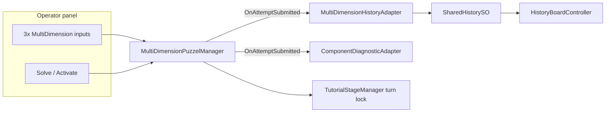

# Pipe Pressure Puzzle — Puzzel Pipes implementation plan

**Keep this plan** as the source of truth for Phases 2–6. Phase 1 is done; do not delete remaining phases when continuing work.

**Design choices (locked in):** separate 2×3 puzzles per player; fixed solutions first (Phase 1); **2** component hints per failed attempt (Phase 3); visualizer visible to **both** players (Phase 4); **alternating** turns with glass overlay (Tutorial-like).

**4-state prefabs (use these; do not edit old 3-state prefabs):**

| Prefab | States (index 0→3) |
|--------|---------------------|
| `MultiDimension_Knob_4State` | SHUT / LOW / HALF / OPEN |
| `MultiDimension_Slider_4State` | LOW / MID / HIGH / MAX |
| `MultiDimension_ButtonText_4State` | LEFT / MID / RGHT / LOOP |

**Player A:** VALVE (knob), PRESS (slider), FLOW (button). **Player B:** GATE (knob), PUMP (slider), ROUTE (button).

**Phase 1 fixed solutions:** Blue VALVE=2, PRESS=1, FLOW=2; Red GATE=3, PUMP=2, ROUTE=3.

**Re-wire menu:** Who Wired This → Pipe Pressure → Wire Puzzel Pipes Scene (`PipePressurePuzzelPipesWireTool`).

---

## Phase status

| Phase | Status | Notes |
|-------|--------|-------|
| 1 — 3×4 inputs + wiring | **implemented** | Scene uses 4-state prefabs; managers/history/focus/turn locks wired |
| 2 — History 3×5 columns | planned | |
| 3 — Component diagnostic | planned | 2 hints/attempt |
| 4 — Result visualizer | planned | Both players see rig |
| 5 — Randomized solution | planned | |
| 6 — Balance / hints | planned | |

---

## 1. Scene summary (baseline → after Phase 1)

### Top-level hierarchy

| Root object | Role |
|-------------|------|
| `_Players` | Two player rigs + `PlayerPanelFocusController` per player |
| `Player1_Panel` / `Player2_Panel` | Blue / Red pipe panels |
| `UI_Canvas` | Dual HUD (`PlayerHudView` ×2) |
| `_Tutorial` | `TutorialStageManager` (turn locks); metrics/summary optional to disable |
| `_Environment` | Zones, room meshes |

### After Phase 1 — inputs per panel

| Side | Control | Prefab | States |
|------|---------|--------|--------|
| Blue | VALVE | Knob_4State | SHUT / LOW / HALF / OPEN |
| Blue | PRESS | Slider_4State | LOW / MID / HIGH / MAX |
| Blue | FLOW | ButtonText_4State | LEFT / MID / RGHT / LOOP |
| Red | GATE | Knob_4State | SHUT / LOW / HALF / OPEN |
| Red | PUMP | Slider_4State | LOW / MID / HIGH / MAX |
| Red | ROUTE | ButtonText_4State | LEFT / MID / RGHT / LOOP |

### Still on Tutorial-style diagnostic (Phase 3)

`MultiDimensionDiagnosticAdapter` — SETTINGS OK / PLACES OK (Bulls-and-Cows). Tutorial scenes keep this adapter; Puzzel Pipes will swap to `ComponentDiagnosticAdapter` in Phase 3.

---

## 2. Puzzle structure (target)

**Label rule:** `subjects[i].displayName` = visible TMP on controls; max **5** chars; no padding in authored labels. History pads only in `HistoryBoardController.FormatInputCell` (`InputTokenWidth = 5`).

**Status strings (scene):** unsolved `UNSTABLE`, solved `CALIBRATED`.

---

## 3. Scene changes (reference)

Phase 1 completed:

- [x] Three inputs under each `Buttons` (VALVE/PRESS/FLOW, GATE/PUMP/ROUTE)
- [x] `puzzleElements` ×3 per panel with fixed `correctIndex`
- [x] `inputOrder` ×3 per `MultiDimensionHistoryAdapter`
- [x] `PanelFocusController` ×3 interactable buttons per board
- [x] `TutorialStageManager` action colliders ×3 + Send per panel lock bundle
- [x] `visibleToPlayer` set (Player_A / Player_B) on each input

Remaining optional scene work (not done):

- [ ] Pipe-themed diagnostic titles
- [ ] Glass overlay copy refresh
- [ ] Disable `TutorialMetricsTracker` / `TutorialSummaryPopupPresenter` on this scene only

---

## 4. Prefab policy

| Asset | Policy |
|-------|--------|
| `MultiDimension_Knob_4State` | Use as-is; scene instance config only |
| `MultiDimension_Slider_4State` | Use as-is |
| `MultiDimension_ButtonText_4State` | Use as-is |
| Old `MultiDimension_Knob` / `MultiDimension_Slider` (3-state) | **Do not modify** |
| `DiagnosticPanel`, `HistoryPanel`, `TutorialActionGlass` | Reuse; scene overrides OK |
| Global prefab edits | Only with explicit approval |

---

## 5. History (Phase 2)

- [x] `MultiDimensionHistoryAdapter` `inputOrder` length 3 per panel (Phase 1)
- [ ] Widen `headerLine` / `separatorLine` on **scene** HistoryPanel instances for ~17-char INPUT (three 5-wide tokens + spaces)
- [ ] Remove stale `inputSeparator` serialized overrides if present
- [ ] Optional: `[SerializeField] int inputTokenWidth` on `HistoryBoardController` (see [puzzle-input-labels-5char.md](puzzle-input-labels-5char.md))

---

## 6. Diagnostic (Phase 3)

- New `ComponentDiagnosticAdapter` + optional `ComponentDiagnosticProfile` SO.
- Per-element hints (e.g. `VALVE LOOKS STABLE.`, `PRESSURE IS TOO HIGH.`); **2** hints per failed attempt; commit-only on SEND.
- Keep `MultiDimensionDiagnosticAdapter` for Tutorial scenes.

---

## 7. Pipe Result Visualizer (Phase 4)

- `SubmittedCombinationVisualizer`: listens to `OnAttemptSubmitted`; maps submitted indices only; no correctness.
- World-space rig; **both** players see last submission per side.

---

## 8. Randomized solution (Phase 5)

- `RandomPuzzleSolutionAssigner` writes `correctIndex` at session start; optional constraints SO.
- Phase 1–4 use fixed Inspector indices.

---

## 9. Risks

| Risk | Mitigation |
|------|------------|
| History column overflow (3×5) | Phase 2 header/separator widen |
| Diagnostic still Bulls-and-Cows | Phase 3 swap adapter on Puzzel Pipes only |
| Turn lock missing 3rd collider | Re-run wire tool if inputs recreated |
| FLOW/ROUTE hint mode | Use `ExactIndex` / `CyclicRoute`, not ordered low/high |
| Tutorial regression | Never replace Tutorial diagnostic adapter type in Tutorial scenes |

---

## 10. Implementation phases (detail)

### Planning & archive

- [x] Full plan written and kept under `.cursor/plan/`
- [x] README index row added
- [x] Design choices recorded (separate puzzles, fixed solutions, 2 hints, visualizer both players, alternating turns)
- [x] 4-state prefab mapping documented (no edits to old 3-state prefabs)

### Phase 1 — 3×4 inputs, fixed solutions ✅

- [x] Six inputs from 4-state prefabs (`Knob_4State`, `Slider_4State`, `ButtonText_4State`)
- [x] Per-input labels: `displayName` matches prefab state order (verified in-editor)
- [x] `correctIndex` fixed table (Blue 2/1/2, Red 3/2/3)
- [x] `MultiDimensionPuzzelManager.puzzleElements` ×3 per panel
- [x] `MultiDimensionHistoryAdapter.inputOrder` ×3 per panel
- [x] `PanelFocusController.interactableButtons` ×3 per board
- [x] `TutorialStageManager` action colliders ×3 + Send per lock bundle
- [x] Editor re-wire tool: `PipePressurePuzzelPipesWireTool` + menu item
- [x] Scene saved: `Assets/Scenes/Puzzel Pipes.unity`
- [ ] Play Mode manual pass (see Testing checklist below)

### Phase 2 — Shared History for 3×5

- [ ] Widen history headers on scene instances
- [ ] Verify padded columns for three tokens
- [ ] **Test:** e.g. `HALF  MID  RGHT` in INPUT column

### Phase 3 — Component diagnostic

- [ ] Implement `ComponentDiagnosticAdapter` + pipe profile
- [ ] 2 hints per failed attempt
- [ ] **Test:** partial lines; Tutorial unchanged

### Phase 4 — Pipe Result Visualizer

- [ ] Scene rig + `SubmittedCombinationVisualizer`
- [ ] **Test:** visuals update on SEND; no correctness leak

### Phase 5 — Randomized solution

- [ ] `RandomPuzzleSolutionAssigner` + constraints
- [ ] **Test:** new play → new solution

### Phase 6 — Balance / progressive hints

- [ ] Hint cooldown, copy variety, co-op playtest

---

## Testing checklist (Phase 1)

- [x] Each input has 4 subjects; `displayName` order matches spec (in-editor verification)
- [ ] Each input cycles 4 states in Play Mode; visible TMP matches `displayName`
- [ ] SEND records 3 tokens in shared history
- [ ] Panel focus cycles 3 inputs + Solve + Exit
- [ ] Alternating glass lock blocks non-operator inputs
- [ ] Blue: HALF / MID / RGHT solves; Red: OPEN / HIGH / LOOP solves

## Rollback notes

Git revert `Assets/Scenes/Puzzel Pipes.unity` and `Assets/WhoWiredThis/Editor/PipePressurePuzzelPipesWireTool.cs` if needed. Do not revert 4-state prefabs or Tutorial scenes.
