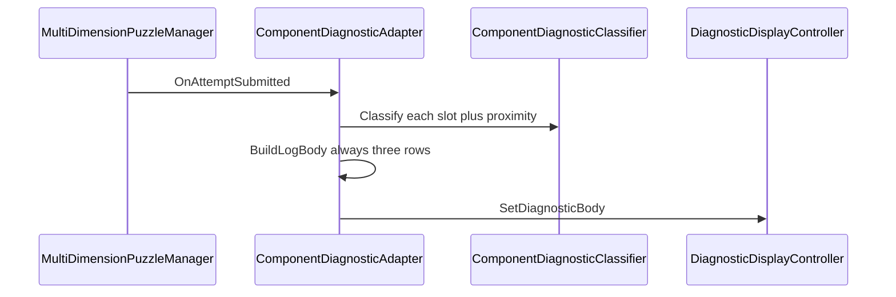

# Pipes diagnostic log format (+ close/far)

## Task name

Pipes diagnostic log screen (plain English, fixed layout, proximity hints)

## Date

2026-07-18

## Decision (locked)

- **Not** a Tutorial-style hex/glyph decode matrix.
- Keep **readable** Pressure / Valve / Flow status lines.
- Restyle body to the **log layout** you mocked.
- Add **close (±1)** vs **far (≥2)** for Ordered slots (Pressure, Valve). Flow stays categorical (match / not balanced).

## Target screen format (exactly **40 cols × 12 lines**)

**Locked:** `Width = 40`, `TotalLines = 12`.  
Dots between label and status are **computed**. **No dashed separators** — use blank lines as spacing.

### Dot-padding rule

```
FormatLabelStatus(label, status):
  gap = 40 - label.Length - status.Length
  if gap < 1: truncate so gap >= 1
  return label + new string('.', gap) + status

PadRight(text):
  return text truncated/padded with '.' to length 40
```

Blank lines are empty strings (length 0); formatter still emits exactly 12 lines.

Solved replaces the whole body with success copy (e.g. `PIPE LINE CALIBRATED.`), fit to ≤12 lines.

### Line map (exactly 12)

| Line | Content |
|------|---------|
| 1 | `OTHER PLAYER SUBMITS // YOU READ........` (PadRight) |
| 2 | `### FIND THE PATTERN IN THE LOG ###.....` (PadRight) |
| 3 | `DIAGNOSTIC LOG // REVISION {rev}.........` (PadRight) |
| 4 | *(blank)* |
| 5 | `STATUS.........................ANALYZING` |
| 6 | *(blank)* |
| 7 | `PRESSURE......................{status}` |
| 8 | `VALVE POSITION................{status}` |
| 9 | `STEAM FLOW....................{status}` |
| 10 | *(blank)* |
| 11 | `WAITING FOR PARTNER INPUT...............` (PadRight) |
| 12 | *(blank)* |

### Exact 40×12 mock

```
OTHER PLAYER SUBMITS // YOU READ........
### FIND THE PATTERN IN THE LOG ###.....
DIAGNOSTIC LOG // REVISION 3012.........

STATUS.........................ANALYZING

PRESSURE......................A BIT HIGH
VALVE POSITION................A BIT OPEN
STEAM FLOW............................OK

WAITING FOR PARTNER INPUT...............

```

## Status vocabulary (correct words for this layout)

| Slot | Exact | Close wrong | Far wrong | Notes |
|------|-------|-------------|-----------|-------|
| PRESSURE | `OK` | `A BIT HIGH` / `A BIT LOW` | `TOO HIGH` / `TOO LOW` | Ordered |
| VALVE POSITION | `OK` | `A BIT OPEN` / `A BIT CLOSED` | `TOO OPEN` / `TOO CLOSED` | Ordered |
| STEAM FLOW | `OK` | — | `NOT BALANCED` | Categorical only |

Proximity: `abs(submitted - correct) == 1` → close; `>= 2` → far.

## Simulated examples

**Close pressure + flow OK + valve slightly open**

```
OTHER PLAYER SUBMITS // YOU READ........
### FIND THE PATTERN IN THE LOG ###.....
DIAGNOSTIC LOG // REVISION 3012.........

STATUS.........................ANALYZING

PRESSURE......................A BIT HIGH
VALVE POSITION................A BIT OPEN
STEAM FLOW............................OK

WAITING FOR PARTNER INPUT...............

```

**Far pressure + flow bad + valve OK**

```
OTHER PLAYER SUBMITS // YOU READ........
### FIND THE PATTERN IN THE LOG ###.....
DIAGNOSTIC LOG // REVISION 2956.........

STATUS.........................ANALYZING

PRESSURE........................TOO HIGH
VALVE POSITION........................OK
STEAM FLOW..................NOT BALANCED

WAITING FOR PARTNER INPUT...............

```

## Manager brief

### What changes

| Area | Change |
|------|--------|
| [`ComponentDiagnosticClassifier.cs`](Assets/WhoWiredThis/Scripts/Puzzles/Common/ComponentDiagnosticClassifier.cs) | Add close (±1) vs far (≥2) for Ordered slots; result-light mapping (close→orange, far→red) |
| [`ComponentDiagnosticAdapter.cs`](Assets/WhoWiredThis/Scripts/Puzzles/Common/ComponentDiagnosticAdapter.cs) | New `bodyLayout` mode; LogRows builder (12×40); Inspector fields for log copy + per-slot short status strings |
| New small helper (e.g. `ComponentDiagnosticLogFormatter.cs`) | Pure string padding: `FormatLabelStatus`, `PadRight`, assemble 12 lines |
| Prefab [`Pipes_A V1.prefab`](Assets/WhoWiredThis/Prefabs/Panels/Pipes_A V1.prefab) | Set `bodyLayout = LogRows` + Pipes vocabulary (B variant inherits) |

### What does **not** change

| Area | Why |
|------|-----|
| `MultiDimensionPuzzleManager` / solve logic | Same submit + correct indices |
| Tutorial hex matrix scripts | Tutorial-only Productive Failure path |
| `DiagnosticDisplayController` API | Still `SetDiagnosticBody` / `SetSuccess` |
| Signal panels | Stay on `LegacyHints` (old sentence list) |
| Puzzle Pipes scene hierarchy / controls | Prefab-level text/layout only |
| Input modules / Activate flow | Untouched |

### How it is configurable in Unity (Inspector)

On the panel object that has **Component Diagnostic Adapter** (e.g. under `Pipes_A V1` → Diagnostic Adapter):

**1. Layout mode**

- `Body Layout` enum: `LegacyHints` | `LogRows`
- Pipes → `LogRows`; Signal → leave `LegacyHints`

**2. Log chrome (only used when LogRows)**

| Property | Example |
|----------|---------|
| `Header Line 1` | `OTHER PLAYER SUBMITS // YOU READ` |
| `Header Line 2` | `### FIND THE PATTERN IN THE LOG ###` |
| `Log Title Prefix` | `DIAGNOSTIC LOG // REVISION` |
| `Status Label` / `Status Value` | `STATUS` / `ANALYZING` |
| `Footer Line` | `WAITING FOR PARTNER INPUT` |
| `Line Width` | `40` (default) |
| `Total Lines` | `12` (default) |

Revision number is runtime (attempt counter), appended then PadRight to 40.

**3. Per-component row (existing Components array, extended)**

Each element already has `input`, `diagnosticType`. For LogRows add:

| Property | Use |
|----------|-----|
| `Row Label` | `PRESSURE` / `VALVE POSITION` / `STEAM FLOW` |
| `Correct Status` | `OK` |
| `Close Too Low` / `Close Too High` | `A BIT LOW` / `A BIT HIGH` (Ordered) |
| `Far Too Low` / `Far Too High` | `TOO LOW` / `TOO HIGH` (Ordered) |
| `Mismatch Status` | `NOT BALANCED` (Categorical / Flow) |

Legacy sentence fields (`correctText`, `tooLowText`, …) remain for `LegacyHints` / Signal — unused when LogRows is selected (or reused as fallback if short status empty).

**4. Solved**

- Existing `Solved Message` → full-screen success when puzzle solves.

**Designer workflow:** edit strings on `Pipes_A V1` prefab once → Blue/Red variants inherit; no code change for copy tweaks.

## Architecture

Reuse existing pipeline:



- Extend classifier with proximity-aware statuses.
- Gate body via `bodyLayout`: `LegacyHints` vs `LogRows`.
- LogRows always emits all three component rows (Pressure, Valve, Flow order as configured in the Components array).

## Scope

- Code: classifier + adapter + log formatter.
- Prefab: `Pipes_A V1` (B inherits).
- Scene: `Puzzle Pipes.unity` only if overrides need revert.
- Result lights: close→orange, far→red.

## Out of scope

- Tutorial hex matrix / `TutorialDiagnosticReport`.
- Changing puzzle solution logic.
- Signal panel copy (LegacyHints default).
- Font authoring beyond Body_TMP fit check.

## Approved implementation steps

1. Add proximity classification to `ComponentDiagnosticClassifier` (Ordered only).
2. Add `LogRows` body builder: **exactly 12 lines × 40 chars**; blank-line spacing (no dashes); **dot-pad** labels/status via `FormatLabelStatus` / `PadRight`; lines 7–9 = Pressure / Valve / Flow.
3. Expose Inspector fields listed in Manager brief § configurable.
4. Set `Pipes_A V1` adapter to LogRows + vocabulary; leave Signal on LegacyHints.
5. Compile + Play Mode check on Puzzle Pipes both panels; assert formatter returns 12 lines of length 40.

## Testing checklist

- Failed try shows full log skeleton every time (all three rows).
- Body is exactly **12 lines × 40 characters** (blank spacer lines; dots fill label/status gaps; no dash rules).
- Exact → `OK`; ±1 → `A BIT …`; ≥2 → `TOO …` / `NOT BALANCED` for flow.
- Solved → success message only.
- Signal scenes unchanged (LegacyHints).
- Blue/Red Pipes both update after Send.
- Copy edits in Inspector appear without code changes.

## Rollback notes

- Revert classifier/adapter/formatter + `Pipes_A V1` serialized fields in Git.
