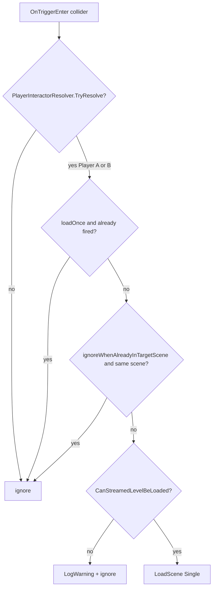

# Player scene transition trigger

## Scope

- New small runtime script under `Assets/WhoWiredThis/Scripts/Environment/` (same area as `ZoneTrigger.cs`).
- Inspector-configured **target scene name** (Unity scene name, not asset path).
- **Any** co-op player (Player A **or** Player B) entering the trigger loads the scene once.
- Reuse existing player identification: `PlayerInteractorResolver.TryResolve`.
- Reuse existing load guards from `SceneHotkeySwitcher`: `Application.CanStreamedLevelBeLoaded`, `SceneManager.LoadScene(..., LoadSceneMode.Single)`.
- Scene wiring only: add a trigger volume GameObject per exit (Tutorial, Puzzle Pipes, Puzzle Signal, etc.) — no changes to puzzle solve logic.

## Out of scope

- Fade / loading screen / async `LoadSceneAsync`.
- Requiring **both** players in the trigger before loading (can be a follow-up flag if needed).
- Hard dependency on `TutorialStageManager` or completion state (prefer disabling the trigger GameObject or its collider until the room is complete).
- Adding scenes to **Build Settings** automatically (document manual step).
- Physics **collision** (`OnCollisionEnter`) — use **trigger** volumes only (matches `ZoneTrigger` and avoids fighting CharacterController).

## Design

### Component name (proposed)

`SceneTransitionTrigger` in namespace `WhoWiredThis.Environment`.

### Serialized fields (implemented)

| Field | Purpose |
|-------|---------|
| `string targetSceneName` | Scene to load (e.g. `Puzzle Signal`, `Tutorial`). |
| `bool loadOnce` (default `true`) | After first successful load attempt, ignore further triggers. |
| `bool ignoreWhenAlreadyInTargetScene` (default `true`) | No-op if active scene name already matches target. |
| `Collider triggerCollider` | Single external trigger source assigned in Inspector. |

### Runtime flow



### Player detection

Mirror `ZoneTrigger`:

```csharp
if (PlayerInteractorResolver.TryResolve(other.transform, out _))
{
    TryLoadTargetScene();
}
```

Do **not** use legacy `"Player"` tag unless you explicitly want dev-only behavior; co-op scenes use `PlayerA` / `PlayerB` on player roots (see `TagManager` and FirstPerson prefab variants).

### Scene load

Mirror `SceneHotkeySwitcher` (lines 61–68):

- Warn if `targetSceneName` is empty.
- Warn if scene is not in Build Settings.
- `SceneManager.LoadScene(targetSceneName, LoadSceneMode.Single)`.

### One-shot guard

Private `bool _hasTriggered` set **before** calling `LoadScene` so rapid double-entry from two players in the same frame does not queue duplicate loads.

## Scene setup (per exit door)

1. Create empty child e.g. `Exit_SceneTransition` at doorway.
2. Add **Box Collider** (or mesh collider): **Is Trigger** = checked; size covers walk-through volume.
3. Add `SceneTransitionTrigger`; set **Target Scene Name** to the next room’s scene name.
4. Ensure target scene is listed and enabled in **File → Build Settings** (current list includes `Tutorial`, `Puzzle Signal`, etc.; **`Puzzle Pipes` is not in build list today** — add before using it as a target).
5. Optional gating: leave GameObject **inactive** or disable collider until `TutorialStageManager` completion disables blockers / enables exit — same pattern as completion door unlock.

### Physics note

`OnTriggerEnter` requires at least one **Rigidbody** on the moving object or the trigger setup Unity expects. First-person players use **CharacterController**; trigger volumes on static geometry are the usual pattern (same as zone tracking). If triggers do not fire in Play Mode, verify layer matrix and that the player capsule/child collider enters the volume.

## Approved implementation steps

1. ✅ Add `SceneTransitionTrigger.cs` under `Assets/WhoWiredThis/Scripts/Environment/`.
2. ✅ Implement relay-based external trigger forwarding + helpers (`TryLoadTargetScene`, validation logging).
3. ✅ Test scene setup validated in `Assets/Scenes/Test_NextLevel.unity` (`NextLevel` + `Cube` trigger collider).
4. ✅ Confirm `Tutorial` exists in Build Settings.
5. ⚠️ Play Mode final sign-off in editor on both players (manual).

## Validation findings (Test_NextLevel)

- `Test_NextLevel` is a test-purpose scene and is now treated as the reference harness for this feature.
- `NextLevel` correctly targets `Tutorial` and references the external `Cube` trigger collider.
- The trigger `Cube` had duplicate `SceneTransitionTriggerRelay` components; cleaned to a single relay component.
- Hardening added in runtime script:
  - Relay now tries owner auto-resolution if owner is missing.
  - Relay forwards both `OnTriggerEnter` and `OnTriggerStay` to avoid missed first-frame enter events.
- Additional hardening from MCP runtime test:
  - Added detailed debug logs in both `SceneTransitionTrigger` and relay for registration, collider filtering, and load decisions.
  - Added bounds-polling fallback (`PlayerA`/`PlayerB` overlap check) to handle cases where Unity trigger callbacks do not fire reliably in this test scene setup.
  - MCP verification path: Play Mode in `Test_NextLevel` + teleport PlayerA into trigger showed fallback log and successful load to `Tutorial`.

## Testing checklist

- ⬜ Empty `targetSceneName` logs warning, no load.
- ⬜ Scene not in Build Settings logs warning, no load.
- ⬜ Player A enter → loads target once.
- ⬜ Player B enter (different run) → loads target once.
- ⬜ Two players enter same frame → still only one load (`loadOnce`).
- ⬜ Non-player collider (prop, UI) → ignored.
- ⬜ Already in target scene + `ignoreWhenAlreadyInTargetScene` → no load.
- ⚠️ Dual-display: both players remain in same loaded scene (Single mode replaces scene — expected POC behavior).

## Rollback notes

- Delete `SceneTransitionTrigger.cs` and remove components from scene objects.
- No prefab or puzzle-system changes required for rollback.

## Risks

| Risk | Mitigation |
|------|------------|
| Target scene missing from Build Settings | `CanStreamedLevelBeLoaded` + warning (same as hotkey switcher). |
| Trigger fires before puzzle complete | Disable trigger object/collider until completion wiring is done. |
| Accidental reload while designing | `ignoreWhenAlreadyInTargetScene` + disable trigger in editor test scenes. |

## Related code (existing)

- `Assets/WhoWiredThis/Scripts/Environment/ZoneTrigger.cs` — trigger + player resolve pattern.
- `Assets/WhoWiredThis/Scripts/Player/PlayerInteractorResolver.cs` — PlayerA / PlayerB parent walk.
- `Assets/WhoWiredThis/Scripts/Core/SceneHotkeySwitcher.cs` — scene name load + build validation.
