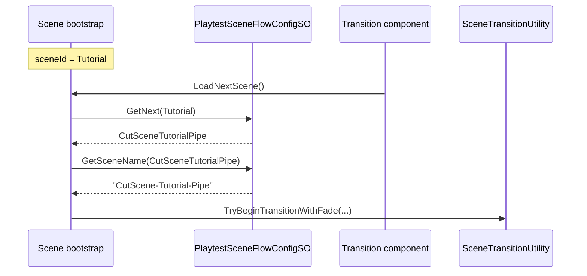
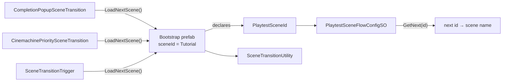
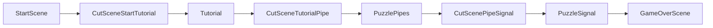

# Playtest scene flow — ScriptableObject + enum

## TLDR

**Scene sends identity; config picks next.**

- Each scene instance sets **`PlaytestSceneId sceneId`** on a shared **`PlaytestSceneFlowBootstrap`** prefab.
- One **`PlaytestSceneFlowConfigSO`** holds: enum → scene name **and** ordered chain (current → next).
- Transition components (**popup / cutscene / trigger**) only fire **`bootstrap.LoadNextScene()`** — no `targetSceneName`, no `nextSceneId` on components.
- Reorder or rename the playtest path by editing the SO only.

## Current pain

| Component | Today |
|-----------|--------|
| `CompletionPopupSceneTransition` | hardcoded `targetSceneName` per scene |
| `CinemachinePrioritySceneTransition` | same |
| `SceneTransitionTrigger` | same |
| Editor wire tool | hardcoded strings per scene |

## Target architecture





### Playtest chain (config-owned)



**Example:** Bootstrap in `Tutorial.unity` has `sceneId = Tutorial`. Popup dismiss → `GetNext(Tutorial)` → `CutSceneTutorialPipe` → load `"CutScene-Tutorial-Pipe"`.

## Proposed types

### 1. `PlaytestSceneId` (enum, code)

```csharp
public enum PlaytestSceneId
{
    None = 0,
    StartScene,
    CutSceneStartTutorial,
    Tutorial,
    CutSceneTutorialPipe,
    PuzzlePipes,
    CutScenePipeSignal,
    PuzzleSignal,
    GameOverScene,
}
```

New scene → add enum value + SO rows (compile-time registry).

### 2. `PlaytestSceneFlowConfigSO`

**Two tables, one asset:**

| Table | Purpose |
|-------|---------|
| `sceneEntries[]` | `{ id, sceneName }` — enum ↔ Unity scene name |
| `playtestChainOrder[]` | ordered ids — defines **next** for each step |

**API:**

```csharp
bool TryGetSceneName(PlaytestSceneId id, out string sceneName);
bool TryGetNext(PlaytestSceneId currentId, out PlaytestSceneId nextId);
bool TryGetNextSceneName(PlaytestSceneId currentId, out string sceneName);
```

- `GetNext`: index of `currentId` in chain → return `[index + 1]` (or fail if last / not found).
- `GameOverScene` / chain tail → no next (validator + runtime guard).

Asset: `Assets/WhoWiredThis/Data/Playtest/PlaytestSceneFlowConfig.asset`

### 3. `PlaytestSceneFlowBootstrap` (prefab + per-scene override)

Shared prefab **`PlaytestSceneFlowBootstrap.prefab`**:

| Field | Scope |
|-------|--------|
| `flowConfig` | Shared SO ref (same asset everywhere) |
| `sceneId` | **Per-scene instance override** — “this scene sends this enum” |

**API:**

```csharp
PlaytestSceneId SceneId { get; }
bool TryLoadNextScene(MonoBehaviour host, float fadeSeconds, SceneTransitionFadeOverlay[] overlays, ...);
```

Registers as scene-local provider; transition components `FindFirstObjectByType` / cached ref in Awake.

**Per scene:** drop prefab, set **`sceneId` only**. All transition logic reads next from SO.

### 4. Transition component changes

**Remove** `targetSceneName` from all three.

Each component on trigger:

```csharp
bootstrap.TryLoadNextScene(this, fadeOutDurationSeconds, fadeOverlays, ...);
```

No scene-specific target wiring on components.

### 5. Bookends + hotkeys (v1)

| Script | Change |
|--------|--------|
| `StartSceneController` | Bootstrap `sceneId = StartScene`; Start button → `LoadNextScene()` |
| `GameOverSceneController` | Restart → load `StartScene` via SO name lookup (or chain head) |
| `SceneHotkeySwitcher` | Bindings use `PlaytestSceneId`; resolve names from SO on Managers prefab |

## Decisions (approved)

| Topic | Choice |
|-------|--------|
| Who owns “next”? | **SO chain** — scene only sends `sceneId` |
| SO access | **Bootstrap prefab** per scene; components find bootstrap |
| SO contents | **Map + ordered chain** |
| v1 scope | **3 transitions + Start/GameOver + SceneHotkeySwitcher** |
| String override | **No** |

## Scope

| In | Out |
|----|-----|
| Enum, SO, bootstrap, 3 transition refactors | Rewriting `SceneTransitionUtility` |
| Shared config asset + bootstrap prefab | Branching / alternate paths |
| Scene migration (bootstrap + sceneId per scene) | Per-component `nextSceneId` |
| Editor validator + wire tool update | String fallback fields |

## Implementation steps (when approved)

1. Add `PlaytestSceneId`, `PlaytestSceneFlowConfigSO`, `PlaytestSceneFlowBootstrap`.
2. Populate SO asset: entries + chain matching current Build Settings order.
3. Create bootstrap prefab (SO ref wired once).
4. Refactor 3 transition scripts → call `bootstrap.LoadNextScene()`.
5. Refactor Start / GameOver / `SceneHotkeySwitcher` to use SO.
6. Migrate scenes: add bootstrap, set `sceneId`, strip `targetSceneName` from components.
7. Editor: validator menu (chain complete, bootstrap.sceneId matches active scene name, build settings).
8. Update wire tool: set bootstrap `sceneId` + ensure bootstrap present (no string targets).
9. Compile + manual full-chain playtest.

## Editor validator rules

- ⬜ Every `playtestChainOrder` id has a `sceneEntries` row.
- ⬜ Scene names ∈ Build Settings.
- ⬜ Active scene name ↔ bootstrap `sceneId` consistent.
- ⬜ No duplicate ids in chain.
- ⚠️ Warn if transition components exist but no bootstrap in scene.

## Testing checklist

- ⬜ Each scene: correct `sceneId` on bootstrap only.
- ⬜ Tutorial popup → cutscene → Pipes → cutscene → Signal → GameOver (full chain).
- ⬜ Change chain in SO only → all scenes follow without per-component edits.
- ⬜ Last scene / missing next → warning, no load.
- ⬜ Hotkeys resolve from SO.

## Rollback

Revert scripts; restore string `targetSceneName` on scenes; remove bootstrap prefab instances.

## Prefab / scene wiring summary

```
PlaytestSceneFlowConfig.asset     ← single chain + name map (edit here to reroute)
PlaytestSceneFlowBootstrap.prefab ← flowConfig ref (shared)
  └─ Tutorial.unity instance      ← sceneId = Tutorial
  └─ CutScene-Tutorial-Pipe       ← sceneId = CutSceneTutorialPipe
  └─ Puzzle Pipes                 ← sceneId = PuzzlePipes
  …
```

Transition components in any scene: **zero target configuration** — only trigger timing (fade, dolly position, popup dismiss).
