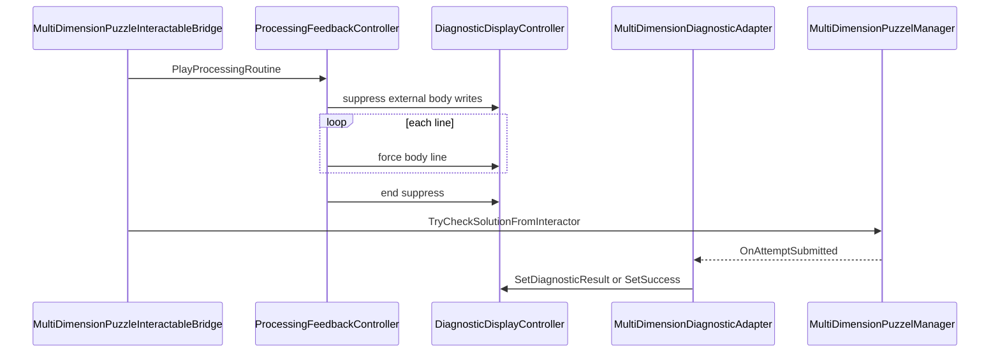

# Processing messages on diagnostic Body_TMP

## Problem with the current approach

- Separate **`Processing_TMP`** and **`SetActive`** on the diagnostic panel / root duplicate the diagnostic surface and are **explicitly out of scope** now: remove those scene objects and **do not** toggle diagnostic visibility in code.
- With **[`MultiDimensionDiagnosticAdapter`](Assets/WhoWiredThis/Scripts/Puzzles/Common/MultiDimensionDiagnosticAdapter.cs)** and **`updateContinuously`**, **`Update` → `RefreshDisplay` → `SetDiagnosticResult`** runs every frame and writes the body through **[`DiagnosticDisplayController`](Assets/WhoWiredThis/Scripts/Puzzles/Common/DiagnosticDisplayController.cs)**. Any processing text written straight to `TMP_Text` would be **overwritten immediately** unless the display layer cooperates.

## Target behavior

- **During processing:** only the processing lines appear in **Body_TMP** (the `bodyText` field on `DiagnosticDisplayController`).
- **After processing:** existing adapter logic runs unchanged and **replaces** the body with the real diagnostic (metrics + message or success text).

### Cross-panel diagnostic (Split Tutorial layout)

In **[`Split Tutorial.unity`](Assets/Scenes/Split Tutorial.unity)**, diagnostics are **not** co-located with the same root as each player’s Solve control:

- **DIAGNOSTIC A** (Actor / Player A readout) lives under **`Player2_Panel`** (`677608034`).
- **DIAGNOSTIC B** (Actor / Player B readout) lives under **`Player1_Panel`** (`596226953`).

**Wiring rule:** `ProcessingFeedbackController.diagnosticDisplay` must reference the **`DiagnosticDisplayController` on that actor’s diagnostic**—the one already driven by the matching **`MultiDimensionDiagnosticAdapter`**—not “whatever diagnostic is under the same panel as the Solve button.” Concretely:

| Activate / manager side | `diagnosticDisplay` target |
|---------------------------|------------------------------|
| Player A (`MultiDimensionPuzzelManager` for A, e.g. manager on **Player1** flow) | **DIAGNOSTIC A** instance under **Player2_Panel** |
| Player B | **DIAGNOSTIC B** instance under **Player1_Panel** |

So processing lines and post-check results appear on the **same Body_TMP** the player sees for that actor, including the cross-panel placement.

## 1. Extend `DiagnosticDisplayController` (minimal API)

**File:** [`Assets/WhoWiredThis/Scripts/Puzzles/Common/DiagnosticDisplayController.cs`](Assets/WhoWiredThis/Scripts/Puzzles/Common/DiagnosticDisplayController.cs)

- Add an internal **suppress** flag (e.g. `int bodyWriteSuppressDepth` or a single `bool` with try/finally from caller).
- **`WriteBody`** (or all existing public paths that call it): if suppressed, **skip** updating `bodyText` (adapter can still run; lamp/state updates can stay as today, or optionally skip lamp during suppress—keep first version minimal: **only body skipped**).
- Add **`public void SetProcessingBodyText(string text)`** (name up to you): sets `bodyText.text` **even when suppressed**, used exclusively by processing feedback.

**Why not public “get Body_TMP” only:** exposing raw `TMP_Text` would still lose to adapter every frame unless suppress lives on the display controller (single place).

## 2. Simplify `ProcessingFeedbackController`

**File:** [`Assets/WhoWiredThis/Scripts/Puzzles/Common/ProcessingFeedbackController.cs`](Assets/WhoWiredThis/Scripts/Puzzles/Common/ProcessingFeedbackController.cs)

- **Remove:** `processingRoot`, `processingMessageText`, and **all** `diagnosticDisplayRoot` / `Transform` / `GameObject.SetActive` logic that hides or shows the diagnostic panel (not needed; panel stays active).
- **Add:** `[SerializeField] private DiagnosticDisplayController diagnosticDisplay;`
- **`PlayProcessingRoutine`:**  
  - `diagnosticDisplay` null → `Debug.LogWarning`, `yield break`.  
  - `BeginSuppress()` → loop messages with `SetProcessingBodyText` + `WaitForSeconds` → `EndSuppress()` in **`finally`** (matches current coroutine safety).  
  - Keep **`activateInteractable`** disable/enable behavior as today; bridge still owns **`RestoreActivateIfNeeded`** after `TryCheck`.

**No adapter or manager changes** if suppression is entirely inside `DiagnosticDisplayController`.

## 3. Bridge

**File:** [`Assets/WhoWiredThis/Scripts/Visibility/MultiDimensionPuzzleInteractableBridge.cs`](Assets/WhoWiredThis/Scripts/Visibility/MultiDimensionPuzzleInteractableBridge.cs)

- **No behavioral change** beyond what you already have: still `yield return processingFeedback.PlayProcessingRoutine()` then `TryCheckSolutionFromInteractor`.

## 4. Scene cleanup and re-wire ([`Assets/Scenes/Split Tutorial.unity`](Assets/Scenes/Split Tutorial.unity))

- **Must remove** every **`Processing_TMP`** object and its components from the scene YAML (both sides), including:
  - The **`!u!1` / `RectTransform` / `MeshRenderer` / `TextMeshPro`** blocks for `990011000` and `990012000` (and any related IDs introduced for that UI).
  - **`m_Children`** entries on **`Player1_Panel`** / **`Player2_Panel`** transforms that point at those processing roots.
- **Do not** leave any scene or script path that **deactivates the diagnostic panel** for processing; visibility stays unchanged.
- **Keep** `ProcessingFeedbackController` on the panels (or chosen host) and **`m_Component`** entries for it; adjust serialized fields to the new layout (see below) if the YAML order changes.
- **Place `ProcessingFeedbackController`** where it is easy to assign refs (often still on **`Player1_Panel` / `Player2_Panel`** next to other orchestration); placement does not imply `diagnosticDisplay` is on the same transform tree as the host.
- **`ProcessingFeedbackController` → `diagnosticDisplay`:** drag the **`DiagnosticDisplayController`** for **that actor’s** diagnostic panel (**cross-panel** as in the table above). It **must** be the same object the corresponding **`MultiDimensionDiagnosticAdapter`** uses so suppress + adapter updates hit one `Body_TMP`.
- **`MultiDimensionPuzzleInteractableBridge` → `processingFeedback`:** unchanged pattern (bridge on each Solve references its side’s `ProcessingFeedbackController`); only the **diagnostic** reference inside that controller crosses panels per the table.

## 5. Testing

- Play **Split Tutorial**: From each side’s view, **Activate** shows processing lines on the **correct actor diagnostic Body_TMP** (A’s text on **DIAGNOSTIC A** under **Player2**; B’s on **DIAGNOSTIC B** under **Player1**), then the usual diagnostic body after the check; history unchanged.
- With **`updateContinuously`** on, confirm body text **does not** flicker back to live metrics during processing (validates suppress).
- Solve: Activate stays off; unsolved fail: Activate returns.

## 6. Other scenes / prefabs

- **Tutorial** / **Split Puzzle:** unchanged until you assign the new `ProcessingFeedbackController` layout; null `processingFeedback` preserves instant check.
