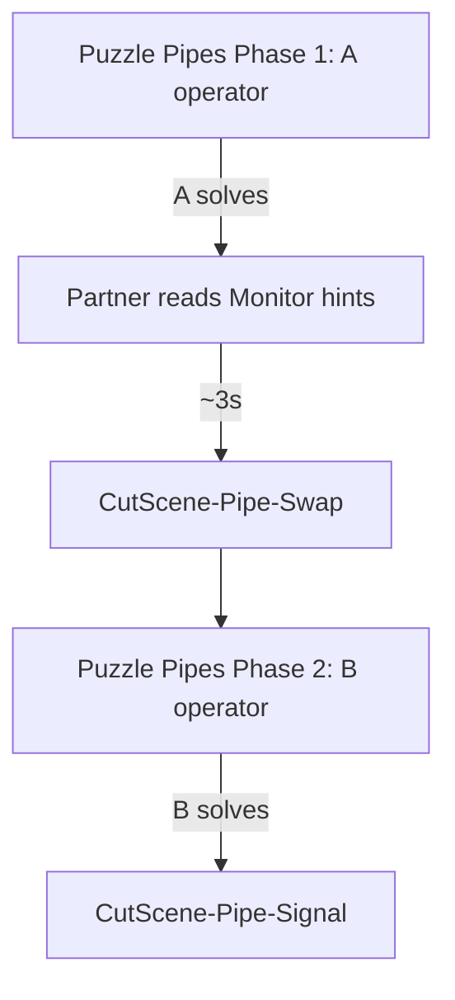

# Puzzle Pipes role-swap cut-scene round trip

## Task name

1. **Rename** shared “tutorial” types to **`Scene*`** (used by Tutorial, Puzzle Pipes, Puzzle Signal).
2. **Mirror** the Tutorial cut-scene role-swap round trip on **Puzzle Pipes** (Monitor hints + legacy rules panels).

## Date

2026-07-09 (audit updated after implementation)

## Overall status

| Area | Status |
|------|--------|
| Code + scene wiring | ✅ **Implemented** (2026-07-09) |
| Automated compile + Pipes Phase 1 validator | ✅ **Passed** |
| Manual Play Mode (Tutorial + Pipes + chain) | ⬜ **Not run** — owner validation |
| Custom Pipes copy (Monitor reveal + TSM bodies) | ⬜ **Deferred** — user copy TBD |
| Docs cross-link (`tutorial-role-swap-cutscene-round-trip.md`) | ⬜ **Not updated** |

---

## Pattern reference

Same guidelines as [tutorial-role-swap-cutscene-round-trip.md](tutorial-role-swap-cutscene-round-trip.md):

- Opt-in `roleSwapMode` on stage manager (`InScene` | `CutSceneRoundTrip`)
- Phase-1 solve → `OnPhaseOneSolved` → delay → swap cut scene → reload same puzzle scene Phase 2
- Static **`SceneRoleState`** for cross-load operator phase
- `InitialPanelFocusBootstrap.useSceneRoleStateOperator`
- Swap cut scene = explicit load by id (not in `playtestChainOrder`)
- Cut scene return via `CinemachinePrioritySceneTransition.overrideTargetSceneId`

---

## Part A — Scene* rename ✅

### Principle

| Keep `Tutorial*` | Rename to `Scene*` |
|------------------|-------------------|
| Tutorial-only metrics / summary popup | Shared staged two-player flow (role swap, locks, completion) |
| `TutorialMetricsTracker`, `TutorialMetricsSnapshot`, `TutorialSummaryPopupPresenter` | `SceneStageManager`, `SceneRoleState`, `SceneRoleSwapCutsceneTransition`, etc. |

New folder: **`Assets/WhoWiredThis/Scripts/Scene/`** (`namespace WhoWiredThis.Scenes` — **not** `WhoWiredThis.Scene`; clashes with `UnityEngine.SceneManagement.Scene`).  
Tutorial-only scripts stay in **`Assets/WhoWiredThis/Scripts/Tutorial/`**.

### Rename map (files + types) — all done ✅

| Current | New | Done |
|---------|-----|------|
| `Tutorial/TutorialRoleState.cs` | `Scene/SceneRoleState.cs` | ✅ |
| `TutorialRolePhase` | `SceneRolePhase` | ✅ |
| `Tutorial/TutorialStageManager.cs` | `Scene/SceneStageManager.cs` | ✅ |
| `TutorialSessionStage` | `SceneSessionStage` | ✅ |
| `TutorialRoleSwapMode` | `SceneRoleSwapMode` | ✅ |
| `TutorialPanelLockBundle` | `ScenePanelLockBundle` | ✅ |
| `OnTutorialStarted` | `OnStageStarted` | ✅ |
| `OnTutorialCompleted` | `OnStageCompleted` | ✅ |
| `Environment/TutorialRoleSwapCutsceneTransition.cs` | `Environment/SceneRoleSwapCutsceneTransition.cs` | ✅ |
| `useTutorialRoleStateOperator` | `useSceneRoleStateOperator` | ✅ `[FormerlySerializedAs]` |
| `tutorialStageManager` | `sceneStageManager` | ✅ `[FormerlySerializedAs]` on transition + metrics + summary |
| Log prefixes / tooltips | Drop “Tutorial only” where shared | ✅ partial — shared types updated |

**Unity serialization:** `.meta` GUIDs preserved; scenes rebind via script GUID (no broken refs).

### Scene-entry reset ✅

Implemented in **`SceneRoleStateEntryUtility`** + `SceneRoleState.ConfigureForSceneLoad`, registered on `SceneManager.sceneLoaded` (not `PlaytestSceneFlowBootstrap` — equivalent outcome).

| Loaded scene | Previous scene | `SceneRoleState` | Done |
|--------------|----------------|------------------|------|
| `Tutorial` | `CutScene-Tutorial-Swap` | Keep Phase 2 | ✅ |
| `Tutorial` | anything else | Reset → Phase 1 | ✅ |
| `PuzzlePipes` | `CutScene-Pipe-Swap` | Keep Phase 2 | ✅ |
| `PuzzlePipes` | anything else | Reset → Phase 1 | ✅ |
| Other | — | No change | ✅ |

Existing resets unchanged: `StartSceneController`, `PlaytestFlowUtility.TryReturnToMainMenu`.

### Code references updated ✅

| Area | Status |
|------|--------|
| Runtime (8 files) | ✅ |
| Editor (7 tools) | ✅ |
| Production scenes (`Tutorial`, `Puzzle Pipes`, `Puzzle Signal`) | ✅ compile via GUID; Inspector not manually re-checked |
| Plans / README | ✅ this file + README row; ⬜ `tutorial-role-swap-cutscene-round-trip.md` addendum |

### What does **not** rename (unchanged) ✅

- `TutorialMetricsTracker`, `TutorialMetricsSnapshot`, `TutorialSummaryPopupPresenter`
- `TutorialDiagnosticController` / decode matrix
- Scene asset names (`Tutorial.unity`, etc.)
- `PlaytestSceneId.Tutorial` enum value

---

## Part B — Puzzle Pipes role-swap

### Post-implementation state (verified in repo)

| Item | Status |
|------|--------|
| `SceneStageManager` on scene | ✅ |
| `roleSwapMode` | ✅ `CutSceneRoundTrip` (`1`) |
| `SceneRoleSwapCutsceneTransition` | ✅ on TSM GameObject; `targetCutScene: 10` |
| `useSceneRoleStateOperator` | ✅ `true` on bootstrap |
| Dual diagnostics | ✅ (prior v2 migration) |
| `CutScene-Pipe-Swap.unity` | ✅ `sceneId=10`, `overrideTargetSceneId=5` |
| `PlaytestSceneId.CutScenePipeSwap` | ✅ enum value `10` |
| Flow config entry | ✅ `id: 10` → `CutScene-Pipe-Swap` |
| Build Settings | ✅ scene enabled |
| `Puzzle Signal.unity` | ✅ `roleSwapMode: 0`, no swap transition |

### Approved decisions — status

| # | Decision | Status |
|---|----------|--------|
| 1 | Cut-scene swap on Pipes only; Signal stays `InScene` | ✅ |
| 2 | `Scene*` naming; Tutorial refactored | ✅ |
| 3 | Scene-entry reset | ✅ |
| 4 | Retarget `CutScene-Pipe-Swap.unity` | ✅ |
| 5 | Custom Phase-1 reveal on partner Monitor | ⬜ **Not done** — uses standard hint/diagnostic flow during delay |
| 6 | Rewrite Pipes TSM body strings (Pipes tone) | ⬜ **Not done** — scene still has calibration-style copy |
| 7 | Phase-2 exit → `CutScene-Pipe-Signal` | ✅ unchanged |

### Flow

---

## Part C — Tutorial changes

| # | Change | Status |
|---|--------|--------|
| 1 | Types → `SceneStageManager` / `SceneRoleState` / `SceneRoleSwapCutsceneTransition` | ✅ |
| 2 | `Tutorial.unity` components rebind via script GUID | ✅ (`roleSwapMode: 1`, `targetCutScene: 9`) |
| 3 | Bootstrap `useSceneRoleStateOperator` (YAML key still `useTutorialRoleStateOperator` via FormerlySerializedAs) | ✅ `true` |
| 4 | Scene-entry reset on Tutorial load | ✅ |
| 5 | Manual Tutorial Play Mode regression | ⬜ |
| 6 | Update `tutorial-role-swap-cutscene-round-trip.md` addendum | ⬜ |

---

## Implementation steps (audit)

### Phase 0 — Scene* rename + entry reset

1. ✅ Create `Scripts/Scene/`; move/rename `SceneRoleState`, `SceneStageManager` (meta GUIDs kept)
2. ✅ Rename `TutorialRoleSwapCutsceneTransition` → `SceneRoleSwapCutsceneTransition`
3. ✅ Update all C# references + editor tools; `[FormerlySerializedAs]` on renamed fields
4. ✅ `SceneRoleStateEntryUtility` + `ConfigureForSceneLoad` on `sceneLoaded`
5. ✅ Unity compile — 0 errors

### Phase 1 — Tutorial regression pass

6. ⬜ Open `Tutorial.unity`; Inspector spot-check (role swap + bootstrap flags)
7. ⬜ Manual Tutorial checklist (Part D.2)

### Phase 2 — Pipes config + cut scene

8. ✅ `CutScenePipeSwap` enum + flow config + build settings
9. ✅ Retarget `CutScene-Pipe-Swap.unity`
10. ⬜ Draft/apply Pipes body copy + Monitor reveal copy

### Phase 3 — Puzzle Pipes wiring

11. ✅ `roleSwapMode`, `useSceneRoleStateOperator`, `SceneRoleSwapCutsceneTransition`
12. ⬜ Wire **custom** Phase-1 reveal to partner Monitor (beyond existing hint wiring)
13. ⬜ Manual Pipes checklist (Part D.3)

---

## Part D — Test plan

### D.1 Automated

| Step | Status |
|------|--------|
| Compile (`read_console` 0 errors) | ✅ |
| Pipes Phase 1 validator (`MCP/0. Phase 1`) | ✅ ALL CHECKS PASSED |
| Tutorial Phase 1 validator | ⬜ not run (panel structure differs) |

### D.2 Tutorial regression (manual)

- ⬜ Fresh run / direct Editor open → Phase 1
- ⬜ A solves → ~3s → `CutScene-Tutorial-Swap`
- ⬜ Return Phase 2 (B operator)
- ⬜ B solves → `CutScene-Tutorial-Pipe` → **Puzzle Pipes Phase 1** (critical reset test)
- ⬜ Menu / new run → `SceneRoleState` reset

### D.3 Puzzle Pipes (manual)

- ⬜ Direct Editor open → Phase 1
- ⬜ Rules on legacy panels; hints on Monitor
- ⬜ A solves → Monitor read → ~3s → `CutScene-Pipe-Swap`
- ⬜ Return Phase 2; roles swapped
- ⬜ B solves → `CutScene-Pipe-Signal`
- ⬜ After Tutorial swap: chain entry still Phase 1 on Pipes

### D.4 Negative / edge cases

- ⬜ `Puzzle Signal.unity` — no errors in Play Mode
- ⬜ Re-enter scene — no duplicate loads (`loadOnce`)
- ⬜ Git diff — no accidental transform edits in production scenes

### D.5 Rollback

- ⬜ Not tested (git is rollback path; backup scene still at `_BACKUP_2026-07-09/`)

---

## Forgotten / deferred / cosmetic (not blocking compile)

| Item | Severity | Notes |
|------|----------|-------|
| **Custom Phase-1 Monitor reveal text** | Medium (content) | Approved in Q&A but no dedicated copy component or TSM string; partner sees normal solve hints on Monitor during 3s delay |
| **Pipes TSM body string rewrite** | Low (content) | Intro/post-solve strings still calibration tone in `Puzzle Pipes.unity` |
| **Manual Play Mode** | High (validation) | Full Tutorial + Pipes + chain not run by implementer |
| **`tutorial-role-swap-cutscene-round-trip.md` addendum** | Low (docs) | Still references old `TutorialStageManager` paths in frontmatter |
| **GameObject rename** `TutorialStageManager` → `SceneStageManager` | Cosmetic | GO name unchanged in `Puzzle Pipes.unity` / `Tutorial.unity`; component type is `SceneStageManager` |
| **Tutorial structural validator** | Low | Pipes validator passed; Tutorial not re-validated with editor menu |
| **Entry-reset hook location** | N/A | Plan said bootstrap; implemented via `SceneRoleStateEntryUtility` — behavior matches spec |

Nothing **blocking** was found in code wiring, enum/config, build settings, or cut-scene return target.

---

## Open input (still needed for content polish)

- **Phase-1 Monitor reveal text** (Pipes) — partner read during delay after A solves
- **Rewritten `SceneStageManager` body strings** on Puzzle Pipes (intro, post-A-solve, etc.)

---

## Rollback notes

- Revert C# moves + scene YAML changes via git
- `Assets/Scenes/Game/_BACKUP_2026-07-09/Puzzle Pipes.pre-v2-wiring.unity` — panel wiring rollback (separate from role-swap)

## Related plans

- [tutorial-role-swap-cutscene-round-trip.md](tutorial-role-swap-cutscene-round-trip.md) — original Tutorial implementation; ⬜ add “types renamed to Scene*” note
- [puzzle-pipes-v2-panel-wiring-migration.md](puzzle-pipes-v2-panel-wiring-migration.md) — dual diagnostics prerequisite ✅
- [puzzle-pipes-completion-cutscene-transition.md](puzzle-pipes-completion-cutscene-transition.md) — Phase-2 exit unchanged ✅
