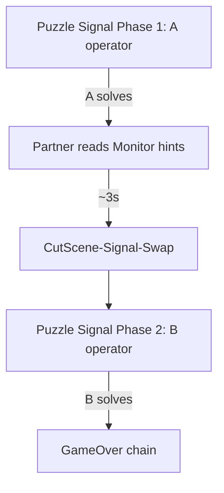

# Puzzle Signal role-swap cut-scene round trip

## Task name

Mirror the **Puzzle Pipes** / **Tutorial** cut-scene role-swap round trip on **Puzzle Signal**, using existing **`CutScene-Signal-Swap.unity`**.

## Date

2026-07-10

## Scope

- Add `PlaytestSceneId.CutSceneSignalSwap` and flow-config / build-settings entry.
- Retarget `CutScene-Signal-Swap.unity` (`sceneId` → Signal swap, `overrideTargetSceneId` → Puzzle Signal).
- Wire `Puzzle Signal.unity`: `roleSwapMode = CutSceneRoundTrip`, turn-based operators (`simultaneousOperators = false`), `SceneRoleSwapCutsceneTransition`, `useSceneRoleStateOperator`.
- Extend `SceneRoleState` entry reset for Puzzle Signal ↔ CutScene-Signal-Swap.
- Editor wire tool + MCP menu; stop full Signal wire tool from forcing simultaneous operators.

## Out of scope

- Custom Signal Monitor reveal copy (deferred, same as Pipes).
- Rewriting TSM body strings for Signal tone.
- Changing Phase-2 exit (still completion popup → `GameOverScene` chain).

## Approved implementation steps

1. ✅ `CutSceneSignalSwap` enum (`11`) + `PlaytestSceneFlowConfig` entry + build settings.
2. ✅ `SceneRoleState` / `SceneRoleStateEntryUtility` Puzzle Signal entry rules.
3. ✅ `PuzzleSignalRoleSwapCutsceneWireTool` + MCP wire menu.
4. ✅ `SignalCalibrationPuzzleSignalWireTool` — do not force `simultaneousOperators` when cut-scene swap enabled.
5. ⬜ Manual Play Mode validation (Part D).

## Flow

## Testing checklist

- ⬜ Direct Editor open `Puzzle Signal` → Phase 1 (A operator).
- ⬜ A solves → ~3s → `CutScene-Signal-Swap` → return Phase 2 (B operator).
- ⬜ B solves → completion / game over flow.
- ⬜ Re-enter from `CutScene-Pipe-Signal` → Phase 1 reset.
- ✅ Unity compile — pending after implementation.

## Rollback notes

- Git revert scene YAML + enum/config changes.
- Set `roleSwapMode: 0` and `simultaneousOperators: 1` on Puzzle Signal to restore prior simultaneous play.
