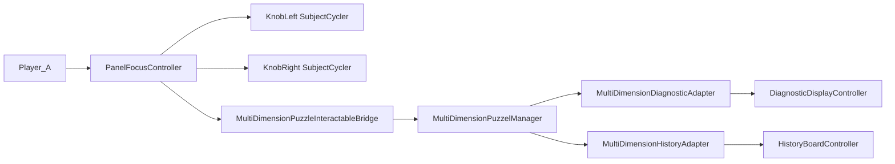

# Build `SplitPuzzle_Panel1` Scene

## Goal
Create a new scene copied from [`/Users/ilang/git/unity/who-wired-this/Assets/Scenes/Split Puzzle.unity`](/Users/ilang/git/unity/who-wired-this/Assets/Scenes/Split%20Puzzle.unity), then add a fully wired Player_A panel with:
- 2 knob buttons
- solve button
- exit button
- puzzle manager
- board selection manager (panel focus)
- diagnostic display
- history board

Player setup remains dual-ready, but this new panel is configured for Player_A.

## Layout Specification
- Board aspect ratio: 16:9.
- Top controls row (20% of board height): left knob, right knob, solve, exit.
- Lower area (60% of board height): diagnostic and history side-by-side.
- Remaining vertical space used as visual margins/padding.

## Implementation Plan
- Duplicate source scene to `Assets/Scenes/SplitPuzzle_Panel1.unity` (+ `.meta`) and load it for edits.
- Create/position a new panel root under puzzle environment and add a board object sized to 16:9.
- Add panel-focus orchestration on the board using [`/Users/ilang/git/unity/who-wired-this/Assets/WhoWiredThis/Scripts/PanelFocus/PanelFocusController.cs`](/Users/ilang/git/unity/who-wired-this/Assets/WhoWiredThis/Scripts/PanelFocus/PanelFocusController.cs), configured for Player_A with highlight anchors for 4 top-row slots.
- Instantiate or duplicate 2 knob interactables (`MultiDimension_*` style) and wire their `MultiDimensionSubjectCycler` references into panel button entries (left/right).
- Add solve button object with [`/Users/ilang/git/unity/who-wired-this/Assets/WhoWiredThis/Scripts/Visibility/MultiDimensionPuzzleInteractableBridge.cs`](/Users/ilang/git/unity/who-wired-this/Assets/WhoWiredThis/Scripts/Visibility/MultiDimensionPuzzleInteractableBridge.cs) targeting a `MultiDimensionPuzzelManager`.
- Configure exit button entry to exit focus (PanelFocus exit path).
- Add/configure a dedicated [`/Users/ilang/git/unity/who-wired-this/Assets/WhoWiredThis/Scripts/Visibility/MultiDimensionPuzzelManager.cs`](/Users/ilang/git/unity/who-wired-this/Assets/WhoWiredThis/Scripts/Visibility/MultiDimensionPuzzelManager.cs):
  - puzzle elements mapped to the 2 knobs
  - feedback renderer/materials
  - solve button interactable reference
  - disable-on-solve interactables list (knobs + solve bridge)
- Create lower board section:
  - diagnostic display object + [`/Users/ilang/git/unity/who-wired-this/Assets/WhoWiredThis/Scripts/Puzzles/Common/DiagnosticDisplayController.cs`](/Users/ilang/git/unity/who-wired-this/Assets/WhoWiredThis/Scripts/Puzzles/Common/DiagnosticDisplayController.cs)
  - history board object + [`/Users/ilang/git/unity/who-wired-this/Assets/WhoWiredThis/Scripts/Puzzles/Common/HistoryBoardController.cs`](/Users/ilang/git/unity/who-wired-this/Assets/WhoWiredThis/Scripts/Puzzles/Common/HistoryBoardController.cs)
- Add adapters and wire them to the same puzzle manager:
  - [`/Users/ilang/git/unity/who-wired-this/Assets/WhoWiredThis/Scripts/Puzzles/Common/MultiDimensionDiagnosticAdapter.cs`](/Users/ilang/git/unity/who-wired-this/Assets/WhoWiredThis/Scripts/Puzzles/Common/MultiDimensionDiagnosticAdapter.cs)
  - [`/Users/ilang/git/unity/who-wired-this/Assets/WhoWiredThis/Scripts/Puzzles/Common/MultiDimensionHistoryAdapter.cs`](/Users/ilang/git/unity/who-wired-this/Assets/WhoWiredThis/Scripts/Puzzles/Common/MultiDimensionHistoryAdapter.cs)
- Ensure Player_A can enter panel focus via existing `PlayerPanelFocusController` in scene and interact with new panel.
- Save scene and run validation pass (compile + console + interaction flow checks).

## Validation Checklist
- Scene loads and compiles without new errors.
- Player_A enters panel focus and can cycle Left/Right knob.
- Solve button triggers bridge -> puzzle manager.
- Exit button exits focus mode.
- On failed/solved attempts, diagnostic + history update.
- Solve success applies configured feedback and disables solve/knob interaction.

## Data Flow (Target Wiring)
