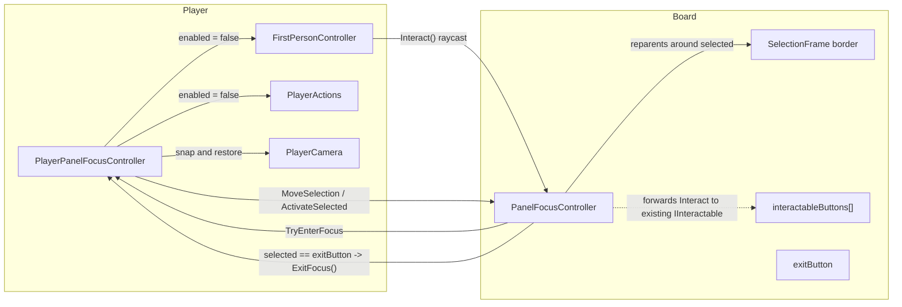

## Why Exit flickers (one-line)

`PlayerActions` is NOT disabled during focus. It reads `FirstPersonController.InteractPressedThisFrame`, but that flag is only refreshed inside FPC's own `Update()`. Once FPC is disabled, the flag stays stuck at `true` (from the entry press), so `PlayerActions.HandleInteraction()` keeps dispatching `Interact()` every frame to the nearest `IInteractable` in its 1.5 m sphere ([Assets/WhoWiredThis/Scripts/Player/PlayerActions.cs](Assets/WhoWiredThis/Scripts/Player/PlayerActions.cs) lines 83-129). On the exit frame, that races the `lastStateChangeFrame` guard and re-triggers entry — the camera "flicker" the user sees.

Fix: have `PlayerPanelFocusController` toggle BOTH `firstPersonController.enabled` and `playerActions.enabled` together.

## Final architecture (2 scripts only)

- `PlayerPanelFocusController` (per-player): owns focus state, camera snap/restore, and toggles FPC + PlayerActions.
- `PanelFocusController` (per-panel, attached to Board, **renamed from `FocusablePanelController`**): identity + camera pose offsets + variable `interactableButtons[]` + dedicated `exitButton` slot + SelectionFrame border.
- `PanelFocusTarget` MonoBehaviour and its file: **deleted**. Buttons are described by inline `[Serializable] PanelFocusButton` records on the panel.



## Selection model (generic)

- Selection navigates an ordered sequence: `[interactableButtons[0], ..., interactableButtons[N-1], exitButton]`. Exit is always the last index, so `exitButton` is reachable with one extra Right press past the rightmost button.
- Only the **currently selected** button reacts to the Interact press. The PFC.Update path calls `panel.ActivateSelected(player)`, which forwards exactly once to the selected entry. Non-selected buttons do nothing — including their own colliders, because `PlayerActions` is disabled during focus (see Exit-flicker fix above).
- Pressing Interact when `exitButton` is selected calls `PlayerPanelFocusController.ExitFocus()`. There is no other code path to exit from inside focus.

## SelectionFrame visual (border image)

- One GameObject in the scene (designer-authored), reused across all buttons. Suggested setup: a flat **Quad** with an **Unlit/Transparent** material whose texture is a rectangle border PNG (transparent middle, opaque edge). Alternative: a world-space `UI.Image` with a 9-sliced border sprite. No collider.
- Each button (interactable or exit) has a child Transform named `HighlightAnchor` whose **position, rotation, and lossyScale** define the rectangle the border should occupy around that button.
- At runtime the panel **re-parents** the SelectionFrame under the selected button's `HighlightAnchor` and zeroes its local pose, so the frame exactly matches each anchor regardless of size:
```csharp
selectionFrame.transform.SetParent(currentEntry.highlightAnchor, worldPositionStays: false);
selectionFrame.transform.localPosition = Vector3.zero;
selectionFrame.transform.localRotation = Quaternion.identity;
selectionFrame.transform.localScale    = Vector3.one;
selectionFrame.SetActive(true);
```
This means designers tune the visual size by scaling the per-button `HighlightAnchor`, not the SelectionFrame itself.

## Code changes

### Create `Assets/WhoWiredThis/Scripts/PanelFocus/PanelFocusController.cs`

Replaces `FocusablePanelController` with the same responsibilities, but generalized:

```csharp
[Serializable]
public class PanelFocusButton
{
    public string label = "Button";
    [Tooltip("Child Transform sized to the rectangle the border should occupy around this button.")]
    public Transform highlightAnchor;
    [Tooltip("Existing IInteractable MonoBehaviour to forward activation to (e.g. MultiDimensionSubjectCycler). Leave empty to do nothing on press.")]
    public MonoBehaviour interactableReference;
}

public class PanelFocusController : MonoBehaviour, IInteractable
{
    [Header("Ownership")]
    [SerializeField] private AllowedPlayerTag allowedPlayerId = AllowedPlayerTag.Player_A;

    [Header("Camera (panel-local pose)")]
    [SerializeField] private Vector3 cameraLocalPosition = new Vector3(0f, 1f, -0.7f);
    [SerializeField] private Vector3 cameraLocalEuler    = Vector3.zero;

    [Header("Buttons")]
    [Tooltip("All non-exit interactable buttons on this panel, in left-to-right order.")]
    [SerializeField] private PanelFocusButton[] interactableButtons;
    [Tooltip("Always-present Exit button. Selecting + activating it exits focus mode.")]
    [SerializeField] private PanelFocusButton exitButton;

    [Header("Selection Frame")]
    [Tooltip("Border-image GameObject; gets re-parented under the selected button's HighlightAnchor.")]
    [SerializeField] private GameObject selectionFrame;

    [Header("Prompt")]
    [SerializeField] private string promptText = "$INTERACT$ Open Panel";

    private int selectedIndex;
    private PlayerPanelFocusController activeController;

    private int ButtonCount         => (interactableButtons?.Length ?? 0);
    private int TotalCount          => ButtonCount + 1;
    private bool IsExitSelected     => selectedIndex == ButtonCount;
    private PanelFocusButton Current => IsExitSelected ? exitButton : interactableButtons[selectedIndex];

    public void GetCameraSnapPose(out Vector3 worldPos, out Quaternion worldRot)
    {
        worldPos = transform.TransformPoint(cameraLocalPosition);
        worldRot = transform.rotation * Quaternion.Euler(cameraLocalEuler);
    }

    public void MoveSelection(int delta)
    {
        if (TotalCount <= 1) return;
        selectedIndex = Mathf.Clamp(selectedIndex + delta, 0, TotalCount - 1);
        RefreshSelectionFrame();
    }

    public void ActivateSelected(GameObject interactor)
    {
        if (IsExitSelected)
        {
            Debug.Log($"Player {activeController?.PlayerId} pressed ExitButton.");
            activeController?.ExitFocus();
            return;
        }
        var entry = interactableButtons[selectedIndex];
        Debug.Log($"Player {activeController?.PlayerId} activated '{entry?.label}'.");
        if (entry?.interactableReference is IInteractable existing)
        {
            existing.Interact(interactor);
        }
    }
    // OnFocusEntered/Exited + RefreshSelectionFrame as described in the SelectionFrame visual section above.
}
```

Notes:
- No `PanelFocusTargetType` enum. "Exit" is whatever is plugged into `exitButton`; everything else lives in `interactableButtons[]`.
- Validation in `Awake`: assert `exitButton != null && exitButton.highlightAnchor != null` so designers can't ship a panel without an Exit.

### Update [Assets/WhoWiredThis/Scripts/PanelFocus/PlayerPanelFocusController.cs](Assets/WhoWiredThis/Scripts/PanelFocus/PlayerPanelFocusController.cs)

- Replace `FocusablePanelController` references with `PanelFocusController`.
- Add new serialized field `[SerializeField] private PlayerActions playerActions;` (reuses [Assets/WhoWiredThis/Scripts/Player/PlayerActions.cs](Assets/WhoWiredThis/Scripts/Player/PlayerActions.cs)).
- In `TryEnterFocus`:
```csharp
if (firstPersonController != null) firstPersonController.enabled = false;
if (playerActions != null) playerActions.enabled = false;   // NEW: stops stale-input dispatch
```
- In `ExitFocus`:
```csharp
if (firstPersonController != null) firstPersonController.enabled = true;
if (playerActions != null) playerActions.enabled = true;    // NEW
```
- Replace the `panel.FocusCameraAnchor` snap with `panel.GetCameraSnapPose(out var pos, out var rot); playerCamera.transform.SetPositionAndRotation(pos, rot);`
- Keep the existing `lastStateChangeFrame` / `IsInputAllowedThisFrame` guard.

### Delete

- [Assets/WhoWiredThis/Scripts/PanelFocus/FocusablePanelController.cs](Assets/WhoWiredThis/Scripts/PanelFocus/FocusablePanelController.cs) (and `.meta`)
- [Assets/WhoWiredThis/Scripts/PanelFocus/PanelFocusTarget.cs](Assets/WhoWiredThis/Scripts/PanelFocus/PanelFocusTarget.cs) (and `.meta`)

## Manual scene re-wiring (do this once after the script changes compile)

The rename gives the new script a fresh GUID, so the existing components on the panels become "Missing Script". Short checklist for [Assets/Scenes/PanelFocusMode.unity](Assets/Scenes/PanelFocusMode.unity).

### One-time SelectionFrame visual swap (per panel)

The current `SelectionFrame` is a solid cube. Replace its visual with a border:
1. Select `Panel_Player1/SelectionFrame` -> change Mesh Filter mesh to `Quad` (or replace with a UI world-space `Image`).
2. Assign a material that uses a transparent **rectangle border** texture (opaque edge, transparent center). A simple `Unlit/Transparent` material with a border PNG works.
3. Remove any colliders on it. Set it inactive by default — `PanelFocusController` activates it on focus entry.
4. Repeat for `Panel_Player2/SelectionFrame`.

### Per-button HighlightAnchor

For **each** button on each panel (TestButton AND ExitButton today; whatever the designer adds tomorrow):
1. Confirm/create a child `HighlightAnchor` Transform on the button.
2. Position the anchor centered on the button face and **scale it** so its X/Y match the rectangle you want the border to surround. The Z scale should be small (e.g. 0.01) since the SelectionFrame is a flat Quad.

### Per-panel `PanelFocusController` setup

For **each panel** (`Panel_Player1`, `Panel_Player2`):
1. Select the panel **root** GameObject. If a `Missing Script` (the duplicate `FocusablePanelController`) is on it — Remove Component. There should be NO `PanelFocusController` on the root.
2. Select the panel's `Board` child. Remove the old `Missing Script` slot. `Add Component` -> `PanelFocusController`.
3. Configure:
   - Allowed Player Id: `Player_A` for Panel_Player1, `Player_B` for Panel_Player2
   - Camera Local Position: `(0, 1, -0.7)` (closer than before; tune in Inspector)
   - Camera Local Euler: `(0, 0, 0)`
   - Selection Frame: drag `SelectionFrame` child
   - **Interactable Buttons** size = 1 (today; raise as more are added):
     - Element 0: Label `Test`, Highlight Anchor = `TestButton/HighlightAnchor`, Interactable Reference = the `MultiDimensionSubjectCycler` on `TestButton`
   - **Exit Button** (single slot, always required):
     - Label `Exit`, Highlight Anchor = `ExitButton/HighlightAnchor`, Interactable Reference = (leave empty)
4. Select `TestButton` and `ExitButton` -> Remove the now-unused `PanelFocusTarget` (Missing Script after delete) component.
5. (Optional cleanup) Delete the `FocusCameraAnchor` child — no longer used.

### Per-player `PlayerPanelFocusController` setup

For **each player** (`FirstPersonPlayer_A`, `FirstPersonPlayer_B`):
6. Select the player root -> on its `PlayerPanelFocusController`:
   - Drag the player's own `PlayerActions` component into the new `Player Actions` slot.
   - Re-confirm Player Camera, First Person Controller, and Input Bindings are still set (they should survive).
7. Save the scene.

## Acceptance

- The panel exposes `interactableButtons[]` (variable size) plus a single `exitButton` slot in the Inspector. Adding/removing buttons does not require a code change.
- The SelectionFrame is a single rectangular border (transparent middle) that visually wraps the currently selected button — including the Exit button — and re-parents to each `HighlightAnchor` as the selection moves.
- Pressing Interact only triggers the **selected** button. Test cycles its cycler; Exit cleanly leaves focus mode.
- Exit no longer flickers: camera restores, SelectionFrame hides, player moves again — no immediate re-entry.
- Inspector fields `cameraLocalPosition` / `cameraLocalEuler` change the focus pose live without touching any child Transform.
- Only two `.cs` files in `Assets/WhoWiredThis/Scripts/PanelFocus/`. Each panel has exactly one `PanelFocusController` (on `Board`).