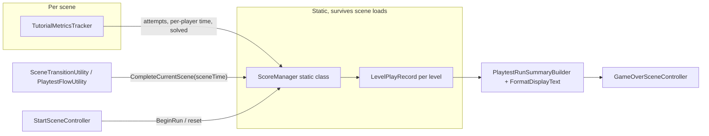

# Static Cross-Scene ScoreManager Refactor

## Task name

Static cross-scene ScoreManager (run scoreboard)

## Date

2026-07-23V

## Scope

- Rewrite `ScoreManager` as a static class that survives scene loads
- Absorb `PlaytestRunTotal` timing into `ScoreManager`
- Record per-level Blue/Red attempts, retries, play time, scene totals
- Feed from existing `TutorialMetricsTracker` in Tutorial / Puzzle Pipes / Puzzle Signal
- Extend GameOver summary with per-level lines; delete legacy numeric score
- Editor validator for tracker presence in gameplay scenes

## Out of scope

- High score / persistence leaderboard
- Rewriting `PuzzleScoreSession` / A17 local LCD score math
- Changing HUD layout assets beyond clearing the score text line

## Approved implementation steps

1. Archive this plan and update `.cursor/plan/README.md`
2. Add `LevelPlayRecord` + rewrite static `ScoreManager`; delete `PlaytestRunTotal`
3. Delete legacy `AddScore`/`SetScore`/`OnScoreChanged` call sites; update flow utilities
4. Remove obsolete `ScoreManager` MonoBehaviour from `Managers.prefab`
5. Feed `TutorialMetricsTracker` into `ScoreManager` (live + finalize)
6. Extend `PlaytestRunSummary` / builder for per-level Blue/Red summary
7. Add `ScoreTrackingSceneValidator` editor tool
8. Compile-check via Unity MCP

## Testing checklist

- ⬜ Full run StartScene → Tutorial → Pipes → Signal → GameOver shows per-level lines
- ⬜ Abandon mid-Pipes shows partial Pipes record
- ⬜ Restart from GameOver zeros the run
- ✅ Editor validator passes on gameplay scenes
- ✅ No missing-script warnings on Managers prefab instances (ScoreManager component removed)
- ✅ Unity compiles with zero new errors
- 🚧 Role-swap must preserve Blue retries/time across CutScene-*-Swap reload (merge + skip early CompleteCurrentScene)

## Rollback notes

Revert the commit(s) for this refactor. Git is the primary rollback; the Managers.prefab component removal is the riskiest single asset change.

## Target architecture

