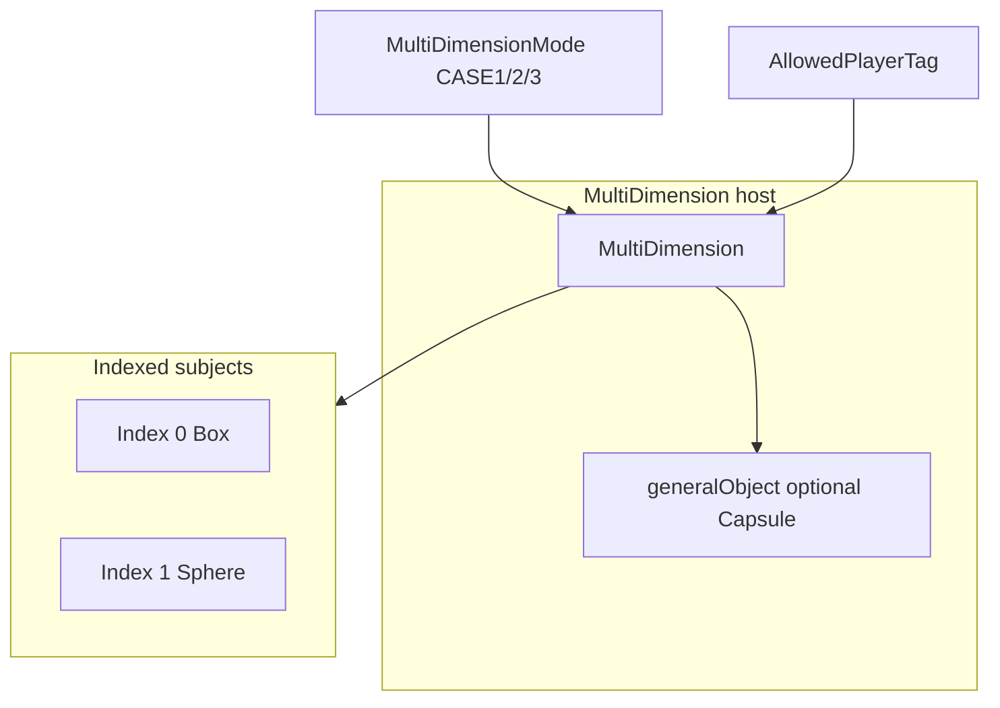

# MultiDimension — guidelines (plan)

## Scope

- **New script only** [`MultiDimension.cs`](/Users/ilang/git/unity/who-wired-this/Assets/WhoWiredThis/Scripts/Visibility/MultiDimension.cs) (+ optional tiny helper in the same folder). **Do not** refactor **[`DimensionVisibilityObject`](/Users/ilang/git/unity/who-wired-this/Assets/WhoWiredThis/Scripts/Visibility/DimensionVisibilityObject.cs)** or other existing systems—**copy** layer/renderer/collider patterns into new code when needed.

---

## Core behaviour

### Inspector: subject array

- Serialize **`GameObject[]`** or **`Transform[]` subjects** — ordered list; **index `i`** selects which child subtree is “the active subject” for a given rule.
- Indices must be **validated** (in-range, null-safe); invalid entries skip or log.

### Three use cases (configuration mode)

Expose a **mode** in the inspector (e.g. enum **`MultiDimensionMode`** or similar) so designers switch behaviour without code changes.

| Mode | Meaning |
|------|---------|
| **CASE 1 — Split A/B** | **Different indices** for **Player A** and **Player B** at the same time—subject for A on **DimensionA**, subject for B on **DimensionB** (both relevant subjects **active**; layers route visibility per existing project cameras/physics). Inspector: **`indexPlayerA`**, **`indexPlayerB`** (or two int fields). |
| **CASE 2 — Exclusive one player** | **One selected index** visible **only** to **either** Player A **or** Player B; the **other player sees none** of the subject entries (those subjects **inactive** or on layers that player’s camera does not render—pick one strategy and document; simplest is **SetActive(false)** on non-chosen subjects for the “off” side only if impossible without splitting—prefer **layer + activation** consistent with CASE 1 patterns). Inspector: **`exclusivePlayer`** via **`AllowedPlayerTag`** (`Player_A` or `Player_B` only for this case), **`subjectIndex`**. **`Any_Player`** is invalid or maps to “undefined”—document. |
| **CASE 3 — All players** | **One selected index** for **everyone**—same subject **visible to all** (typically **`Any_Player`** semantics: put that subject’s renderers/colliders on **Default** or a layer **both** cameras include; deactivate other indices or leave them inactive). Inspector: **`sharedIndex`**. |

Runtime/API may mirror inspector (e.g. `ApplyCase1(aIndex, bIndex)`, `ApplyCase2(AllowedPlayerTag player, int index)`, `ApplyCase3(int index)`) **using `AllowedPlayerTag`** wherever a **player** must be chosen—**no parallel player enums** on public surface.

### General object (always on)

- Optional **`Transform` / `GameObject` generalObject** (or `[SerializeField] GameObject alwaysActiveGeneral`).
- If assigned: **always active** for **all players**—never deactivated by subject switching; colliders/renderers stay on the **shared** layer (**Default** or project-standard “all players” layer).
- Typical use: **interaction capsule** that both players hit regardless of which subject mesh is shown.

### AllowedPlayerTag

- Use **[`AllowedPlayerTag`](/Users/ilang/git/unity/who-wired-this/Assets/WhoWiredThis/Scripts/Data/enums/AllowedPlayerTag.cs)** for **player selection** in APIs and inspector fields where a player must be specified (`Player_A`, `Player_B`, `Any_Player` as appropriate per case above).

### Inspector summary (fields to plan in code)

- **`subjects`** — array.
- **`generalObject`** — optional; always on.
- **`mode`** — CASE 1 / 2 / 3.
- **CASE 1**: indices for A and B.
- **CASE 2**: `AllowedPlayerTag` (A or B) + single subject index.
- **CASE 3**: single index for all.
- Optional: **default layers** capture per subject for reset; **help boxes** / `[Tooltip]` for designers.

---

## Example object (deliverable)

Build **one** example in a scene (prefab optional):

| Node | Role |
|------|------|
| **Host** | `MultiDimension` component |
| **Child — Box** | **Subject index 0** (Cube mesh + collider as needed) |
| **Child — Sphere** | **Subject index 1** |
| **Child — Capsule** | **General object** — **`CapsuleCollider`** (and mesh if you want a visible capsule); stays **always active**, shared layer, **not** part of the subject index cycle |

Wire **`subjects[0]`** = Box, **`subjects[1]`** = Sphere; assign **`generalObject`** = Capsule root. Exercise **CASE 1** (Box for A, Sphere for B), **CASE 2** (e.g. Box for A only), **CASE 3** (same index for all).

---

## Architecture

---

## Layer / visibility notes

- **CASE 1**: align with **DimensionA** / **DimensionB** the same way copied logic from **`DimensionVisibilityObject`** resolves layers (new code only).
- **CASE 3** / **generalObject**: prefer **Default** (or your verified shared layer) so all player cameras and physics agree.
- Document **`Any_Player`** for CASE 3 explicitly in script comments.

---

## Testing checklist

- All three **modes** from inspector + optional runtime API.
- **General** capsule never drops inactive when switching subjects.
- **CASE 2**: non-target player sees **no** subject content (per chosen strategy).
- Example hierarchy (**Box / Sphere / Capsule**) behaves as expected in play mode.

---

## Non-goals

- No mass refactor of **`DimensionVisibilityMode`**, **`TutorialStationConfigurator`**, or tutorials—validate **`MultiDimension`** in isolation first.
