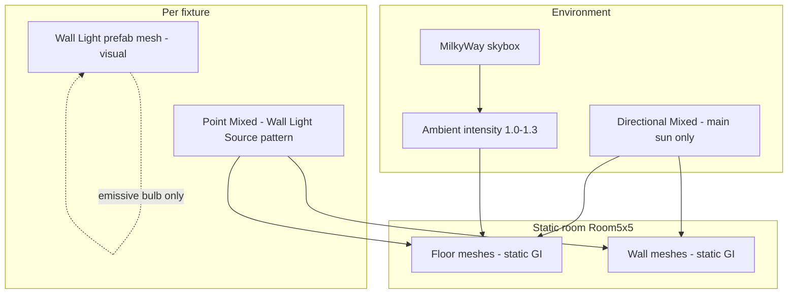

# Test_Room_Light — interior + sun lighting pilot

## Task name

Realistic interior lighting with sun fill on `Test_Room_Light.unity` (pilot before Game-scene rollout)

## Date

2026-07-11

## Scope

- Establish a **repeatable lighting recipe** on **`Assets/Scenes/Test/Test_Room_Light.unity`** only.
- Goal look: **warehouse interior that is not dark**, with **visible local pools under wall fixtures**, while a **moderate sun** still provides direction, contrast, and sky-linked ambient.
- Match the **proven SciFi Warehouse demo pattern** (not the broken `Wall Light` prefab baked-spot workflow).
- Document the recipe so it can be applied **one Game scene at a time** after pilot sign-off.

## Out of scope

- Changing any **`Assets/Scenes/Game/*.unity`** scene until pilot is validated.
- Rewriting puzzle, panel, or gameplay systems.
- Runtime-created lights or global `FindObjectOfType` coupling.
- Modifying `StartScene` / `GameOverScene` (they intentionally use no shared lighting settings asset today).
- Committing or merging pilot changes into production scenes without explicit approval per scene.

---

## Manager summary (read this first)

### What “realistic” means in this project

| Layer | Role | What players should see |
|-------|------|-------------------------|
| **Sun (Directional, Mixed)** | Main outdoor/skylight through openings | Soft overall direction, shadows, readable contrast — **not** the only light |
| **Skybox + ambient** | Base fill so interiors are never pitch black | MilkyWay-style sky; ambient intensity ~1.0–1.3 |
| **Wall fixture lights (Point, Mixed)** | Local sconce pools on floor/walls near fixtures | Warm/cool pools under each `Wall Light`; visible in Play Mode |
| **Baked GI (optional indirect)** | Stable bounce in static rooms | Floor/walls pick up subtle fill; wall lights also have realtime direct |

### Why the current pilot fails

1. **`Wall Light` prefab child is the wrong light type** — Spot/Baked/Directional experiments do not match how the asset pack demo lights interiors.
2. **URP allows only one Directional (“sun”)** — a wall “Directional” is ignored or replaces the sun; it cannot fake a sconce.
3. **`Test_Room_Light` uses a different GI pipeline than Game scenes** — scene uses `Test_Room_LightSettings` (baked ON); Game scenes use `SciFi_WarehouseSettings` (realtime lightmaps ON, baked OFF).
4. **~18 lights in scene** — URP `Additional Lights Per Object Limit` is **4** on `PC_RPAsset`; weak wall lights lose to closer machine/panel lights.
5. **Stale bake data** — mode changes without **Clear Baked Data** leave `isBaked` state that hides realtime tests.

### Target architecture (one sentence)

**One Mixed sun + skybox ambient + separate Mixed Point lights at each wall fixture** — same idea as `SciFi_Warehouse.unity` “Wall Light Source” objects.

---

## Current state (baseline)

| Asset / scene | Current | Issue |
|---------------|---------|-------|
| `Test_Room_Light.unity` | `Test_Room_LightSettings`, baked lightmaps, MilkyWay_InteriorBright | Different from Game scenes; wall tests confused by bake |
| `_Lights/Directional Light` | Mixed, intensity ~1.35 | Correct role (sun) — keep, tune down if interior too flat |
| `Wall Light.prefab` child `Directional Light` | Was Spot/Baked/Directional/Mixed in experiments | Wrong pattern for URP interior pools |
| Game scenes (9) | `SciFi_WarehouseSettings.lighting` | Production target settings — align pilot toward this |
| `PC_RPAsset` | Additional lights per object = **4** | May need 6–8 if many local lights stay enabled |
| SciFi demo | Separate `Wall Light Source` Point lights, Mixed, range 5–12 | **Reference implementation** |

---

## Approved implementation steps

### Phase 0 — Git safety (before edits)

- ⬜ Confirm working tree is committed or user accepts dirty state.
- ⬜ Pilot work stays in **`Test_Room_Light.unity`** + test lighting assets only; do not edit Game scenes yet.

### Phase 1 — Align lighting settings with production target

**Decision:** Pilot should converge on **`SciFi_WarehouseSettings`** behavior (or a tuned fork saved next to it after validation).

| Setting | Pilot target | Why |
|---------|--------------|-----|
| Lighting Settings asset | Start from `SciFi_WarehouseSettings`; optionally fork `WhoWired_InteriorSettings.lighting` after tune | Game rollout uses same asset |
| Baked lightmaps | **Off** (match demo) | Avoids “only baked, no realtime pool” confusion |
| Realtime lightmaps | **On** | Demo + Game scenes |
| Mixed bake mode | Shadowmask (as demo) | Sun + locals work together on static geometry |
| Sun | **On**, Mixed, intensity **0.8–1.2** (tune) | Visible but not washing out fixtures |
| Ambient | Skybox, intensity **1.0–1.3** | Prevents total darkness |
| Skybox | Keep `MilkyWay_InteriorBright` | User preference; neutral-enough interior |

**Actions:**

- ⬜ Assign `SciFi_WarehouseSettings` (or fork) to `Test_Room_Light` Lighting window.
- ⬜ **Lighting → Clear Baked Data** (remove stale `LightingData` confusion).
- ⬜ Link `Render Settings → Sun` to `_Lights/Directional Light`.

### Phase 2 — Fix wall fixture lighting (demo pattern)

**Do not** rely on the prefab’s misnamed child spot/directional for floor pools.

**Option A (recommended): prefab variant / child template**

- ⬜ On each `Wall Light` instance (or prefab variant `Wall Light_Lit`):
  - Keep existing mesh children (`SciFi_WallLight`, `SciFi_WallLightBulb`).
  - **Disable or remove** the prefab’s built-in `Directional Light` child light component.
  - Add child **`Wall Light Source`** (empty GO + Light):
    - **Type: Point**
    - **Mode: Mixed**
    - **Range: 6–10** (tune per ceiling height)
    - **Intensity: 2–5** (tune)
    - **Color:** slight cool white (match demo ~`#DFEFF`)
    - **Position:** at bulb, slightly in front of wall mesh
    - **Parent `Wall Light` root: non-static** (match demo) OR keep static if bake-only indirect — prefer **non-static** for pilot
- ⬜ Bulb material (`Light Mat`) — emissive is visual only; optional **Contribute GI** on bulb if emissive bake desired later.

**Option B (scene-only, fastest pilot):**

- ⬜ Duplicate demo `Wall Light Source` lights in scene under `_Lights` or per wall; wire positions manually for 2 pilot fixtures first.

**URP limit:**

- ⬜ If floor still misses pools with all scene lights on: temporarily disable non-essential lights **or** raise `m_AdditionalLightsPerObjectLimit` on `PC_RPAsset` from 4 → **6** or **8** (PC only; document perf note).

### Phase 3 — Tune sun vs interior balance

Target: **readable without cartoon flatness**.

| Knob | Starting range | Effect |
|------|----------------|--------|
| Sun intensity | 0.8 – 1.2 | Lower = fixtures pop more |
| Sun shadows | Soft, Mixed | Depth without black crush |
| Ambient intensity | 1.0 – 1.3 | Safety fill |
| Wall point intensity | 2 – 5 | Local pools |
| Wall point range | 6 – 10 | Reach floor from ~2 m height |
| Reflection probe | Existing `_Lights/Reflection Probe` — rebake if moved | Specular on metal |

- ⬜ Tune in **Play Mode** (not Scene view only).
- ⬜ Scene view: enable **Lighting** (bulb icon) when editing.

### Phase 4 — Bake / generate lighting

- ⬜ **Window → Rendering → Lighting → Generate Lighting** (after static flags and light modes set).
- ⬜ Verify **no yellow wash** (if skybox ground tint returns, keep `MilkyWay_InteriorBright` neutral ground).
- ⬜ Optional: Scene view shading **Baked Lightmap** to confirm indirect; Play Mode for realtime pools.

### Phase 5 — Pilot validation (sign-off gate)

**Pass criteria before any Game scene rollout:**

- ⬜ Sun **on**: room has direction and shadows; not flat gray.
- ⬜ Sun **off** (debug only): room still has ambient fill (not pitch black).
- ⬜ Wall fixtures: **visible pools** on floor/near wall in Play Mode with sun **on**.
- ⬜ Both players / dual viewport: acceptable on Display 1 and Display 2 cameras.
- ⬜ No new console errors; Unity compiles clean.
- ⬜ Scene saved; lighting data folder committed with scene if bake is part of workflow.

**Rollback:** Git revert `Test_Room_Light.unity` + lighting folder; backup exists at `Assets/Scenes/Test/_BACKUP_2026-07-11/`.

### Phase 6 — Document rollout recipe (after pilot pass)

Create a short **Lighting rollout checklist** (can live in this plan’s appendix) for each Game scene:

1. Assign `SciFi_WarehouseSettings` (or approved fork).
2. Confirm sun linked in Environment.
3. Per wall fixture: Point Mixed `Wall Light Source` pattern.
4. Clear baked data if migrating from old setup.
5. Generate Lighting.
6. Play Mode sign-off on that scene only.
7. Git commit per scene (Conventional Commits: `fix(scenes): interior lighting for Puzzle Pipes` etc.).

**Game scene rollout order (suggested, after pilot):**

| Order | Scene | Notes |
|-------|-------|-------|
| 1 | `Tutorial.unity` | Main playtest entry |
| 2 | `Puzzle Pipes.unity` | Room5x5-style env |
| 3 | `Puzzle Signal.unity` | Same |
| 4–9 | Cutscenes | Shorter; same settings asset already assigned |

**Explicitly later:** `StartScene`, `GameOverScene` (no shared lighting asset today).

---

## Testing checklist

- ⬜ Play Mode: sun on — floor shows sun direction + wall pools
- ⬜ Play Mode: toggle one wall light off — local pool disappears, sun fill remains
- ⬜ Play Mode: sun intensity 0 — ambient prevents total black (sanity)
- ⬜ Dual display: both viewports acceptable
- ⬜ Walk full `Room5x5` — no black pockets unless intentional
- ⬜ Panel/machine emissive screens still readable
- ⚠️ Performance: acceptable frame time with additional lights limit raised (if changed)

## Rollback notes

- Revert scene + `Test_Room_Light/` lighting data via Git.
- Restore `Test_Room_LightSettings.lighting` assignment if fork/settings experiment fails.
- Restore `PC_RPAsset` additional light limit if perf regresses.
- Prefab: keep original `Wall Light.prefab`; use variant `Wall Light_Lit` so kit asset stays untouched.

## Risks

| Risk | Mitigation |
|------|------------|
| Changing working Game scenes too early | **Pilot only** on Test_Room_Light until sign-off |
| URP 4-light limit | Raise limit or cull/disable decorative lights during tune |
| Yellow GI wash | Neutral skybox variant; lower bounce / indirect output scale |
| Prefab breaks other scenes | Prefab **variant** for lit version |
| Unsaved editor-only wall lights | Save scene after placement; verify YAML contains instances |

## Files likely touched (pilot only)

| Path | Change |
|------|--------|
| `Assets/Scenes/Test/Test_Room_Light.unity` | Lighting settings, wall sources, sun tune |
| `Assets/Scenes/Test/Test_Room_Light/` | Regenerated lighting data (if baked indirect used) |
| `Assets/Models/.../Wall Light.prefab` or **variant** | Point source pattern |
| `Assets/Settings/PC_RPAsset.asset` | Optional additional lights limit |
| `Assets/Scenes/Test/Test_Room_Light/MilkyWay_InteriorBright.mat` | Ambient tune only if needed |

## Approval required before implementation

- User approves this plan (or says **implement now**).
- User confirms: pilot on `Test_Room_Light` only; Game scenes wait for pass gate.
