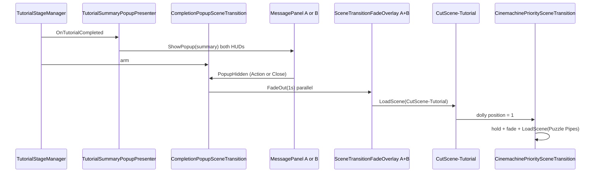

# Tutorial completion popup → CutScene-Tutorial transition

## Task name

Tutorial completion popup dismiss → configurable cutscene load (`CutScene-Tutorial`).

## Date

2026-05-30

## Scope

**Tutorial only.** When players complete the puzzle in `Tutorial.unity` and either player dismisses the summary popup (Close button or **Action** while popup is open), fade out both HUDs and load **`CutScene-Tutorial`** (Inspector-configurable `targetSceneName`).

### Why this is mostly configuration

The desired behavior is **already implemented** by [`CompletionPopupSceneTransition.cs`](../Assets/WhoWiredThis/Scripts/Environment/CompletionPopupSceneTransition.cs) on the `TutorialStageManager` GameObject in `Tutorial.unity`. That component:

- Arms on `TutorialStageManager.OnTutorialCompleted`
- Listens for the first `MessagePanel.PopupHidden` from either player HUD
- Runs dual-HUD fade via `SceneTransitionUtility.TryBeginTransitionWithFade`
- Loads `targetSceneName` (currently **`Puzzle Pipes`** — needs retarget)

**Action dismiss** is already wired: `PlayerPanelFocusController` calls `PlayerHudView.HidePopup()` when Action is pressed and a popup is open → `MessagePanel.Hide()` → `PopupHidden`.

**Downstream cutscene** [`CutScene-Tutorial.unity`](../Assets/Scenes/Game/CutScene-Tutorial.unity) already exists in Build Settings and already has `CinemachinePrioritySceneTransition` on **`Next Scene Selector`** loading **`Puzzle Pipes`** after the spline dolly reaches position 1 (same pattern as `CutScene-Intro` → `Tutorial`).

### Updated playtest chain (Tutorial slice)

```text
… → CutScene-Intro → Tutorial → CutScene-Tutorial → Puzzle Pipes → …
```

Previously: `Tutorial → Puzzle Pipes` directly (via completion popup).

## Out of scope

- **Puzzle Pipes**, **Puzzle Signal**, or other gameplay scenes — migrate one-by-one in follow-up plans (each may need its own cutscene asset when available).
- New runtime transition scripts (unless validation finds a gap).
- Changing cutscene animation, Cinemachine setup, or `CutScene-Tutorial` exit target (`Puzzle Pipes` stays as-is).
- Requiring **both** players to dismiss before load (keep current: **either** dismiss triggers fade).
- Fade-in on the cutscene scene (follow-up polish).
- Updating `playtest-flow-start-gameover-total-time.md` body beyond a note in this plan (optional doc pass later).

## Current state (inspected)

| Item | Status |
|------|--------|
| `CompletionPopupSceneTransition` on Tutorial | ✅ Present on `TutorialStageManager` GO |
| `targetSceneName` | ❌ `"Puzzle Pipes"` — change to `"CutScene-Tutorial"` |
| Walk-through `SceneTransitionTrigger` (`NextLevel`) | ✅ Already **disabled** (`enabled: 0`); target still `Puzzle Pipes` |
| `CutScene-Tutorial` in Build Settings | ✅ Enabled (index after Tutorial) |
| `CutScene-Tutorial` exit transition | ✅ Loads `Puzzle Pipes` via dolly position 1 |
| Completion copy on `TutorialStageManager` | ✅ Already mentions closing summary popup |
| Popup panel refs (`completionPopupPanelA/B`) | ⚠️ Serialized as null; `ResolveReferences()` auto-finds HUD `MessagePanel`s at runtime |
| Editor wire menu default for Tutorial | ❌ Still `"Puzzle Pipes"` in `TutorialCompletionTransitionWireTool` |

## Approved implementation steps

1. **Retarget Tutorial scene**
   - Open `Assets/Scenes/Game/Tutorial.unity`.
   - On `CompletionPopupSceneTransition` (same GameObject as `TutorialStageManager`): set **`targetSceneName`** = **`CutScene-Tutorial`** (exact Unity scene name string).
   - Leave `fadeOutDurationSeconds` = `1`, `loadOnce` = true, `ignoreWhenAlreadyInTargetScene` = true.
   - Confirm walk-through `NextLevel` / `SceneTransitionTrigger` remains **disabled** (do not re-enable).

2. **Update editor wire tool default**
   - In [`TutorialCompletionTransitionWireTool.cs`](../Assets/WhoWiredThis/Editor/TutorialCompletionTransitionWireTool.cs), change `WireTutorialCompletionTransition()` target from `"Puzzle Pipes"` to **`"CutScene-Tutorial"`** so re-running **Who Wired This → Playtest → Wire Tutorial Completion Transition** stays consistent.

3. **Optional: run wire menu once**
   - Execute menu item to refresh serialized refs / confirm fade overlays on `UI_Canvas.prefab` (idempotent with existing setup).

4. **Validation**
   - Unity compile / console clean.
   - Play Mode: complete Tutorial → summary on both HUDs → dismiss via **Action** on one player → 1s dual fade → **`CutScene-Tutorial`** loads.
   - Repeat with **Close** button dismiss.
   - Confirm cutscene plays and eventually loads **`Puzzle Pipes`** (existing cutscene transition).
   - Confirm `PlaytestRunTotal` still records Tutorial scene time before load (via `SceneTransitionUtility`).
   - Spam dismiss / no double-load.

5. **No changes required** on `CutScene-Tutorial.unity` for this Tutorial-only task.

## Design notes



- **Configurable next scene:** `targetSceneName` on `CompletionPopupSceneTransition` per scene instance — Tutorial uses `"CutScene-Tutorial"`; future scenes use their cutscene or next gameplay scene name.
- **Pattern reuse for later scenes:** Same component + wire tool pattern already used on Puzzle Pipes → Signal and Signal → GameOver; future work inserts cutscenes by changing `targetSceneName` and ensuring a cutscene scene handles exit to the next gameplay scene.

## Testing checklist

- ⬜ Complete Tutorial puzzle — summary popup appears on **both** HUDs.
- ⬜ Player A **Action** dismisses popup → both screens fade ~1s → **`CutScene-Tutorial`** loads.
- ⬜ Reset / replay Tutorial — Player B **Close** dismiss works the same way.
- ⬜ No second load if popup dismissed twice quickly.
- ⬜ Walk `NextLevel` trigger does not fire (still disabled).
- ⬜ CutScene-Tutorial plays through → loads **Puzzle Pipes**.
- ⬜ Console: `[CompletionPopupSceneTransition] Armed` then `Summary popup dismissed` logs; no errors.
- ⚠️ Dual-display manual check if two monitors available.

## Rollback notes

- Git revert: `Tutorial.unity` `targetSceneName` back to `"Puzzle Pipes"` and wire tool string.
- No script deletion required; change is configuration-only.

## Future migration (explicitly deferred)

Apply the same **popup dismiss → cutscene** pattern **one scene at a time** after Tutorial is validated:

| Scene | Current popup target | Likely next step (when cutscene exists) |
|-------|----------------------|----------------------------------------|
| `Tutorial.unity` | `Puzzle Pipes` → **`CutScene-Tutorial`** | **This plan** |
| `Puzzle Pipes.unity` | `Puzzle Signal` | Retarget to `CutScene-Pipes` (or equivalent) when authored |
| `Puzzle Signal.unity` | `GameOverScene` | Retarget to `CutScene-Signal` (or equivalent) when authored |

Each follow-up plan should: retarget `CompletionPopupSceneTransition`, disable/update walk triggers, wire cutscene exit via `CinemachinePrioritySceneTransition`, and update the wire tool menu default for that scene.
