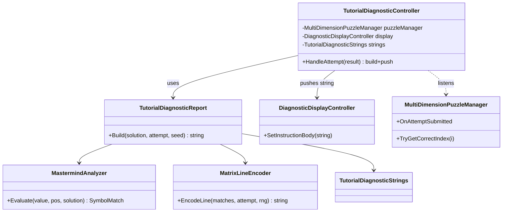
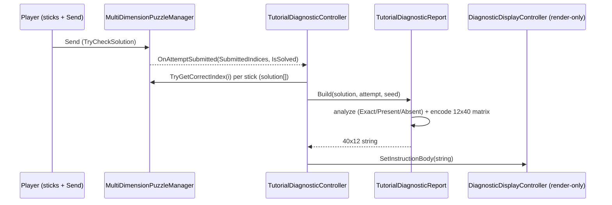

# Tutorial Diagnostic Decode Matrix

## TLDR

- New, self-contained **pure-C# class** `TutorialDiagnosticReport` that takes `(solution[], attempt[], seed)`
  and returns the exact **40×12** display string. No Unity dependencies → trivially unit-testable.
- A thin new **MonoBehaviour** `TutorialDiagnosticController` that listens to the existing
  `MultiDimensionPuzzleManager.OnAttemptSubmitted`, reads the solution + the submitted try, calls the
  report builder, and pushes the string to the existing render-only `DiagnosticDisplayController`
  (via `SetInstructionBody`).
- **Tutorial only**: add the new controller to the two tutorial diagnostic panels; leave the current
  `MultiDimensionDiagnosticAdapter` untouched everywhere else.
- Feedback model is **Mastermind-style** per stick (Exact / Present / Absent), hidden inside a noisy hex
  matrix the player learns to decode (Productive Failure).

## Scope

- 2 sticks, each a 3-state `MultiDimension` (values `0/1/2`). Solution is a 2-tuple, e.g. `(1, 2)`.
- Build a `40 char × 12 line` diagnostic string:
  - Lines 1–3: informative message to the diagnostic player (suggested copy below).
  - Lines 4–5: cryptic "result log header" (pure atmosphere, no hidden signal).
  - Line 6: empty.
  - Lines 7–12: the decode matrix (6 lines), all encoding the **same current try** with re-randomized noise.
- Pure logic returns the string; the MonoBehaviour only wires Unity references and pushes the string.
- Wire into the **Tutorial scene only**, on the two diagnostic panels (Blue / Red).

## Out of scope

- Changing puzzle-solve logic in `MultiDimensionPuzzleManager`.
- Touching `MultiDimensionDiagnosticAdapter` or any non-tutorial scene/prefab.
- Generalizing the matrix layout beyond 2 sticks / 3 symbols (kept fixed for now).
- Scoring, history board, or processing-feedback changes.
- Font/material authoring beyond confirming `Body_TMP` is monospace and sized for 40×12.

## Confirmed design decisions (user-approved Q&A, 2026-06-27)

1. **Lines 4–5** = cryptic result code / log header (flavor only, no hidden signal).
2. **Matrix lines 7–12** = all six encode the SAME current try; only the noise re-randomizes per line
   (signal stays stable down the columns = the decode mechanic).
3. **Scope** = locked to the 2-stick / 3-symbol tutorial layout for now.

## Feedback model (Mastermind per stick)

| Per stick | Meaning |
|---|---|
| **Exact** (OK)            | `attempt[i] == solution[i]` |
| **Present** (not in pos)  | symbol exists elsewhere in the solution, wrong slot |
| **Absent** (wrong)        | symbol not in the solution at all |

"Present" uses simple membership (multiplicity intentionally simplified for a 2-stick tutorial).

## Matrix line layout (13 words, 38 visible chars, fits in 40)

```
[ W1 W2 W3 ] [W4] [ W5 W6 W7 ] [W8] [ W9 W10 W11 W12 ] [W13]
  stick-1 blk  noise  stick-2 blk  noise   result block     noise

Stick block (3 words):
  Exact   -> 00 00 00                      (clean zeros = "locked in")
  Present -> low-digit pattern (0 + symbol) e.g. 21 11 12 / 12 22 21
  Absent  -> full-range random hex         e.g. 7A 3F C1

Result block (4 words):
  stick1 Exact only -> 0x 0x 0x 0x         (leading zero)
  stick2 Exact only -> x0 x0 x0 x0         (trailing zero)
  neither Exact     -> random / mixed-low
  both Exact        -> WIN (whole screen replaced by win message)

Noise words W4, W8, W13 -> always random hex.
```

### Verification vs the source table (solution `1 2`)

| try | stick1 | stick2 | block1 | block2 | result | matches row |
|---|---|---|---|---|---|---|
| 0 0 | Absent | Absent | rand | rand | rand | ✅ |
| 0 1 | Absent | Present | rand | low | rand | ✅ |
| 0 2 | Absent | Exact | rand | `00 00 00` | `x0 x0 x0 x0` | ✅ |
| 1 0 | Exact | Absent | `00 00 00` | rand | `0x 0x 0x 0x` | ✅ |
| 1 1 | Exact | Present | `00 00 00` | low | `0x 0x 0x 0x` | ✅ |
| 1 2 | Exact | Exact | — | — | **WIN** | ✅ |
| 2 0 | Present | Absent | low | rand | rand | ✅ |
| 2 1 | Present | Present | low | low | mixed-low | ✅ |
| 2 2 | Present | Exact | low | `00 00 00` | `x0 x0 x0 x0` | ✅ |

All nine rows reproduce consistently.

## Architecture





## Files

```
Assets/WhoWiredThis/Scripts/Puzzles/Diagnostics/
  SymbolMatch.cs                    (enum)
  MastermindAnalyzer.cs             (pure logic)
  MatrixLineEncoder.cs              (pure logic, hex word encoding)
  TutorialDiagnosticStrings.cs      ([Serializable] copy/config)
  TutorialDiagnosticReport.cs       (pure logic, builds 40x12 string)
  TutorialDiagnosticController.cs   (MonoBehaviour: wiring only)
```

Everything except the controller is plain C# (no `UnityEngine`), so it is unit-testable in isolation.

## Approved implementation steps

1. Create the pure-logic scripts (`SymbolMatch`, `MastermindAnalyzer`, `MatrixLineEncoder`,
   `TutorialDiagnosticStrings`, `TutorialDiagnosticReport`) under
   `Assets/WhoWiredThis/Scripts/Puzzles/Diagnostics/`.
2. Create `TutorialDiagnosticController` MonoBehaviour (subscribe in `OnEnable`, unsubscribe in
   `OnDisable`; read solution via `TryGetCorrectIndex`, try via `result.SubmittedIndices`; push via
   `SetInstructionBody`).
3. Compile via Unity MCP `read_console`; fix any errors before wiring.
4. (Second step, after compile) MCP preflight, then in **Tutorial.unity** add
   `TutorialDiagnosticController` to the two diagnostic panels and assign each panel's
   `MultiDimensionPuzzleManager` + `DiagnosticDisplayController`.
5. Confirm tutorial `Body_TMP` is a monospace SDF font sized for 40 cols × 12 rows.

## Draft code

```csharp
namespace WhoWiredThis.Puzzles.Diagnostics
{
    /// <summary>Per-stick Mastermind classification.</summary>
    public enum SymbolMatch
    {
        Absent = 0,   // symbol not in solution at all
        Present = 1,  // symbol in solution, wrong position
        Exact = 2     // correct symbol, correct position
    }
}
```

```csharp
using System.Collections.Generic;

namespace WhoWiredThis.Puzzles.Diagnostics
{
    /// <summary>Pure Mastermind classification for one position. Membership-based "Present"
    /// (multiplicity intentionally simplified for this 2-stick tutorial).</summary>
    public static class MastermindAnalyzer
    {
        public static SymbolMatch Evaluate(int value, int position, IReadOnlyList<int> solution)
        {
            if (solution == null || position < 0 || position >= solution.Count)
                return SymbolMatch.Absent;

            if (value == solution[position])
                return SymbolMatch.Exact;

            for (int i = 0; i < solution.Count; i++)
                if (solution[i] == value)
                    return SymbolMatch.Present;

            return SymbolMatch.Absent;
        }

        public static SymbolMatch[] EvaluateAll(IReadOnlyList<int> solution, IReadOnlyList<int> attempt)
        {
            int n = solution?.Count ?? 0;
            var result = new SymbolMatch[n];
            for (int i = 0; i < n; i++)
            {
                int v = (attempt != null && i < attempt.Count) ? attempt[i] : -1;
                result[i] = Evaluate(v, i, solution);
            }
            return result;
        }
    }
}
```

```csharp
using System;

namespace WhoWiredThis.Puzzles.Diagnostics
{
    /// <summary>Encodes one 13-word matrix line: stick blocks carry signal, padding words are noise.</summary>
    internal static class MatrixLineEncoder
    {
        // [0..2] stick1 | [3] noise | [4..6] stick2 | [7] noise | [8..11] result | [12] noise
        private const int Stick1Start = 0, Stick2Start = 4, ResultStart = 8, WordCount = 13;

        public static string EncodeLine(SymbolMatch s1, SymbolMatch s2, int sym1, int sym2, Random rng)
        {
            string[] w = new string[WordCount];
            for (int i = 0; i < WordCount; i++) w[i] = NoiseWord(rng);

            WriteStickBlock(w, Stick1Start, s1, sym1, rng);
            WriteStickBlock(w, Stick2Start, s2, sym2, rng);
            WriteResultBlock(w, s1, s2, rng);

            return string.Join(" ", w);
        }

        private static void WriteStickBlock(string[] w, int start, SymbolMatch m, int symbol, Random rng)
        {
            for (int i = 0; i < 3; i++)
            {
                switch (m)
                {
                    case SymbolMatch.Exact:   w[start + i] = "00"; break;
                    case SymbolMatch.Present: w[start + i] = LowDigitWord(symbol, rng); break;
                    // Absent: leave as noise
                }
            }
        }

        private static void WriteResultBlock(string[] w, SymbolMatch s1, SymbolMatch s2, Random rng)
        {
            for (int i = 0; i < 4; i++)
            {
                if (s1 == SymbolMatch.Exact && s2 != SymbolMatch.Exact)
                    w[ResultStart + i] = "0" + HexNibble(rng);            // 0x
                else if (s2 == SymbolMatch.Exact && s1 != SymbolMatch.Exact)
                    w[ResultStart + i] = HexNibble(rng) + "0";            // x0
                else if (s1 == SymbolMatch.Present || s2 == SymbolMatch.Present)
                    w[ResultStart + i] = LowNibble(rng) + LowNibble(rng); // mixed-low
                // both-exact handled as WIN upstream; both-absent stays noise
            }
        }

        private static string LowDigitWord(int symbol, Random rng)
        {
            char a = rng.Next(2) == 0 ? '0' : DigitChar(symbol);
            char b = rng.Next(2) == 0 ? DigitChar(symbol) : '0';
            return $"{a}{b}";
        }

        private static string NoiseWord(Random rng) => HexNibble(rng) + HexNibble(rng);
        private static string HexNibble(Random rng) => rng.Next(16).ToString("X1");
        private static string LowNibble(Random rng) => rng.Next(3).ToString();
        private static char DigitChar(int v) => (char)('0' + Math.Max(0, Math.Min(9, v)));
    }
}
```

```csharp
using System;
using UnityEngine;

namespace WhoWiredThis.Puzzles.Diagnostics
{
    /// <summary>Inspector-editable copy for the tutorial diagnostic (Blue/Red configurable per panel).</summary>
    [Serializable]
    public class TutorialDiagnosticStrings
    {
        [TextArea(3, 3)]
        public string InfoMessage =
            "RUN A TEST, THEN READ THE GRID.\n" +
            "EACH ROW IS THE SAME RESULT.\n" +
            "STEADY DIGITS ARE THE SIGNAL.";

        [TextArea(2, 2)]
        public string ResultReadout = "DIAGNOSTIC LOG  REV {0}\nSTATUS .... ANALYZING";

        [TextArea(4, 8)]
        public string WinMessage =
            "ALL CHANNELS LOCKED.\nCALIBRATION COMPLETE.";
    }
}
```

```csharp
using System.Collections.Generic;
using System.Text;

namespace WhoWiredThis.Puzzles.Diagnostics
{
    /// <summary>Pure builder: (solution, attempt, seed) -> fixed 40x12 diagnostic string. No Unity deps.</summary>
    public sealed class TutorialDiagnosticReport
    {
        public const int Width = 40;
        public const int TotalLines = 12;
        private const int MatrixLines = 6; // lines 7..12

        private readonly TutorialDiagnosticStrings _s;

        public TutorialDiagnosticReport(TutorialDiagnosticStrings strings)
        {
            _s = strings ?? new TutorialDiagnosticStrings();
        }

        public string Build(IReadOnlyList<int> solution, IReadOnlyList<int> attempt, int seed)
        {
            var m = MastermindAnalyzer.EvaluateAll(solution, attempt);
            bool win = m.Length == 2 && m[0] == SymbolMatch.Exact && m[1] == SymbolMatch.Exact;

            var lines = new List<string>(TotalLines);
            if (win)
            {
                AppendWrapped(lines, _s.WinMessage);
            }
            else
            {
                AppendWrapped(lines, _s.InfoMessage);                       // lines 1-3
                while (lines.Count < 3) lines.Add(string.Empty);
                AppendWrapped(lines, string.Format(_s.ResultReadout, seed & 0xFFF)); // lines 4-5
                while (lines.Count < 5) lines.Add(string.Empty);
                lines.Add(string.Empty);                                    // line 6

                int sym1 = (attempt != null && attempt.Count > 0) ? attempt[0] : 0;
                int sym2 = (attempt != null && attempt.Count > 1) ? attempt[1] : 0;
                var rng = new System.Random(seed);
                for (int i = 0; i < MatrixLines; i++)                       // lines 7-12
                    lines.Add(MatrixLineEncoder.EncodeLine(
                        m.Length > 0 ? m[0] : SymbolMatch.Absent,
                        m.Length > 1 ? m[1] : SymbolMatch.Absent,
                        sym1, sym2, rng));
            }

            return FitToScreen(lines);
        }

        private static void AppendWrapped(List<string> lines, string text)
        {
            foreach (var raw in (text ?? string.Empty).Split('\n'))
                lines.Add(raw.Length <= Width ? raw : raw.Substring(0, Width));
        }

        private static string FitToScreen(List<string> lines)
        {
            var sb = new StringBuilder();
            for (int i = 0; i < TotalLines; i++)
            {
                string line = i < lines.Count ? lines[i] : string.Empty;
                if (line.Length > Width) line = line.Substring(0, Width);
                sb.Append(line);
                if (i < TotalLines - 1) sb.Append('\n');
            }
            return sb.ToString();
        }
    }
}
```

```csharp
using UnityEngine;
using WhoWiredThis.Puzzles.Common;
using WhoWiredThis.Visibility;

namespace WhoWiredThis.Puzzles.Diagnostics
{
    /// <summary>Tutorial-only diagnostic: listens to one puzzle manager, renders the decode matrix
    /// into a render-only DiagnosticDisplayController. Leaves MultiDimensionDiagnosticAdapter untouched.</summary>
    public class TutorialDiagnosticController : MonoBehaviour
    {
        [Header("References")]
        [SerializeField] private MultiDimensionPuzzleManager puzzleManager;
        [SerializeField] private DiagnosticDisplayController display;

        [Header("Copy")]
        [SerializeField] private TutorialDiagnosticStrings strings = new TutorialDiagnosticStrings();

        private TutorialDiagnosticReport _report;
        private int _attemptCounter;

        private void Awake() => _report = new TutorialDiagnosticReport(strings);

        private void OnEnable()
        {
            if (puzzleManager != null)
                puzzleManager.OnAttemptSubmitted += HandleAttempt;
            else
                Debug.LogWarning($"[{nameof(TutorialDiagnosticController)}] puzzleManager not assigned on '{name}'.", this);
        }

        private void OnDisable()
        {
            if (puzzleManager != null)
                puzzleManager.OnAttemptSubmitted -= HandleAttempt;
        }

        private void HandleAttempt(MultiDimensionAttemptResult result)
        {
            if (result == null || display == null || puzzleManager == null)
                return;

            int n = puzzleManager.PuzzleElementCount;
            var solution = new int[n];
            for (int i = 0; i < n; i++)
                solution[i] = puzzleManager.TryGetCorrectIndex(i, out int c) ? c : -1;

            int seed = unchecked((result.IsSolved ? 0 : ++_attemptCounter) * 73856093) ^ HashAttempt(result.SubmittedIndices);
            display.SetInstructionBody(_report.Build(solution, result.SubmittedIndices, seed));
        }

        private static int HashAttempt(int[] a)
        {
            int h = 17;
            if (a != null) foreach (int v in a) h = h * 31 + v;
            return h;
        }
    }
}
```

## Testing checklist

- ⬜ Scripts compile (Unity MCP `read_console`, no new errors/warnings from these files).
- ⬜ `Body_TMP` confirmed monospace SDF, sized so 40 columns × 12 rows fit without wrapping.
- ⬜ Tutorial play test: each Send updates the diagnostic with a 12-line block.
- ⬜ Exact stick renders a stable `00 00 00` column across all 6 matrix rows.
- ⬜ Both-exact try shows the win message (whole screen replaced).
- ⬜ Same try repeated → same signal columns (only noise differs).
- ⬜ Existing scenes unaffected (`MultiDimensionDiagnosticAdapter` untouched).

## Rollback notes

- New files only + additive scene/prefab wiring on the tutorial panels.
- Rollback = `git checkout` the new scripts and the `Tutorial.unity` diagnostic-panel edits.
- No changes to `MultiDimensionPuzzleManager`, `DiagnosticDisplayController`, or other scenes.

## Open follow-ups (non-blocking)

- Difficulty: stick symbols render as `0/1/2` while noise spans `0–F`, making signal easy to spot.
  Optional later: map stick symbols across the full hex range to make decoding harder.
