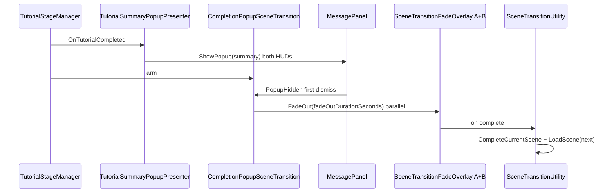

# Tutorial exit hide + completion popup scene transition

## Task name

Tutorial exit hide + completion popup scene transition with fade-out (pattern for full playtest chain).

## Date

2026-05-30

## Scope

### Phase 1 — `Tutorial.unity` only (this approval)

1. **Hide Exit** on both tutorial panels the same way as [`Puzzle Pipes.unity`](../Assets/Scenes/Game/Puzzle%20Pipes.unity):
   - Scene override `PanelFocusController.includeExitInFocusCycle = false` on **both** `Player1_Tutorial_Panel` instances (`Board-A` prefab instance `1019864807`, `Board-B` prefab instance `968524633`).
   - Scene override `m_IsActive = false` on **`ExitButton Variant-A`** and **`ExitButton Variant-B`** (tutorial prefab `69eff0b70f60e4784bef65367b1b7c14`).
   - **Do not** change [`Player1_Tutorial_Panel.prefab`](../Assets/WhoWiredThis/Prefabs/Panels/Player1_Tutorial_Panel.prefab) defaults — scene-only overrides.

2. **Fade-out → load next scene** — new reusable fade + transition stack:

   **`SceneTransitionFadeOverlay`** (`Assets/WhoWiredThis/Scripts/UI/` or `Environment/`):
   - Full-screen black `Image` + `CanvasGroup` on each player HUD canvas (high sort order, starts **alpha 0**, blocks raycasts only while fading).
   - Coroutine API: `IEnumerator FadeOutRoutine(float durationSeconds)` using **`Time.unscaledDeltaTime`** (fade works even if gameplay time is paused).
   - Prefer adding overlay children to [`UI_Canvas.prefab`](../Assets/WhoWiredThis/Prefabs/Game/UI_Canvas.prefab) under each per-player HUD root so **both displays** fade together in dual-screen play.

   **`SceneTransitionUtility`** (`Assets/WhoWiredThis/Scripts/Core/` or `Environment/`):
   - `TryBeginTransitionWithFade(string targetSceneName, float fadeOutDurationSeconds, SceneTransitionFadeOverlay[] fadeOverlays, …)`
   - Flow: validate build settings → `PlaytestRunTotal.CompleteCurrentScene` when applicable → run **parallel fade-out** on all wired overlays for **`fadeOutDurationSeconds`** → `PlaytestSceneLoadUtility.PrepareForSceneLoad()` → `SceneManager.LoadScene(Single)` (or `PlaytestFlowUtility.TryEndRunAndLoadGameOver` when target is `GameOverScene`).
   - Guard against double-trigger (`isTransitionActive` flag, same pattern as `PlaytestFlowUtility`).
   - Refactor [`SceneTransitionTrigger.cs`](../Assets/WhoWiredThis/Scripts/Environment/SceneTransitionTrigger.cs) to call the same utility (optional `fadeOutDurationSeconds = 0` preserves instant load for walk triggers until scenes opt in).

   **`CompletionPopupSceneTransition`** (`Assets/WhoWiredThis/Scripts/Environment/`):
   - `[SerializeField] string targetSceneName` — Tutorial: `"Puzzle Pipes"`.
   - `[SerializeField] float fadeOutDurationSeconds = 1f` — **Inspector-configured** fade length before load.
   - `[SerializeField] SceneTransitionFadeOverlay[] fadeOverlays` — wire both player overlays from `UI_Canvas` (or auto-find under assigned HUD roots with null-safe warning).
   - Subscribe to **`TutorialStageManager.OnTutorialCompleted`** to arm.
   - On first completion-popup dismiss (`MessagePanel.PopupHidden`), start fade + load once (`loadOnce` default `true`).

3. **Minimal UI hook** — add **`PopupHidden`** on [`MessagePanel.cs`](../Assets/WhoWiredThis/Scripts/UI/MessagePanel.cs), fired from `Hide()` only when transitioning visible → hidden.

4. **Scene wiring on Tutorial**:
   - Add `CompletionPopupSceneTransition` on `TutorialStageManager` GO (or flow sibling).
   - Wire `tutorialStageManager`, completion popup `MessagePanel`s (same HUD refs as `TutorialSummaryPopupPresenter`), `fadeOverlays`, `targetSceneName`, `fadeOutDurationSeconds`.
   - **Disable** walk-through `SceneTransitionTrigger` (`NextLevelCollider` → Puzzle Pipes) to avoid double load.

5. **Copy cleanup** — update Tutorial `TutorialStageManager.completionMessage`: remove Exit double-click copy; mention closing the summary popup to continue.

### Phase 2 — follow-up scenes (same pattern)

| Scene | Exit hide | Popup transition target | Fade duration | Retire walk trigger |
|-------|-----------|-------------------------|---------------|---------------------|
| `Tutorial.unity` | ✅ done | `Puzzle Pipes` | ✅ 1s | ✅ disabled |
| `Puzzle Pipes.unity` | ✅ done | `Puzzle Signal` | ✅ 1s | ✅ disabled |
| `Puzzle Signal.unity` | ✅ done | `GameOverScene` | ✅ 1s | ✅ disabled |

Optional editor menu: **Who Wired This → Playtest → Wire Completion Popup Transition** (exit hide + fade overlay refs + transition component).

## Out of scope

- Changing puzzle solve logic, `TutorialStageManager` stage rules, or metrics.
- Requiring **both** players to dismiss popup before load (default: **either** dismiss starts fade).
- **Fade-in** on the *next* scene after load (follow-up polish; phase 1 is fade-out of current scene only).
- `LoadSceneAsync` / loading bar (sync load after fade is acceptable; black screen hides hitch).
- Modifying `Player1_Tutorial_Panel.prefab` default Exit behavior.
- Puzzle Pipes / Puzzle Signal wiring in phase 1.

## Current state (inspected)

| Item | Tutorial | Puzzle Pipes (reference) |
|------|----------|---------------------------|
| `includeExitInFocusCycle` scene override | ❌ not set | ✅ `false` on both panels |
| Exit button GameObject active | ✅ visible | ✅ inactive |
| Completion summary popup | ✅ `TutorialSummaryPopupPresenter` | ✅ same pattern |
| Walk-through scene load | ✅ `SceneTransitionTrigger` | ✅ → Puzzle Signal |
| Popup dismiss → fade → load | ❌ none | ❌ none |
| Screen fade overlay | ❌ none in repo | ❌ none |

Playtest chain: `StartScene → Tutorial → Puzzle Pipes → Puzzle Signal → GameOverScene`.

## Approved implementation steps

1. Add **`SceneTransitionFadeOverlay`** + prefab overlay under each player HUD on `UI_Canvas.prefab` (black fullscreen, alpha 0 at start).
2. Add **`SceneTransitionUtility.TryBeginTransitionWithFade(...)`** with double-load guard and playtest time/scene rules.
3. Add **`MessagePanel.PopupHidden`** event.
4. Add **`CompletionPopupSceneTransition`** with `targetSceneName`, `fadeOutDurationSeconds`, fade overlay refs, popup + stage manager refs.
5. Refactor **`SceneTransitionTrigger`** to optional fade via utility (duration 0 = instant, backward compatible).
6. **Tutorial.unity**: exit hide overrides; wire transition; disable walk trigger; update completion copy.
7. Optional validation menu; MCP compile check.

## Design notes

- **Dual display:** fade overlays on **both** HUD canvases so each monitor goes black together.
- **Configurable duration:** `fadeOutDurationSeconds` per scene instance on `CompletionPopupSceneTransition` (e.g. Tutorial 1.0s, Signal 1.5s).
- **Input during fade:** overlay blocks raycasts while alpha &gt; 0; optional disable of `PlayerPanelFocusController` / movement at fade start via existing `PlaytestFlowUtility.ExitAllPanelFocus()` inside utility before load.
- **Why not only async load?** User asked for visible fade of current scene; sync load after full black is simpler and sufficient for POC.

## Testing checklist

- ⬜ Tutorial focus cycle: inputs → Solve only (no Exit).
- ⬜ Exit buttons not visible/interactable.
- ⬜ Complete puzzle — summary popup on both HUDs.
- ⬜ Dismiss popup (Close or Action) → **screen fades to black** for configured seconds → `Puzzle Pipes` loads.
- ⬜ Both displays fade (dual-screen check if available).
- ⬜ Second dismiss / spam Close does not double-load.
- ⬜ Walk `NextLevelCollider` does not load (trigger disabled).
- ⬜ `PlaytestRunTotal` records Tutorial time before fade/load.
- ⬜ Console clean; one transition log.
- ⬜ Other tutorial scenes using prefab still show Exit unless overridden.

## Rollback notes

- Revert new scripts, `UI_Canvas.prefab` fade children, `MessagePanel` event, `SceneTransitionTrigger` refactor.
- Restore `Tutorial.unity` overrides and walk trigger.
- Git: `git checkout --` affected paths.

## Next scenes (after Tutorial sign-off)

1. **Puzzle Pipes** — `CompletionPopupSceneTransition` → `Puzzle Signal` + fade duration; disable walk trigger.
2. **Puzzle Signal** — exit hide + transition → `GameOverScene` + fade duration; disable walk trigger.
