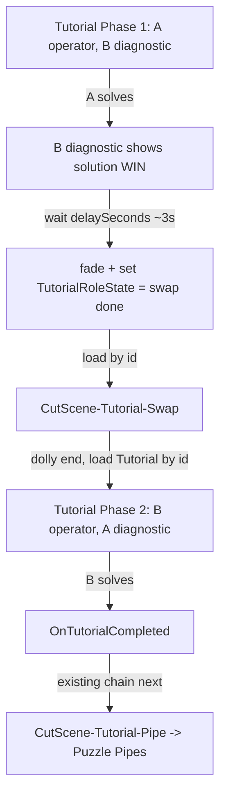

# Tutorial role-swap cut-scene round trip

## Task name

Convert the Tutorial's Player A → Player B operator hand-off from an in-scene stage
switch into a **cut-scene round trip**: A solves → B reads the solution diagnostic →
configurable delay → new cut scene → return to Tutorial with **B operator / A diagnostic**.

## Date

2026-06-27

## Approved design decisions (user Q&A, 2026-06-27)

1. **Opt-in mode** — add a `roleSwapMode` toggle to `TutorialStageManager`; default `InScene`
   (today's behavior, unchanged everywhere). Enable `CutSceneRoundTrip` only on `Tutorial.unity`.
2. **Cut scene** — a real Cinemachine dolly cut scene like the existing ones, auto-returning to
   Tutorial. Build by duplicating an existing cut scene (closest analog: `CutScene-Tutorial-Pipe`)
   and retargeting its return to `Tutorial`.
3. **Solution reveal** — reuse the existing decode-matrix WIN/solution screen (already shown to the
   partner when the operator solves). No new reveal copy.
4. **Phase-1 operator = Player A** — A solves first and triggers the cut scene; after the round trip
   Player B operates and Player A is on diagnostic.
5. **After Phase 2** — unchanged: B solving completes the tutorial and continues to
   `CutScene-Tutorial-Pipe` → `Puzzle Pipes` via the existing chain.
6. **Naming** — scene `CutScene-Tutorial-Swap`, enum `CutSceneTutorialSwap`.

## Scope

- Add `PlaytestSceneId.CutSceneTutorialSwap`; map it in `PlaytestSceneFlowConfigSO`
  defaults and in the live `PlaytestSceneFlowConfig.asset` (scene name `CutScene-Tutorial-Swap`).
  Add the scene to Editor Build Settings.
- New scene `Assets/Scenes/Game/CutScene-Tutorial-Swap.unity` (duplicated from an existing
  cut scene), whose end-of-dolly transition loads `Tutorial` **by id** and flags the swap.
- New static class `TutorialRoleState` (mirrors `PlaytestRunTotal`) to persist the current
  tutorial phase/operator across the `LoadSceneMode.Single` round trip; reset on run start /
  return to menu.
- `TutorialStageManager`:
  - Add `roleSwapMode` enum field (`InScene` default | `CutSceneRoundTrip`).
  - On Tutorial load in cut-scene mode, read the starting stage/operator from `TutorialRoleState`.
  - In cut-scene mode, when the Phase-1 operator (A) solves, raise a new `OnPhaseOneSolved`
    event **instead of** the in-scene `PlayerAOperator → PlayerBOperator` switch.
  - Phase-2 (B) solve completes exactly as today (`OnTutorialCompleted` → existing transition).
- New thin component `TutorialRoleSwapCutsceneTransition`:
  - Listens for `TutorialStageManager.OnPhaseOneSolved`.
  - Waits `delaySeconds` (configurable, default `3`) so B reads the solution diagnostic.
  - Fades (reuse `SceneTransitionFadeOverlay` like `CompletionPopupSceneTransition`).
  - Sets `TutorialRoleState` = swap-done (next Tutorial load = Phase 2 / operator B).
  - Loads the configurable target `PlaytestSceneId` (default `CutSceneTutorialSwap`) by id.
- `InitialPanelFocusBootstrap`: when `TutorialRoleState` has an active phase, override
  `startupOperatorPlayer` from it; otherwise use the serialized value (zero change elsewhere).
- Wire `Tutorial.unity` (enable cut-scene mode, add the transition component, set delay) and
  `CutScene-Tutorial-Swap.unity` (return-to-Tutorial transition). Editor wire tool optional.

## Out of scope

- Changing puzzle-solve logic in `MultiDimensionPuzzleManager` or the decode-matrix diagnostic.
- Any change to Pipes/Signal/other scenes (they stay on `InScene` default).
- The linear flow `playtestChainOrder` semantics — the swap is an explicit side-trip
  (`TryLoadSceneById`), NOT a chain node, so Tutorial's chain "next" stays `CutSceneTutorialPipe`.
- New scoring, history, or HUD changes.
- Cut-scene art/dolly authoring beyond duplicating an existing cut scene and retargeting return.

## Why a static phase + explicit side-trip (rationale)

- Scene reload reinitializes `Tutorial.unity` from serialized defaults (operator = A again).
  A static `TutorialRoleState` is the project's established cross-scene persistence pattern
  (cf. `PlaytestRunTotal`) and lets the reload come back as Phase 2.
- The chain can't represent the loop `Tutorial → Swap → Tutorial → Pipe` because `TryGetNext`
  returns the first match for `Tutorial`. Explicit `TryLoadSceneById` for the two hops keeps the
  chain (and Phase-2 completion) untouched.

## Flow

## Approved implementation steps

1. ✅ Add `PlaytestSceneId.CutSceneTutorialSwap` (appended at end to preserve serialized int
   values); update `SetDefaultsForCurrentPlaytestChain` mapping (scene-entry only; not inserted
   into `playtestChainOrder`).
2. ✅ Add `TutorialRoleState` static class (phase getter + `HasSwapped`, `Reset`,
   `MarkSwapToPlayerBOperator`); reset hooks in `StartSceneController` (run begin) and
   `PlaytestFlowUtility.TryReturnToMainMenu` (menu return).
3. ✅ `TutorialStageManager`: add `roleSwapMode`, `OnPhaseOneSolved`, read start phase from
   `TutorialRoleState` in cut-scene mode, branch Phase-1 solve to the event; Phase-2 bodies on load.
4. ✅ Add `TutorialRoleSwapCutsceneTransition` (delay + fade + set state + load by id via
   `SceneTransitionUtility`).
5. ✅ `InitialPanelFocusBootstrap`: `useTutorialRoleStateOperator` override from `TutorialRoleState`.
6. ✅ Add optional `overrideTargetSceneId` to `CinemachinePrioritySceneTransition` so the cut scene
   loads `Tutorial` by id instead of chain "next" (additive; default `None` = existing behavior).
7. ✅ Compile via Unity MCP `refresh_unity` + `read_console`; zero new errors.
8. ✅ Duplicate `CutScene-Tutorial-Pipe.unity` → `CutScene-Tutorial-Swap.unity`; set bootstrap
   `sceneId = CutSceneTutorialSwap`, transition `overrideTargetSceneId = Tutorial`; add to Build
   Settings (index 3); map in `PlaytestSceneFlowConfig.asset`.
9. ✅ Wire `Tutorial.unity`: `TutorialStageManager.roleSwapMode = CutSceneRoundTrip`,
   `InitialPanelFocusBootstrap.useTutorialRoleStateOperator = true`, added
   `TutorialRoleSwapCutsceneTransition` (delay 3s, target `CutSceneTutorialSwap`, stage manager wired).
10. ⬜ Play-test full round trip (see checklist) — pending manual Play Mode.

## Testing checklist

- ✅ Compile: zero new errors (`read_console`).
- ⬜ Fresh run: Tutorial starts Phase 1 (A operator, B diagnostic).
- ⬜ A solves → B's diagnostic shows the solution; ~3s later fade + cut scene loads.
- ⬜ Cut scene auto-returns to Tutorial in Phase 2 (B operator, A diagnostic).
- ⬜ B solves → completion fires → continues to `CutScene-Tutorial-Pipe` (unchanged).
- ⬜ `TutorialRoleState` resets on return-to-menu / new run (next playthrough = Phase 1).
- ⬜ Other scenes (Pipes/Signal) unchanged (`InScene` default).
- ⬜ Loading Tutorial directly in the Editor defaults to Phase 1 (no stale static state issues).

## Implemented notes

- Persistence: `TutorialRoleState` (static, play-session scoped). The cut scene is an explicit
  side-trip via the new `overrideTargetSceneId` on `CinemachinePrioritySceneTransition`, so the
  linear chain order is untouched (`playtestChainOrder` unchanged; Tutorial's chain "next" stays
  `CutScene-Tutorial-Pipe`).
- Tutorial bootstrap already had both players' `PanelCamera` + `DiagnosticCamera` wired, so
  operator/diagnostic startup focus works for both Phase 1 (A) and Phase 2 (B).

## Rollback notes

- New scripts + one new scene + additive scene/prefab wiring; `roleSwapMode` defaults to today's
  behavior, so reverting wiring restores the in-scene swap.
- Git: commit before scene/prefab edits. Rollback = `git checkout` new scripts, the new scene,
  `PlaytestSceneFlowConfig.asset`, `Tutorial.unity`, and build settings; revert the enum addition.

## Open implementation notes (non-blocking)

- `delaySeconds` and target cut-scene id are serialized/configurable on the transition component.
- Cut-scene return transition will reuse the `CinemachinePrioritySceneTransition` pattern but load
  a fixed `PlaytestSceneId` (Tutorial) rather than chain "next"; may add a small `targetSceneId`
  option to that component or a sibling variant — decide at implementation time, keeping it additive.
