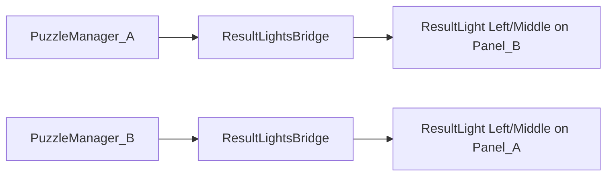

# Tutorial - Visual cross-opponent result lights

## Goal

In [`Assets/Scenes/Tutorial - Visual.unity`](Assets/Scenes/Tutorial - Visual.unity), drive **ResultLight-Left** and **ResultLight-Middle** (nested [`ResultLight.prefab`](Assets/WhoWiredThis/Prefabs/Visualizer/ResultLight.prefab) instances under each `Player1_Panel` / `Player2_Panel`) from **the opponent’s** puzzle state:

- **Player A’s** `MultiDimensionPuzzleManager` → lights on **Player B’s** panel  
- **Player B’s** manager → lights on **Player A’s** panel  

Metrics come from existing [`TryGetDiagnosticSnapshot`](Assets/WhoWiredThis/Scripts/Visibility/MultiDimensionPuzzleManager.cs):

- **SETTINGS OK** = `recognizedCount` (right symbols, any slot)  
- **PLACES OK** = `alignedCount` (exact slot + symbol)  
- **Total** = `totalCount` (2 per panel in this scene)

Lights are driven through [`MultiDimension`](Assets/WhoWiredThis/Scripts/Visibility/MultiDimension.cs) on each `ResultLight-Left` / `ResultLight-Middle` root (prefab subject order: RED / ORNG / GREN). The script uses **hardcoded indices** (not an enum or inspector tuning):

| Index | Color |
|-------|-------|
| `0` | Red |
| `1` | Orange |
| `2` | Green |



## Color rules (approved)

Evaluate in this order (first match wins):

| Condition | ResultLight-Left (SETTINGS) | ResultLight-Middle (PLACES) |
|-----------|----------------------------|----------------------------|
| `placesOk == total` | Green | Green |
| `settingsOk == total && placesOk == 0` | Orange | Orange |
| `settingsOk == 1 && placesOk == 1` | Red | Green |
| `settingsOk == 1 && placesOk == 0` | Orange | Red |
| Otherwise | Red | Red |

Assumes `total == 2` for Tutorial - Visual; logic should use `totalCount` from snapshot (not hardcode 2) so it stays safe if element count changes.

## What exists today (do not reuse as-is)

- [`ResultLightController`](Assets/WhoWiredThis/Scripts/Puzzles/Common/ResultLightController.cs) — single bulb, success/failure only on solve; not metric-based.  
- [`MultiDimensionDiagnosticAdapter`](Assets/WhoWiredThis/Scripts/Puzzles/Common/MultiDimensionDiagnosticAdapter.cs) — updates **diagnostic TMP** only; does not set Left/Middle independently.  
- [`DiagnosticDisplayController.multiDimensionLamps`](Assets/WhoWiredThis/Scripts/Puzzles/Common/DiagnosticDisplayController.cs) — sets **all** lamps to one index; not suitable for split SETTINGS/PLACES colors.

## Implementation

### 1. New script (small, scene-focused)

Add [`Assets/WhoWiredThis/Scripts/Puzzles/Common/SplitMetricResultLightsController.cs`](Assets/WhoWiredThis/Scripts/Puzzles/Common/SplitMetricResultLightsController.cs):

**Serialized fields** (explicit types — no `MonoBehaviour` indirection for lamps)

- `MultiDimensionPuzzleManager puzzleManager` — opponent manager (cross-wire assigned in scene)  
- `[SerializeField] MultiDimension settings` — **required**; assign `ResultLight-Left` root (has `MultiDimension` component)  
- `[SerializeField] MultiDimension places` — **required**; assign `ResultLight-Middle` root  
- `bool updateContinuously` — mirror adapter (`true` = live preview while adjusting; `false` = refresh on `OnAttemptSubmitted` only)  
- `AllowedPlayerTag visibleToPlayer` — passed to `MultiDimension.SetSelection` (layer 7/8 on panel instances)

**Hardcoded color indices** (private constants in script, matching [`ResultLight.prefab`](Assets/WhoWiredThis/Prefabs/Visualizer/ResultLight.prefab) subject order):

```csharp
private const int ColorRed = 0;
private const int ColorOrange = 1;
private const int ColorGreen = 2;
```

**Apply API** — use [`MultiDimension.SetSelection`](Assets/WhoWiredThis/Scripts/Visibility/MultiDimension.cs) (same as [`DiagnosticDisplayController.ApplyMultiDimensionLampValue`](Assets/WhoWiredThis/Scripts/Puzzles/Common/DiagnosticDisplayController.cs)):

```csharp
settings.SetSelection(visibleToPlayer, colorIndex);
places.SetSelection(visibleToPlayer, colorIndex);
```

Null-guard `settings` / `places` with `Debug.LogWarning` if missing in Inspector.

**Behavior**

- `Awake` / `OnEnable`: subscribe `puzzleManager.OnAttemptSubmitted`  
- `Update` (if continuous) + on attempt: `TryGetDiagnosticSnapshot` → read `settingsOk` / `placesOk` / `total` → truth table → apply `ColorRed` / `ColorOrange` / `ColorGreen` to **`settings`** and **`places`** separately  
- Waiting / no snapshot: both lamps index `0` (red)  
- On solved: both lamps index `2` (green)

**Metric variable naming in code** (snapshot → truth table):

- `int settings` ← `recognizedCount` (SETTINGS OK)  
- `int places` ← `alignedCount` (PLACES OK)  
- `int total` ← `totalCount`

No changes to [`Player1_Panel.prefab`](Assets/WhoWiredThis/Prefabs/Panels/Player1_Panel.prefab) — **scene-only** wiring on [`Tutorial - Visual.unity`](Assets/Scenes/Tutorial - Visual.unity) instances only.

### 2. Scene wiring (Tutorial - Visual only)

Add **two** bridge objects (or one root with two components), e.g. under `SplitTutorial_InitialFocus` or a new `TutorialVisual_ResultLights`:

| Component | `puzzleManager` | `settings` (`MultiDimension` on Left) | `places` (`MultiDimension` on Middle) | `visibleToPlayer` |
|-----------|-----------------|--------------------------------------|----------------------------------------|-------------------|
| Bridge A→B | `PuzzleManager-A` on `Player1_Panel-A` | `ResultLight-Left` on **Player2_Panel-B** | `ResultLight-Middle` on **Player2_Panel-B** | Player_B |
| Bridge B→A | `PuzzleManager-B` on `Player2_Panel-B` | `ResultLight-Left` on **Player1_Panel-A** | `ResultLight-Middle` on **Player1_Panel-A** | Player_A |

In Inspector, drag the **`MultiDimension` component** on each renamed `ResultLight-Left` / `ResultLight-Middle` instance (not the parent `ResultLight` folder unless it also has the component — the prefab root on each bulb has `MultiDimension`).

Match [`MultiDimensionDiagnosticAdapter.updateContinuously`](Assets/WhoWiredThis/Prefabs/Panels/Player1_Panel.prefab) (`0` = commit on solve only) unless you want live lamp preview while knobs move.

**Leave unchanged:** `ResultLight-Right`, existing diagnostic TMP, panel focus, TutorialStageManager.

### 3. Regression safety

- [`Tutorial.unity`](Assets/Scenes/Tutorial.unity) — no new components; behavior unchanged.  
- Other scenes using `ResultLightController` — unchanged.

## Testing checklist (Unity MCP + Play Mode)

1. Open **Tutorial - Visual**, Play Mode, both players in panel focus.  
2. **2/2 PLACES, 2/2 SETTINGS** on A’s puzzle → **B’s** Left+Middle **green**.  
3. **2/2 SETTINGS, 0/2 PLACES** on A’s puzzle → **B’s** both **orange**.  
4. **1/1** on A → **B’s** Left **red**, Middle **green**.  
5. **1/0** on A → **B’s** Left **orange**, Middle **red**.  
6. **0/0** → **B’s** both **red**.  
7. Repeat symmetrically for B’s puzzle → **A’s** lights.  
8. Confirm [`Tutorial.unity`](Assets/Scenes/Tutorial.unity) still works (no new script on that scene).  
9. Screenshot both panels after each case (MCP `manage_camera`).

## Plan archive

On approval, archive under [`.cursor/plan/tutorial-visual-result-lights-cross-wire.md`](.cursor/plan/tutorial-visual-result-lights-cross-wire.md) and add a row to [`.cursor/plan/README.md`](.cursor/plan/README.md).

## Rollback

Remove the two `SplitMetricResultLightsController` scene components and delete the script; no prefab revert needed.
