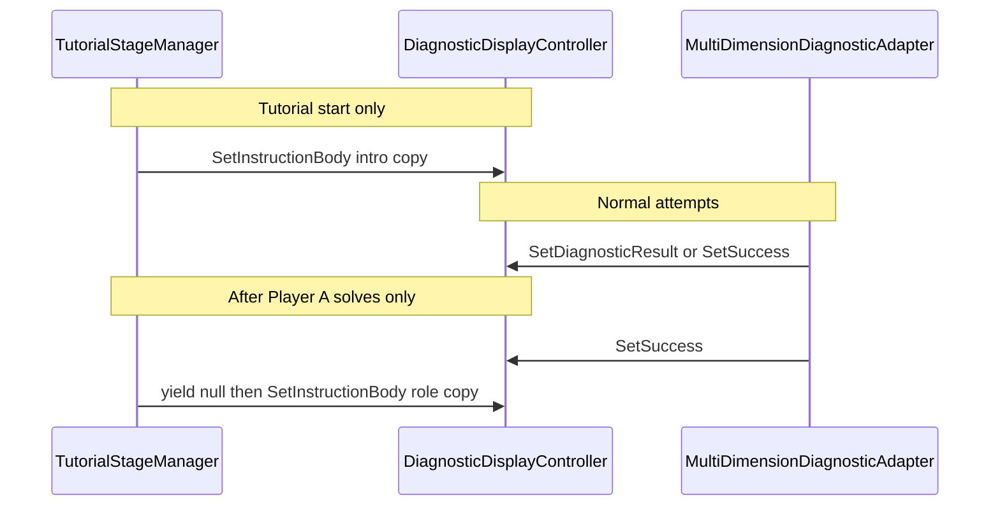

# Tutorial instructional text in Diagnostic Body_TMP (revised — simpler)

## 1. Existing diagnostic text flow (unchanged summary)

- **[`DiagnosticDisplayController`](Assets/WhoWiredThis/Scripts/Puzzles/Common/DiagnosticDisplayController.cs)** owns **`bodyText` (Body_TMP)** for normal states via private **`WriteBody`**: `SetWaiting`, `SetDiagnosticResult`, `SetSuccess`, `SetError`, `Clear`. **`Awake`** calls **`SetWaiting()`**.
- **[`MultiDimensionDiagnosticAdapter`](Assets/WhoWiredThis/Scripts/Puzzles/Common/MultiDimensionDiagnosticAdapter.cs)** drives those APIs from **`OnAttemptSubmitted`** (and from continuous **`Update`** when **`updateContinuously`** is true). Tutorial scenes use **`updateContinuously: 0`** (commit-only): body updates on attempts, not every frame while idle.
- **[`ProcessingFeedbackController`](Assets/WhoWiredThis/Scripts/Puzzles/Common/ProcessingFeedbackController.cs)** uses **`BeginBodyWriteSuppress` / `EndBodyWriteSuppress`**; **`MachineFeedbackTextController`** may write **`bodyText`** directly during processing; **`SetProcessingBodyText`** bypasses suppress. After processing ends, the adapter runs as today.

**Prefab / scene wiring:** Each player has a **DiagnosticPanel** instance; **[`TutorialStageManager`](Assets/WhoWiredThis/Scripts/Tutorial/TutorialStageManager.cs)** already owns **stage + locks** and references both **`MultiDimensionPuzzelManager`** instances — it will also own **serialized refs to both `DiagnosticDisplayController`** instances for copy timing only.

---

## 2. Proposed change (simpler — approved direction)

### `DiagnosticDisplayController` (minimal, non-tutorial)

- **Do not** add a tutorial latch, persistent tutorial flags, or “tutorial mode.”
- **Do not** embed tutorial policy in this class.
- **Add one public method**, e.g. **`SetInstructionBody(string body)`** (name TBD), that **only** updates the body string using the **same code path as other normal body writes** — i.e. call **`WriteBody`** (so **`bodyWriteSuppressDepth`** is respected the same way as `SetWaiting` / `SetDiagnosticResult` / etc.).
- **Lamp / `DisplayState`:** Either leave lamp and internal state **unchanged** (body-only overlay on whatever the last full display update set), or document explicitly that this is **body text only**; do not add branching tutorial logic here.

### `TutorialStageManager` (owns timing and copy)

- **Serialized references:** **`DiagnosticDisplayController`** for **Player A** and **Player B** (two fields).
- **Serialized strings** (e.g. **`[TextArea]`**): **Player A intro (operator)**, **Player B intro (reader)**, **Player A after Player A solved (role switch)**, **Player B after Player A solved (role switch)**.
- **Tutorial start:** After existing stage setup (e.g. end of **`Start`** once **`ApplyStageVisualAndLocks`** has run), call **`SetInstructionBody`** on **A** and **B** with the two intro strings. Rely on **`DefaultExecutionOrder(100)`** on **`TutorialStageManager`** so other components’ **`Awake`/`OnEnable`/`Start`** on default order have already put the panels in a baseline state; intro then **overwrites** initial waiting body text as intended.
- **During normal attempts:** **Do nothing** in **`TutorialStageManager`** for Body_TMP. Processing and adapters **overwrite** the body as they do today.
- **When Player A solves:** In **`HandlePlayerAAttempt`**, after **`stage`** is set to **`PlayerBOperator`** and **`ApplyStageVisualAndLocks`** runs, the **A-side adapter** will have run on the same **`OnAttemptSubmitted`** tick (listener order may vary). Apply role-switch copy to **both** displays using a **short deferred apply** (e.g. **`StartCoroutine`**: **`yield return null`** once, or **`WaitForEndOfFrame`**) so tutorial copy **wins after** **`SetSuccess`** on A’s diagnostic when the adapter runs first.
- **When Player B solves:** **No** new completion UI, **no** score. **Only** invoke existing **`OnTutorialCompleted`** / **`onTutorialCompletedUnity`**. Leave **B**’s (and **A**’s) success body as the adapter last wrote it unless a later task changes that.

**No** separate **`TutorialDiagnosticInstructionController`**. **No** **`OnStageChanged`** event unless you add it later for unrelated systems; this design keeps everything in **`TutorialStageManager`**.

---

## 3. Message ownership and timing

| Moment | Who writes | Player A Body_TMP | Player B Body_TMP |
|--------|------------|--------------------|-------------------|
| Tutorial start | `TutorialStageManager` | Operator intro | Reader / history intro |
| Each attempt | Adapter + processing | Normal diagnostics | Normal diagnostics |
| Player A solves | Adapter then `TutorialStageManager` (deferred) | Role-switch line for A | Role-switch line for B |
| Player B stage | Adapter only | Normal (reader side; commit-only keeps steady until attempts if unsolved) | Operator attempts |
| Player B solves | Adapter + existing completion hooks | Success text remains unless changed later | Success text remains |

**Duration:** Intro and post–A-solve lines stay until the **next** body write for that panel (typically the **next Send** on that side, or processing lines during that Send). No timers required for v1.

---

## 4. Body_TMP conflict strategy (no latch)

| Writer | Behavior |
|--------|----------|
| **`TutorialStageManager`** | Writes **only** at **stage boundaries**: initial **`Start`**, and **one-shot deferred** after **Player A** solve. Uses **`SetInstructionBody`** only. |
| **`MultiDimensionDiagnosticAdapter`** | Remains the **source of truth** for real outcomes on every attempt; any **`SetDiagnosticResult` / `SetSuccess` / …** replaces whatever was in the body, including prior instruction text. |
| **Processing** | Same as today; may replace body during Activate. |

**Without a latch:** instruction text is **ephemeral** — the next real diagnostic (or processing line) **wins**. That matches “do not permanently take over Body_TMP” and avoids display-layer state.

**Caveat:** **`SetInstructionBody`** goes through **`WriteBody`**, so it **no-ops while `bodyWriteSuppressDepth` > 0`**. Tutorial copy is only scheduled **at boundaries** when processing is not holding the body; the **post–A-solve** coroutine must start **after** the activate flow has finished (it runs from **`OnAttemptSubmitted`**, which fires **after** processing — **safe**).

---

## 5. Inspector configuration

- All four message strings and both **`DiagnosticDisplayController`** references live on **`TutorialStageManager`** in the **tutorial scene** (or a scene-specific prefab instance). **No** per-Diagnostic prefab variant required for copy.

---

## 6. Risks and mitigations

| Risk | Mitigation |
|------|------------|
| Instruction text overwrites real diagnostic mid-puzzle | **Only** write at **start** and **after A solve**; never on every attempt. |
| Listener order: adapter vs tutorial on same event | **Deferred one frame** (or end of frame) before applying **both** role-switch strings so **A**’s line wins over **`SetSuccess`** if the adapter subscribed first. |
| `updateContinuously` turned on | Idle intro could be overwritten by **`Update`** refreshes; keep tutorial scenes on **commit-only** (`0`) or document the limitation. |
| `SetInstructionBody` during suppress | No-op; boundaries chosen so suppress is not active for those writes. |

---

## 7. Implementation steps (after approval)

1. **[`DiagnosticDisplayController`](Assets/WhoWiredThis/Scripts/Puzzles/Common/DiagnosticDisplayController.cs):** Add **`public void SetInstructionBody(string body)`** (or agreed name) that assigns body text via **`WriteBody`** only (optional **`ForceMeshUpdate`** only if you discover mesh staleness in playtest — default match **`WriteBody`**).
2. **[`TutorialStageManager`](Assets/WhoWiredThis/Scripts/Tutorial/TutorialStageManager.cs):** Add serialized **`DiagnosticDisplayController`** ×2 and four **`[TextArea]`** strings; in **`Start`**, after **`ApplyStageVisualAndLocks()`**, apply intro strings with null guards + warnings.
3. **`HandlePlayerAAttempt`:** After stage transition and **`ApplyStageVisualAndLocks()`**, **`StartCoroutine`** a tiny routine: **`yield return null`**, then **`SetInstructionBody`** on **A** and **B** with the two post–A-solve strings (null-safe).
4. **`HandlePlayerBAttempt`:** Leave body logic alone; keep **`RaiseCompletionOnce`** only.
5. **Scene wiring:** On **Split Tutorial** (and any other tutorial scene using **`TutorialStageManager`**), assign **Player A / B** diagnostic refs (the same **`DiagnosticDisplayController`** instances the adapters use) and paste copy.
6. **Validate:** Unity MCP **`read_console`** after compile; playtest flow above.

**Non-goals:** scoring, high scores, new UI panels, floating text, diagnostic math, shared history, input config changes.

---

## Approval

Reply when you want this **implemented** as written; until then no code or prefab/scene edits.
