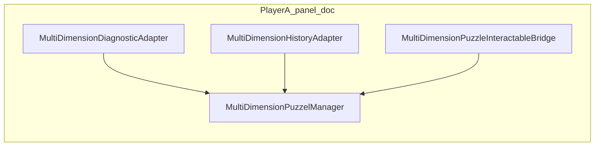

# Tutorial Stage Manager (plan only)

## Approved constraints (this revision)

1. **`TutorialStageManager` host object:** Use a dedicated scene object such as **`_Tutorial/TutorialStageManager`** or **`Managers/TutorialStageManager`**. Do **not** attach `TutorialStageManager` to `SplitTutorial_InitialFocus`.
2. **`InitialPanelFocusBootstrap`:** Do **not** modify it in this step. It runs as today; `TutorialStageManager` applies tutorial state **afterward** (see **Script execution order** below).
3. **Glass overlay coverage:** Prefer covering only the **input / action area** (Board + Buttons) so **Diagnostic** (`Body_TMP` / diagnostic surface) and **Shared History** stay fully readable. If a wider cover is ever used, keep it **subtle** (low alpha) and verify diagnostic + history remain readable.
4. **Real lock:** Interaction lock remains **colliders + `PlayerPanelFocusController`** (and `ExitFocus()` as needed). The overlay is **not** a substitute for locking.
5. **Minimal overlay asset:** Reuse an existing panel/quad style or material if one fits. **Create a new `TutorialGlassOverlay` prefab only if** no suitable existing object exists after a quick asset audit.
6. **Completion:** No completion UI, score, high score, or tutorial summary—only **`OnTutorialCompleted`** / **`UnityEvent`** on `TutorialStageManager`.
7. **Wiring:** All runtime behavior uses **`[SerializeField]`** references (colliders, controllers, overlay roots, both `MultiDimensionPuzzelManager`s). **Do not** use hardcoded hierarchy path strings in code for discovery or behavior.
8. **Terminology:** In code, prefer **`playerA` / `playerB`** (and stage names like **`PlayerAOperator`** / **`PlayerBOperator`** / **`Complete`**). Use **Blue / Red** only in Inspector **tooltips**, `[Header]` labels, or **player-facing UI strings**.

---

## 1. Existing architecture summary

### Relevant GameObjects ([`Assets/Scenes/Split Tutorial.unity`](Assets/Scenes/Split Tutorial.unity) via Unity MCP)

Documentation labels below use Blue/Red for readability; implementation identifiers follow §Approved constraints.

| Role | Scene object (documentation) | Notes |
|------|------------------------------|-------|
| Blue / Player A panel | `Player1_Panel` | Child `Board` has [`PanelFocusController`](Assets/WhoWiredThis/Scripts/PanelFocus/PanelFocusController.cs) with **`AllowedPlayerId` = `Player_A` (1)** |
| Red / Player B panel | `Player2_Panel` | `Board` has **`AllowedPlayerId` = `Player_B` (2)** |
| Per-panel puzzle core | `.../PuzzleManager` | [`MultiDimensionPuzzelManager`](Assets/WhoWiredThis/Scripts/Visibility/MultiDimensionPuzzelManager.cs), [`MultiDimensionPuzzleInteractableBridge`](Assets/WhoWiredThis/Scripts/Visibility/MultiDimensionPuzzleInteractableBridge.cs), [`ActivateButtonFeedbackController`](Assets/WhoWiredThis/Scripts/Visibility/ActivateButtonFeedbackController.cs) |
| Input modules | `.../Buttons/*` | [`MultiDimension`](Assets/WhoWiredThis/Scripts/Visibility/MultiDimension.cs) + [`MultiDimensionSubjectCycler`](Assets/WhoWiredThis/Scripts/Visibility/MultiDimensionSubjectCycler.cs) (`IInteractable`) |
| Activate / Send | `Buttons/SolveButton` | [`SolveInteractProxy`](Assets/WhoWiredThis/Scripts/Visibility/SolveInteractProxy.cs) → bridge |
| Diagnostic | `.../DiagnosticPanel` | [`DiagnosticDisplayController`](Assets/WhoWiredThis/Scripts/Puzzles/Common/DiagnosticDisplayController.cs) — world **TMP 3D** body |
| Shared history | `.../HistoryPanel` | [`HistoryBoardController`](Assets/WhoWiredThis/Scripts/Puzzles/Common/HistoryBoardController.cs) + [`MultiDimensionHistoryAdapter`](Assets/WhoWiredThis/Scripts/Puzzles/Common/MultiDimensionHistoryAdapter.cs) |
| Players | `_Players/FirstPersonPlayer_A`, `..._B` | [`FirstPersonController`](Assets/FirstPerson/Scripts/FirstPersonController.cs), [`PlayerPanelFocusController`](Assets/WhoWiredThis/Scripts/PanelFocus/PlayerPanelFocusController.cs) |
| Startup focus | `_Players/SplitTutorial_InitialFocus` | [`InitialPanelFocusBootstrap`](Assets/WhoWiredThis/Scripts/PanelFocus/InitialPanelFocusBootstrap.cs) — **unchanged**; `Start` enters focus for both when enabled |

### Flow when Activate / Send runs

1. **World raycast:** [`FirstPersonController`](Assets/FirstPerson/Scripts/FirstPersonController.cs) uses ordered ray hits; first collider with `IInteractable` in parent wins. Colliders without `IInteractable` do not block farther hits.

2. **Panel focus (keyboard):** [`PlayerPanelFocusController`](Assets/WhoWiredThis/Scripts/PanelFocus/PlayerPanelFocusController.cs) → [`PanelFocusController.ActivateSelected`](Assets/WhoWiredThis/Scripts/PanelFocus/PanelFocusController.cs) → knob/slider/Solve `Interact`.

3. **Solve path:** [`SolveInteractProxy`](Assets/WhoWiredThis/Scripts/Visibility/SolveInteractProxy.cs) → [`MultiDimensionPuzzleInteractableBridge`](Assets/WhoWiredThis/Scripts/Visibility/MultiDimensionPuzzleInteractableBridge.cs) → [`MultiDimensionPuzzelManager.TryCheckSolutionFromInteractor`](Assets/WhoWiredThis/Scripts/Visibility/MultiDimensionPuzzelManager.cs).

### How solved state is detected

- **`MultiDimensionPuzzelManager.Solved`**; on success, `OnAttemptSubmitted` fires with **`MultiDimensionAttemptResult.IsSolved == true`** ([`MultiDimensionAttemptResult`](Assets/WhoWiredThis/Scripts/Visibility/MultiDimensionAttemptResult.cs)).

### Adapter wiring (unchanged by tutorial)

- [`MultiDimensionDiagnosticAdapter`](Assets/WhoWiredThis/Scripts/Puzzles/Common/MultiDimensionDiagnosticAdapter.cs), [`MultiDimensionHistoryAdapter`](Assets/WhoWiredThis/Scripts/Puzzles/Common/MultiDimensionHistoryAdapter.cs) — no tutorial changes.

---

## 2. Proposed new components

| Component | Purpose |
|-----------|---------|
| **`TutorialStageManager`** on **`_Tutorial/TutorialStageManager`** or **`Managers/TutorialStageManager`** | Owns internal stage enum **`PlayerAOperator`**, **`PlayerBOperator`**, **`Complete`**. Serialized refs: **`playerAPuzzleManager`**, **`playerBPuzzleManager`** (`MultiDimensionPuzzelManager`), two **`TutorialPanelLockBundle`** (or nested serialized structs) for **player A** and **player B** panels, optional refs to **`PanelFocusController`** for `TryEnterFocus` if desired later. Subscribes **`OnAttemptSubmitted`** on both managers. Invokes **`OnTutorialCompleted`** + **`UnityEvent`** when entering **`Complete`**. **No** attachment to `SplitTutorial_InitialFocus`. |
| **`TutorialPanelLockBundle`** | Serialized: **`boardEnterPanelCollider`** (Board `BoxCollider` or equivalent), **`actionColliders`** (`Collider[]` for knobs/sliders/solve), **`playerPanelFocus`**, **`glassOverlayRoot`** (`GameObject`), **`instructionText`** (`TMP_Text` optional). **No** runtime `GameObject.Find` / path-based lookup. |
| **`TutorialGlassOverlayView`** (optional, minimal) | If a separate script helps: set TMP copy for waiting vs diagnostic-side strings. May be omitted if `TutorialStageManager` drives a single assigned `TMP_Text` directly—keep surface area small. |

**Reuse:** No existing `PlayerPanelController` for turns. Drive **[`PlayerPanelFocusController`](Assets/WhoWiredThis/Scripts/PanelFocus/PlayerPanelFocusController.cs)** + **colliders** only.

---

## 3. Proposed scene / prefab changes

### Hierarchy — tutorial manager

- Create empty GameObject **`_Tutorial/TutorialStageManager`** (preferred) **or** **`Managers/TutorialStageManager`**.
- Add **`TutorialStageManager`** component **only** there.

### Hierarchy — glass overlay (per panel)

- Add overlay as a child positioned to cover **`Board` + `Buttons`** only (e.g. parented under a small empty **`ActionArea`** group if the scene has one, or parented to `Player1_Panel` / `Player2_Panel` with transform set in Editor so the quad does **not** sit over `DiagnosticPanel` / `HistoryPanel`).
- **No** blocking collider on the overlay (or keep collider disabled). Readability of diagnostic + history is a hard layout requirement.

### Asset strategy (minimal)

- **Step A:** Audit existing materials/meshes used by **Board** (e.g. [`Mat_Player1Board`](Assets/WhoWiredThis/Materials/) style) or other simple quads in the project for a **semi-transparent** variant or duplicable setup.
- **Step B:** If an existing mesh + material can be duplicated in-scene with only transform + alpha tweaks, **prefer that** and wire refs to its `GameObject` / `Renderer` / `TMP_Text` without a new prefab.
- **Step C:** **Only if** nothing suitable exists, add **`TutorialGlassOverlay.prefab`** (minimal quad + URP transparent material + **TMP 3D**), two instances in the tutorial scene.

### Inspector references (mandatory pattern)

- **`playerAPuzzleManager`**, **`playerBPuzzleManager`**
- Per side bundle: **`boardEnterPanelCollider`**, **`actionColliders`** (explicit array), **`playerPanelFocus`**, **`glassOverlayRoot`**, optional **`instructionText`**
- **No** `InitialPanelFocusBootstrap` reference required (bootstrap is not modified; no coupling).

---

## 4. Proposed flow

**Naming:** First operator stage is **Player A (Blue)** per design; second is **Player B (Red)**. Code uses **`PlayerAOperator`** / **`PlayerBOperator`**.

### Script execution order (bootstrap unchanged)

- Unity default: multiple `Start()` calls on different scripts have **undefined relative order** unless **`[DefaultExecutionOrder]`** is used.
- **`InitialPanelFocusBootstrap`** stays at default order **0**.
- Set **`[DefaultExecutionOrder(100)]`** (or another **positive** value) on **`TutorialStageManager`** so its **`Start`** (or **`Start` + first `ApplyTutorialState`**) runs **after** `InitialPanelFocusBootstrap.Start` in the same frame.
- **Effect:** Both players receive `TryEnterFocus` from bootstrap first; then **`TutorialStageManager`** immediately applies non-operator exit/disabled colliders/focus for the waiting side—**without** editing bootstrap source.

### Initial state — `PlayerAOperator`

- **Player B (waiting):** `ExitFocus()` on player B’s **`PlayerPanelFocusController`** if focused; disable **`boardEnterPanelCollider`** + **`actionColliders`** on player B’s bundle; **`playerPanelFocus.enabled = false`** on player B; show player B overlay copy (Inspector strings / Blue–Red labels in headers only).
- **Player A (operator):** ensure colliders enabled, **`PlayerPanelFocusController`** enabled; overlay hidden or minimal.

### When player A’s puzzle is solved

- Base manager already locks player A puzzle UI where configured.
- Tutorial: transition to **`PlayerBOperator`**; mirror lock/unlock and overlay copy for the two sides (player A waiting overlay; player B operator).

### When player B’s puzzle is solved

- Tutorial: **`Complete`**; lock both sides’ **Board + action** colliders and disable **both** **`PlayerPanelFocusController`**s (with **`ExitFocus()`** first as needed). Overlays stay minimal—**no** completion UI; optional neutral line only if already using TMP on overlay.

### Tutorial complete hook

- Invoke **`event Action OnTutorialCompleted`** and **`UnityEvent`** on `TutorialStageManager` once when entering **`Complete`**. No scoring, high score, or summary UI in this task.

---

## 5. Interaction locking strategy

| Mechanism | Serialized targets | Why |
|-----------|-------------------|-----|
| FP raycast + panel open | **`boardEnterPanelCollider`** | Disables [`PanelFocusController.Interact`](Assets/WhoWiredThis/Scripts/PanelFocus/PanelFocusController.cs) entry from world ray. |
| FP raycast on controls | **`actionColliders`** | Prevents `IInteractable` on knobs/solve from being hit. |
| Keyboard panel focus | **`PlayerPanelFocusController`** `enabled` + **`ExitFocus()`** | Prevents [`ActivateSelected`](Assets/WhoWiredThis/Scripts/PanelFocus/PanelFocusController.cs) from forwarding `Interact` while the other side is operator—**not** replaceable by overlay alone. |

**Diagnostic + history:** Not listed in lock bundles; overlay placement avoids obscuring them.

---

## 6. Risks and mitigations

| Risk | Mitigation |
|------|------------|
| `Start` order without execution order | **`[DefaultExecutionOrder(100)]`** on `TutorialStageManager`; bootstrap remains **0**. |
| `Interact` on disabled `IInteractable` still callable from `PanelFocusController` | **`PlayerPanelFocusController`** off + **`ExitFocus()`** on waiting player. |
| Overlay dims diagnostic | **Cover Board + Buttons only**; lower alpha; verify in scene view / play mode on both displays. |

**Solved signal:** `OnAttemptSubmitted` + **`IsSolved`** per manager—no puzzle core change required.

---

## 7. Implementation steps (after “implement now”)

1. Create **`_Tutorial/TutorialStageManager`** or **`Managers/TutorialStageManager`**; add **`TutorialStageManager`** with **`[DefaultExecutionOrder(100)]`** (adjust only if playtest shows ordering issues).
2. **Audit** materials/quads; add **minimal** overlay over **Board + Buttons** only (reuse assets or create prefab per §3).
3. Implement **`TutorialPanelLockBundle`** fields + apply methods using **only** serialized references.
4. Implement stage state machine: **`PlayerAOperator`** → **`PlayerBOperator`** → **`Complete`**, driven by **`playerAPuzzleManager` / `playerBPuzzleManager`** `OnAttemptSubmitted` **`IsSolved`**.
5. Wire **`OnTutorialCompleted`** + **`UnityEvent`**; no other completion UI.
6. Play-test **`Split Tutorial`**; **`read_console`** / compile check.

---

**Out of scope for this task:** Editing [`InitialPanelFocusBootstrap`](Assets/WhoWiredThis/Scripts/PanelFocus/InitialPanelFocusBootstrap.cs), changing [`MultiDimensionPuzzelManager`](Assets/WhoWiredThis/Scripts/Visibility/MultiDimensionPuzzelManager.cs) solve logic, completion/scoring/summary UI.
