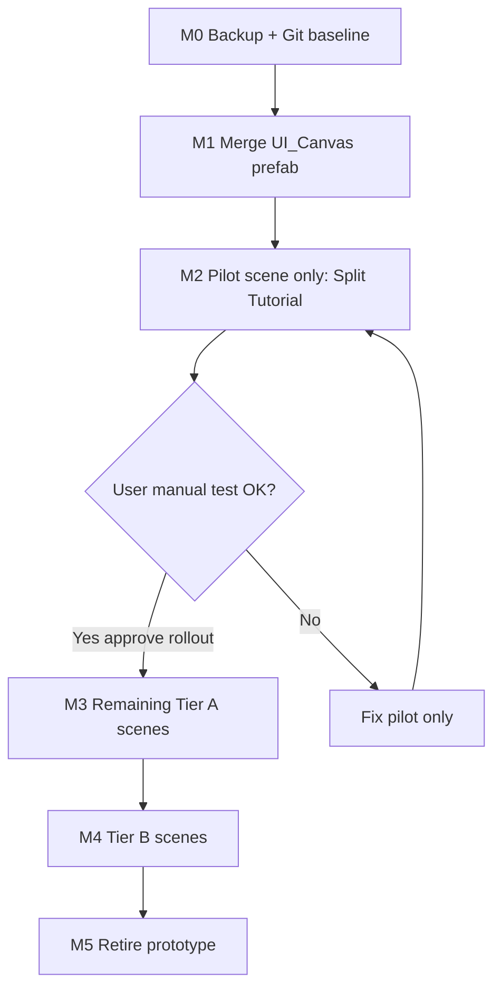

# Promote Dual HUD Prototype to Production UI

## Task name

Replace legacy `UI_Canvas` with approved dual-player HUD — **pilot one scene first**, then rollout after manual approval.

## Date

2026-05-16

## Pilot-first workflow (required)

**Do not migrate all scenes in one pass.** Implementation stops after the pilot scene until you manually test and explicitly approve rollout.

### Pilot scene (fixed for first implementation)

| Role | Scene |
|------|--------|
| **Pilot** | [`Split Tutorial.unity`](Assets/Scenes/Split Tutorial.unity) |
| **Reference wiring** | Copy `playerHudView` pattern from [`Split Tutorial_UIRefactor.unity`](Assets/Scenes/Split Tutorial_UIRefactor.unity) |
| **Not touched in pilot** | All other 12 active scenes keep current prefab instance until approval |

**Why Split Tutorial:** Primary co-op production scene; full interactable + panel-focus + diagnostic coverage; UIRefactor already validated dual HUD behavior there.

### Approval gate (you)

After M0–M2, run Play Mode in **Split Tutorial** and confirm the pilot checklist (section 6). Reply **approve rollout** (or equivalent) before any M3+ scene work.

Until approval:
- Do **not** wire other Tier A scenes
- Do **not** disable `PlayerHud_B` on Tier B scenes
- Do **not** retire `UI_Canvas_DualPlayer_Prototype` or `Split Tutorial_UIRefactor`

---

## Current state (important)

| Asset | GUID | Reality today |
|-------|------|----------------|
| [`UI_Canvas.prefab`](Assets/WhoWiredThis/Prefabs/Game/UI_Canvas.prefab) | `bedc9f9…` | Legacy single canvas + singleton `MessagePanel` + inventory |
| [`UI_Canvas_DualPlayer_Prototype.prefab`](Assets/WhoWiredThis/Prefabs/Game/UI_Canvas_DualPlayer_Prototype.prefab) | `b6660ee…` | Approved dual HUD; missing inventory; has dev test harness |
| 14 active scenes | `bedc9f9…` | Legacy content; inconsistent dual-style overrides |
| UIRefactor | `b6660ee…` | Validated 4A/4B; only scene with `playerHudView` wired |

---

## Approved scope

- **Pilot:** `Split Tutorial.unity` only (M2)
- **After approval:** All other active scenes referencing `UI_Canvas`; exclude `Assets/Scenes/OLD/`
- **Single-player (post-approval):** Disable `PlayerHud_B`; use `PlayerHud_A` only
- **Keep** `UI_Canvas` GUID (`bedc9f9…`)
- **Do not** change diagnostic/history, tutorial puzzle logic, action lock, scoring, broadcast popup

## Out of scope (defer)

- `EngageButtonController` / `HUDController` help-menu routing (Phase 4C / 5)
- Per-player inventory UI
- `Assets/Scenes/OLD/*`

---

## 1. Prefab strategy

1. Backup → `UI_Canvas_Legacy_Backup.prefab`
2. Merge prototype into `UI_Canvas.prefab` (keep `bedc9f9…` GUID)
3. Port inventory + menu wiring from legacy under **`PlayerHud_A`**
4. Remove `PlayerHudPopupTestHarness`; add `SharedHudPresenter`
5. No root singleton `MessagePanel`
6. Retire prototype **only after** full rollout approved (M5)

---

## 2. Scene inventory (post-approval only)

### Tier A — dual-player (after pilot approval)

Split Puzzle, Tutorial, TestPanelFocusMode, Starter FirstPerson, LocalDuel FP/TP, Split Tutorial Original

### Tier B — single-player (after Tier A)

SampleScene, RelayPuzzle, Floor_Puzzle, A17_PolarityPanel, CombinedPuzzels — disable `PlayerHud_B`

### Tier C — dev cleanup (after all scenes pass)

Repoint or archive `Split Tutorial_UIRefactor`; retire prototype prefab

**Excluded:** `Assets/Scenes/OLD/`

---

## 3. Implementation phases

| Phase | Scope | Stops until |
|-------|--------|-------------|
| **M0** | Git baseline + legacy backup prefab | User baseline OK |
| **M1** | Merge `UI_Canvas.prefab` | Compile clean |
| **M2** | **Pilot only:** `Split Tutorial` — wire `playerHudView` A/B | **Your manual test** |
| — | **APPROVAL GATE** | You say rollout approved |
| **M3** | Remaining Tier A (one scene per step) | Each scene smoke OK |
| **M4** | Tier B — hide `PlayerHud_B` | Load test each |
| **M5** | Retire prototype + UIRefactor | Full rollout done |
| **M6** | Plan archive README update | — |

**M2 pilot scene edits only:**
- `UI_Canvas` prefab instance (inherits M1 merged prefab)
- `FirstPersonPlayer_A` / `_B` → `PlayerActions.playerHudView`
- Clear stale root rect overrides if Unity shows broken refs
- **No** diagnostic/history/puzzle object changes

---

## 4. Pilot testing checklist (Split Tutorial — you run this)

- [ ] Display 0: Player A top bar, interact prompt, popups (clue, collectible, socket, relay test)
- [ ] Display 1: Player B same, independent of A
- [ ] Both popups open; closing one does not close the other
- [ ] Panel focus + diagnostic/history unchanged
- [ ] Inventory opens on Display 0 (if merged in M1)
- [ ] Console: no new errors
- [ ] Known OK if broken: Help/About/Restart (Phase 5)

**Optional compare:** Run same tests on UIRefactor before/after to confirm parity.

---

## 5. Known regressions (pilot + rollout)

| Feature | Until Phase 5 |
|---------|----------------|
| Help / About / Restart / Terminal | `MessagePanel.Instance` null on dual |
| Engage button popups | Legacy singleton path |

---

## 6. Rollback

- **Pilot only:** Revert M1–M2 commits; scene still points at `bedc9f9` legacy backup if M0 kept
- **Per scene after rollout:** Revert that scene’s commit; prefab rollback via `UI_Canvas_Legacy_Backup`

---

## Implementation log (2026-05-16)

- M0: `UI_Canvas_Legacy_Backup.prefab` created
- M1: `UI_Canvas.prefab` = dual HUD (GUID `bedc9f9…`); test harness removed
- M2: Pilot `Split Tutorial.unity` — `playerHudView` wired (user validated)
- M3: Tier A scenes wired via [`DualHudSceneRolloutTool.cs`](Assets/WhoWiredThis/Editor/DualHudSceneRolloutTool.cs) (2 `PlayerActions` each)
- M4: Tier B scenes — `PlayerHud_B` disabled
- M5: Prototype moved to `Prefabs/Game/Archive/`; `Split Tutorial_UIRefactor` repointed to production `UI_Canvas` GUID
- **Deferred:** inventory merge from legacy backup; HUD help/menu per-player routing (Phase 5)

## Approval

Rollout complete. Optional: spot-check Tier A co-op scene + one Tier B puzzle scene in Play Mode.
