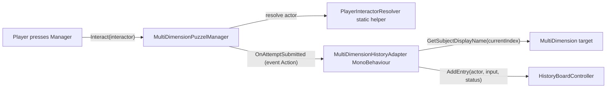

## Code-state revalidation (post user-edit)

The plan was rechecked against the current MultiDimension files. Key updates:

- `MultiDimension` now exposes `GetSubjectDisplayName(int)` and `string this[int]` via the new `MultiDimensionSubject { GameObject subject; string displayName; }`. **The per-target label table previously planned for the Stage B adapter is removed** — labels come from each `MultiDimension` directly.
- A newer validator `MultiDimensionPuzzelManager` (note the typo "Puzzel" preserved from the file) exists alongside `MultiDimensionCombinationLock`. It pairs target+index in `MultiDimensionPuzzleElement`, and already has a partial event surface (`event Action<int,string> OnRetryStringCaptured` — failures only, gated by `captureRetryStrings`) plus `BuildCombinationStateSummary()` / `BuildRetryLine(int)` helpers. **Stage B targets `MultiDimensionPuzzelManager` as the single integration point.**
- `MultiDimensionCombinationLock` has **zero references in code or scenes**; `Tutorial3.unity` references `MultiDimensionPuzzelManager` (guid `6f664a2b9f11488a8b13ea7f6f03b757`). The older lock is dead code and is left untouched here. It can be deleted in a separate cleanup task.
- `MultiDimensionSubjectCycler.TryResolveInteractorPlayer` is still private — extraction into a shared `PlayerInteractorResolver` still applies.

## Conventions confirmed against project

- New script lives in `WhoWiredThis.Puzzles.Common` (alongside `LCDDisplayController` / `EngageButtonController`). The existing `WhoWiredThis.Tutorial2.SharedHistoryBoardController` is left alone.
- Class is named `HistoryBoardController` (no prefix). The existing `Tutorial2.SharedHistoryBoardController` keeps a different name (`Shared` prefix) and lives in a different namespace, so no symbol collision.
- New event is `public event Action<MultiDimensionAttemptResult> OnAttemptSubmitted` — matches the project convention enforced by `unity-csharp.mdc` and the same file's existing `OnRetryStringCaptured`. Adapter subscribes in `OnEnable`, unsubscribes in `OnDisable`.
- Debug input uses **legacy `UnityEngine.Input.GetKeyDown`** to match `SceneHotkeySwitcher`, `MessagePanel`, `DualSingleViewportSwitcher`. No `#if ENABLE_INPUT_SYSTEM` guard.
- `MultiDimension` is **not modified** — labels are read through its existing `GetSubjectDisplayName`.

---

## Stage A — Standalone History Board

### New file

- [Assets/WhoWiredThis/Scripts/Puzzles/Common/HistoryBoardController.cs](Assets/WhoWiredThis/Scripts/Puzzles/Common/HistoryBoardController.cs)
  - Namespace `WhoWiredThis.Puzzles.Common`.
  - Contains `HistoryEntry` as a top-level `[Serializable]` type in the same file: `int attemptNumber; string actor; string inputText; string publicStatus;`.
  - `[SerializeField] TMP_Text titleText`, `[SerializeField] TMP_Text bodyText` — both `TMPro.TMP_Text`, hooked to 3D `TextMeshPro` components (same as `MultiDimension_Knob.prefab` and `LCDDisplayController`).
  - `[SerializeField] string title = "SHARED HISTORY"`.
  - `[SerializeField] int maxVisibleRows = 6`.
  - `[SerializeField] string headerLine = "# | ACTOR | INPUT | STATUS"` and `[SerializeField] string separatorLine = "----------------------------"` (inspector-tweakable).
  - Internal `List<HistoryEntry> entries`, auto-incremented `nextAttemptNumber`, `int viewOffset`.
  - Public API:
    - `void Clear()`
    - `int AddEntry(string actor, string inputText, string publicStatus)` — returns the assigned attempt number.
    - `int AddEntry(HistoryEntry entry)` — overload; if `attemptNumber <= 0`, controller assigns one.
    - `void SetMaxVisibleRows(int count)`
    - `void Render()`
    - `void ScrollUp()`, `void ScrollDown()`, `void ScrollToLatest()` — implemented via `viewOffset`. `AddEntry` auto-snaps to latest unless the user has scrolled. Scroll buttons are optional in the scene; methods are usable from code or wired to interactables later.
  - Body is rendered as a fixed-pitch table using padded column widths so it looks monospace even with proportional fonts (recommend assigning a monospace TMP font asset on the prefab).
  - Debug section under `[Header("Debug")]`:
    - `bool enableDebugInput`
    - `string debugSampleActor = "P1"`, `string debugSampleInput = "R G"`, `string debugSampleStatus = "SIGNAL UNSTABLE"`
    - `[ContextMenu("Add Sample Entry")]`, `[ContextMenu("Clear History")]`.
    - `Update()` (only when `enableDebugInput == true`) uses **legacy `UnityEngine.Input`**:
      - `Input.GetKeyDown(KeyCode.H) && (Input.GetKey(KeyCode.LeftShift) || Input.GetKey(KeyCode.RightShift))` → `Clear()`
      - else `Input.GetKeyDown(KeyCode.H)` → add sample row
      - `Input.GetKeyDown(KeyCode.PageUp)` → `ScrollUp()`
      - `Input.GetKeyDown(KeyCode.PageDown)` → `ScrollDown()`

Sketch of the public surface:

```csharp
namespace WhoWiredThis.Puzzles.Common
{
    [Serializable]
    public class HistoryEntry
    {
        public int attemptNumber;
        public string actor;
        public string inputText;
        public string publicStatus;
    }

    public class HistoryBoardController : MonoBehaviour
    {
        [SerializeField] private TMP_Text titleText;
        [SerializeField] private TMP_Text bodyText;
        [SerializeField] private int maxVisibleRows = 6;

        public int AddEntry(string actor, string inputText, string publicStatus) { /* ... */ }
        public int AddEntry(HistoryEntry entry) { /* ... */ }
        public void Clear() { /* ... */ }
        public void Render() { /* ... */ }
        public void ScrollUp() { /* ... */ }
        public void ScrollDown() { /* ... */ }
        public void ScrollToLatest() { /* ... */ }
        public void SetMaxVisibleRows(int count) { /* ... */ }
    }
}
```

### Scene placement (manual steps for `Tutorial3.unity`)

1. Create an empty `HistoryBoard` GameObject near the puzzle machine.
2. Children: `ScreenMesh` (a `Quad` or thin `Cube` with a dark unlit material to look like a terminal screen), `Title_TMP` (3D `TextMeshPro`), `Body_TMP` (3D `TextMeshPro`).
3. Add `HistoryBoardController` to `HistoryBoard`. Drag `Title_TMP` → `titleText`, `Body_TMP` → `bodyText`.
4. Recommended: assign a monospace SDF (e.g. LiberationMono SDF) for column alignment; the default font also works since the body is space-padded.
5. Optional: `ScrollUp_Button` / `ScrollDown_Button` GameObjects can be added later and wired to `ScrollUp()` / `ScrollDown()` via the existing interaction system.
6. Toggle `Enable Debug Input`, hit Play, press `H` to append rows.

### Acceptance check

- Compiles cleanly in `WhoWiredThis.Puzzles.Common`.
- Pressing `H` in Play mode appends rows; `Shift+H` clears; only the last `maxVisibleRows` are shown.
- No Canvas used, no dependency on any validator.

---

## Stage B — Connect to `MultiDimensionPuzzelManager`

### Architecture



The manager has no knowledge of the board. The board has no knowledge of the manager. Only the adapter knows both, and even then it talks to `MultiDimension` only through the existing `GetSubjectDisplayName` API.

The manager's existing `OnRetryStringCaptured` event (failure-only, opt-in via `captureRetryStrings`) is left fully intact so any current consumers keep working. The new `OnAttemptSubmitted` is a separate event that fires for both pass and fail and is always emitted.

### Edits to existing files

- [Assets/WhoWiredThis/Scripts/Visibility/MultiDimensionPuzzelManager.cs](Assets/WhoWiredThis/Scripts/Visibility/MultiDimensionPuzzelManager.cs)
  - Add `public event Action<MultiDimensionAttemptResult> OnAttemptSubmitted;` near the existing `OnRetryStringCaptured`.
  - In `Interact(GameObject interactor)`: capture the actor (`AllowedPlayerTag`) using the new `PlayerInteractorResolver` before calling the check.
  - Refactor `TryCheckSolution()` to keep its current public signature for callers, but delegate to a private `RunCheck(out int[] submittedIndices, out bool foundParticipating)` that captures the per-target snapshot.
  - After the check completes, build a `MultiDimensionAttemptResult` and `OnAttemptSubmitted?.Invoke(result)`. The manager does NOT format input labels and does NOT decide phase-specific status text — it emits raw indices, an `IsSolved` flag, and a generic `PublicStatus` (`"CALIBRATED"` / `"UNSTABLE"`). The adapter adds richer text.
  - Existing `OnRetryStringCaptured`, `RetryStrings`, `BuildCombinationStateSummary`, `BuildRetryLine`, and `RecordFailedCheckIfEnabled` are not modified.

- [Assets/WhoWiredThis/Scripts/Visibility/MultiDimensionSubjectCycler.cs](Assets/WhoWiredThis/Scripts/Visibility/MultiDimensionSubjectCycler.cs)
  - Replace the body of private `TryResolveInteractorPlayer` with a delegating call to `PlayerInteractorResolver.TryResolve(...)`. Behavior identical; the existing private method is kept as a thin wrapper to avoid touching the call sites.

### New files

- [Assets/WhoWiredThis/Scripts/Player/PlayerInteractorResolver.cs](Assets/WhoWiredThis/Scripts/Player/PlayerInteractorResolver.cs)
  - Namespace `WhoWiredThis.Player`.
  - `public static class PlayerInteractorResolver` with `static bool TryResolve(Transform interactor, out AllowedPlayerTag player)`.
  - Walks parent transforms looking for tags `PlayerA` / `PlayerB`, mapping to `Player_A` / `Player_B`. Lifted verbatim from the cycler so the manager and any future interactable can share it.

- [Assets/WhoWiredThis/Scripts/Visibility/MultiDimensionAttemptResult.cs](Assets/WhoWiredThis/Scripts/Visibility/MultiDimensionAttemptResult.cs)
  - Namespace `WhoWiredThis.Visibility`.
  - Plain runtime payload class (not authored data — `int?` is fine because the Inspector never edits this):

```csharp
public class MultiDimensionAttemptResult
{
    public AllowedPlayerTag Actor;
    public string ActorLabel;
    public int[] SubmittedIndices;
    public bool IsSolved;
    public string PublicStatus;
    public int? PhaseNumber;
    public string PhaseLabel;
}
```

  - The manager fills `Actor`, `ActorLabel` (`Player_A`→"P1", `Player_B`→"P2", `Any_Player`→"?"), `SubmittedIndices`, `IsSolved`, generic `PublicStatus`. Phase fields stay null at this layer.

- [Assets/WhoWiredThis/Scripts/Puzzles/Common/MultiDimensionHistoryAdapter.cs](Assets/WhoWiredThis/Scripts/Puzzles/Common/MultiDimensionHistoryAdapter.cs)
  - Namespace `WhoWiredThis.Puzzles.Common`.
  - The ONLY component that knows about both the manager and the board.
  - Inspector fields:
    - `MultiDimensionPuzzelManager puzzleManager`
    - `HistoryBoardController historyBoard`
    - `MultiDimension[] inputOrder` — same order as `puzzleElements` in the manager. Used to look up display names per submitted index. (Adapter holds a redundant reference rather than reflecting into the manager's private `puzzleElements`.) Trade-off: keeps the manager's serialized API untouched and lets the adapter choose to omit a target from the visible row if desired.
    - Optional `string solvedStatus` (empty → fall back to result's `PublicStatus`), `string unsolvedStatus` (same).
    - Optional `string inputSeparator = " "`.
  - `OnEnable` subscribes to `puzzleManager.OnAttemptSubmitted`; `OnDisable` unsubscribes.
  - On event:
    1. Build `inputText` by walking `inputOrder` in lock-step with `result.SubmittedIndices`, concatenating `target.GetSubjectDisplayName(index)` separated by `inputSeparator`. Skip targets in `SplitPlayers` mode (they are not part of the solution check). Fall back to the index as a string when a target's label is empty.
    2. Pick `status`: prefer `solvedStatus` / `unsolvedStatus` if non-empty; else `result.PublicStatus`.
    3. Call `historyBoard.AddEntry(result.ActorLabel, inputText, status)`.

This adapter is where puzzle-specific text (status overrides) lives — keeping both the validator and the board completely generic.

### Public status mapping for now

- Default in the manager: `IsSolved == true` → `"CALIBRATED"`, else `"UNSTABLE"`.
- Adapter Inspector overrides per puzzle instance, e.g. `solvedStatus = "A-SIDE CALIBRATED"`, `unsolvedStatus = "SIGNAL UNSTABLE"` for the Phase 1 puzzle; `"CORE STABILIZED"` / `"POLARITY UNSTABLE"` for Phase 2. No code changes for additional phases.

### Scene wiring (manual steps)

1. Add an empty `HistoryAdapter` GameObject under the puzzle root.
2. Add `MultiDimensionHistoryAdapter`. Drag the existing `MultiDimensionPuzzelManager` into `puzzleManager` and the `HistoryBoard` into `historyBoard`.
3. Populate `inputOrder` with the same `MultiDimension`s the manager has in its `puzzleElements`, in the same order.
4. Optionally fill `solvedStatus` / `unsolvedStatus` for puzzle-specific text.
5. Disable the board's `Enable Debug Input` (no longer needed once the manager is feeding it).

### Acceptance check

- Pressing the manager (Activate / Submit) adds exactly one row to the board with actor label (P1/P2), input labels (or indices when a label is empty), and a public status string.
- `MultiDimensionPuzzelManager` still works in scenes without an adapter (the new event simply has no listeners).
- The existing `OnRetryStringCaptured` event and `RetryStrings` still behave exactly as before.
- `MultiDimensionSubjectCycler` behavior is unchanged.
- No private feedback (per-target match info, expected indices) is ever surfaced through the new event payload.

---

## How to extend later

- **Phase 1 / Phase 2**: a future PhaseManager can set the adapter's `solvedStatus` / `unsolvedStatus` (or a `phaseLabel` field added later) at runtime when activating a new phase — no other component needs to change.
- **Private diagnostic display**: a separate component can subscribe to the same `OnAttemptSubmitted` event and render private feedback (e.g. count of correct slots) somewhere else, leaving the public board untouched.
- **Other puzzle types**: any future validator can publish its own `*AttemptResult` and feed `HistoryBoardController.AddEntry(...)` through its own adapter — the board stays reusable.
